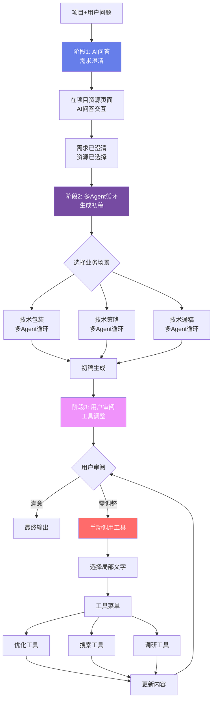
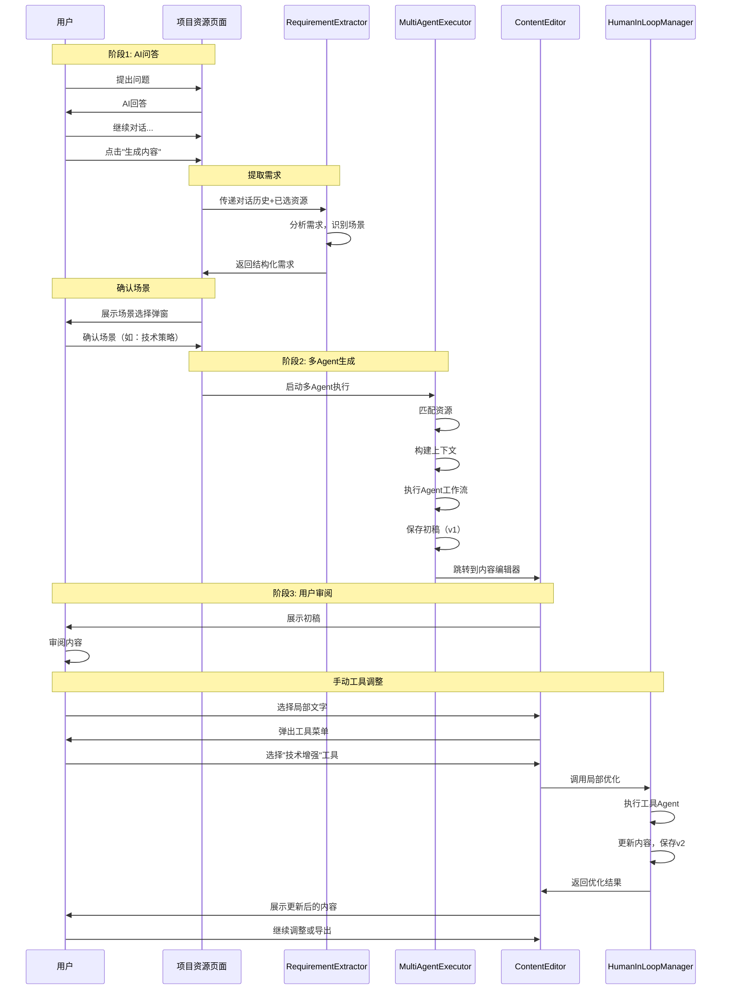

# 三阶段多Agent协作完整方案

## 一、整体流程架构



---

## 二、阶段1: AI问答需求澄清

### 2.1 现状分析

**当前已有功能**（项目资源页面 `/project/:id/resources`）：

- ✅ AI角色选择和对话
- ✅ 项目资源管理（技术点、知识点、来源信息）
- ✅ 对话历史保存
- ✅ 资源关联选择

**需要增强的功能**：

1. **结构化需求提取**：从问答中提取关键信息
2. **业务场景识别**：判断用户想做技术包装/策略/通稿
3. **启动多Agent入口**：问答完成后，引导用户进入多Agent生成

### 2.2 增强设计

#### A. 智能需求识别器

**文件**: `backend/src/services/agent/RequirementExtractor.ts`**功能**：从AI问答历史中提取结构化需求

```typescript
interface ExtractedRequirement {
  scene: 'tech-package' | 'tech-strategy' | 'tech-article' | 'unknown';
  confidence: number;              // 识别置信度 0-1
  techScope: string[];             // 涉及的技术点
  targetAudience: string;          // 目标受众
  outputFormat: string;            // 输出格式要求
  keyRequirements: string[];       // 关键需求点
  selectedResources: {             // 已选择的资源
    techPointIds: number[];
    knowledgePointIds: number[];
    sourceIds: number[];
  };
  conversationSummary: string;     // 对话摘要
}

class RequirementExtractor {
  constructor(private agentOrchestrator: AgentOrchestrator) {}

  // 从对话历史中提取需求
  async extractFromConversation(
    projectId: number,
    conversationHistory: ChatMessage[],
    selectedResources: SelectedResources
  ): Promise<ExtractedRequirement> {
    // 构建提取Prompt
    const prompt = `
你是一个需求分析专家。请分析以下AI问答对话，提取用户的真实需求。

对话历史：
${conversationHistory.map(msg => `${msg.sender}: ${msg.content}`).join('\n')}

用户已选择的资源：
- 技术点：${selectedResources.techPointIds.length}个
- 知识点：${selectedResources.knowledgePointIds.length}个  
- 来源信息：${selectedResources.sourceIds.length}个

请识别：
1. 业务场景（tech-package/tech-strategy/tech-article/unknown）
2. 涉及的技术范围
3. 目标受众
4. 输出格式要求
5. 关键需求点

输出JSON格式：
{
  "scene": "tech-strategy",
  "confidence": 0.85,
  "techScope": ["技术点A", "技术点B"],
  "targetAudience": "企业客户",
  "outputFormat": "长文",
  "keyRequirements": ["突出创新", "强调商业价值"],
  "conversationSummary": "用户希望生成一份针对企业客户的技术策略文档..."
}
`;

    const result = await this.agentOrchestrator.executeAgent(
      'requirement-extractor',
      prompt,
      { parseJSON: true }
    );

    const extracted = JSON.parse(result.content);
    
    // 添加已选资源
    extracted.selectedResources = {
      techPointIds: selectedResources.techPointIds,
      knowledgePointIds: selectedResources.knowledgePointIds,
      sourceIds: selectedResources.sourceIds
    };

    return extracted;
  }
}
```


#### B. 前端增强：启动多Agent入口

**在项目资源页面增加"生成内容"按钮**：

```typescript
// frontend/src/pages/ProjectResourcesPage.tsx

const [extractedRequirement, setExtractedRequirement] = useState<ExtractedRequirement | null>(null);
const [showGenerateModal, setShowGenerateModal] = useState(false);

// 分析需求并启动生成
const handleStartGeneration = async () => {
  try {
    // 1. 从对话历史提取需求
    const response = await api.post('/agent/extract-requirement', {
      projectId,
      conversationHistory: messages,
      selectedResources: {
        techPointIds: selectedTechPoints,
        knowledgePointIds: selectedKnowledgePoints,
        sourceIds: sources.map(s => s.id)
      }
    });

    const requirement = response.data.data;
    setExtractedRequirement(requirement);
    
    // 2. 显示确认弹窗
    setShowGenerateModal(true);
  } catch (error) {
    console.error('需求提取失败:', error);
  }
};

// 确认并启动多Agent生成
const handleConfirmGeneration = async (scene: string) => {
  try {
    // 跳转到生成页面或在当前页面启动
    const response = await api.post('/agent/multi-agent/execute', {
      projectId,
      scene,
      requirement: extractedRequirement
    });

    // 进入阶段3: 初稿展示和工具调整
    navigate(`/project/${projectId}/content-editor/${response.data.data.executionId}`);
  } catch (error) {
    console.error('生成失败:', error);
  }
};

return (
  <div>
    {/* 现有的AI问答界面 */}
    {/* ... */}
    
    {/* 启动多Agent生成按钮 */}
    {messages.length > 0 && (
      <div className="generate-action">
        <button
          onClick={handleStartGeneration}
          className="btn-primary"
        >
          <Sparkles className="w-4 h-4" />
          基于对话生成内容
        </button>
      </div>
    )}

    {/* 场景确认弹窗 */}
    {showGenerateModal && extractedRequirement && (
      <GenerateConfirmModal
        requirement={extractedRequirement}
        onConfirm={handleConfirmGeneration}
        onCancel={() => setShowGenerateModal(false)}
      />
    )}
  </div>
);
```


#### C. 场景确认弹窗

```typescript
interface GenerateConfirmModalProps {
  requirement: ExtractedRequirement;
  onConfirm: (scene: string) => void;
  onCancel: () => void;
}

const GenerateConfirmModal: React.FC<GenerateConfirmModalProps> = ({
  requirement,
  onConfirm,
  onCancel
}) => {
  const [selectedScene, setSelectedScene] = useState(requirement.scene);

  const scenes = [
    {
      id: 'tech-package',
      name: '技术包装',
      description: '生成技术亮点、卖点包装内容',
      icon: '📦'
    },
    {
      id: 'tech-strategy',
      name: '技术策略',
      description: '生成技术传播策略文档',
      icon: '🎯'
    },
    {
      id: 'tech-article',
      name: '技术通稿',
      description: '生成新闻稿、技术文章',
      icon: '📰'
    }
  ];

  return (
    <Modal show onClose={onCancel}>
      <div className="generate-confirm-modal">
        <h2>确认生成内容</h2>
        
        {/* 需求摘要 */}
        <div className="requirement-summary">
          <h3>需求摘要</h3>
          <p>{requirement.conversationSummary}</p>
          
          <div className="requirement-details">
            <div>目标受众：{requirement.targetAudience}</div>
            <div>技术范围：{requirement.techScope.join(', ')}</div>
            <div>关键要求：{requirement.keyRequirements.join(', ')}</div>
          </div>
        </div>

        {/* 场景选择 */}
        <div className="scene-selector">
          <h3>选择生成场景</h3>
          <div className="scene-cards">
            {scenes.map(scene => (
              <div
                key={scene.id}
                className={`scene-card ${selectedScene === scene.id ? 'selected' : ''}`}
                onClick={() => setSelectedScene(scene.id)}
              >
                <div className="scene-icon">{scene.icon}</div>
                <div className="scene-name">{scene.name}</div>
                <div className="scene-desc">{scene.description}</div>
                {requirement.scene === scene.id && (
                  <div className="recommended">推荐</div>
                )}
              </div>
            ))}
          </div>
        </div>

        {/* 已选资源 */}
        <div className="selected-resources">
          <h3>已选资源</h3>
          <div className="resource-count">
            <span>技术点: {requirement.selectedResources.techPointIds.length}个</span>
            <span>知识点: {requirement.selectedResources.knowledgePointIds.length}个</span>
            <span>来源: {requirement.selectedResources.sourceIds.length}个</span>
          </div>
        </div>

        {/* 操作按钮 */}
        <div className="modal-actions">
          <button onClick={onCancel} className="btn-secondary">
            取消
          </button>
          <button
            onClick={() => onConfirm(selectedScene)}
            className="btn-primary"
          >
            开始生成
          </button>
        </div>
      </div>
    </Modal>
  );
};
```

---

## 三、阶段2: 多Agent循环生成初稿

### 3.1 场景化Agent工作流

每个业务场景使用不同的Agent工作流配置。

#### A. 技术包装场景

**文件**: `backend/src/config/workflows/tech-package.workflow.ts`

```typescript
export const techPackageWorkflow: AgentWorkflow[] = [
  {
    agentId: 'tech-highlighter',
    name: '技术亮点提取',
    instruction: '分析技术资料，提取核心亮点和创新点',
    useContext: true,
    usePreviousOutput: false
  },
  {
    agentId: 'value-analyzer',
    name: '价值分析',
    instruction: '分析技术的商业价值、用户价值和竞争优势',
    useContext: true,
    usePreviousOutput: true
  },
  {
    agentId: 'package-writer',
    name: '包装内容撰写',
    instruction: '基于亮点和价值分析，撰写吸引人的技术包装内容',
    useContext: true,
    usePreviousOutput: true
  },
  {
    agentId: 'quality-checker',
    name: '质量检查',
    instruction: '检查内容完整性、吸引力和准确性',
    useContext: false,
    usePreviousOutput: true
  }
];
```


#### B. 技术策略场景

```typescript
export const techStrategyWorkflow: AgentWorkflow[] = [
  {
    agentId: 'tech-analyzer',
    name: '技术分析',
    instruction: '分析技术特点、创新点、竞争优势',
    useContext: true,
    usePreviousOutput: false
  },
  {
    agentId: 'market-analyzer',
    name: '市场分析',
    instruction: '分析市场环境、目标客户、竞争态势',
    useContext: true,
    usePreviousOutput: true
  },
  {
    agentId: 'strategy-planner',
    name: '策略规划',
    instruction: '制定传播策略、定位策略、核心信息',
    useContext: true,
    usePreviousOutput: true
  },
  {
    agentId: 'strategy-writer',
    name: '策略文档撰写',
    instruction: '撰写完整的技术策略文档',
    useContext: true,
    usePreviousOutput: true
  },
  {
    agentId: 'quality-checker',
    name: '质量检查',
    instruction: '检查策略的完整性、可行性和逻辑性',
    useContext: false,
    usePreviousOutput: true
  }
];
```


#### C. 技术通稿场景

```typescript
export const techArticleWorkflow: AgentWorkflow[] = [
  {
    agentId: 'info-collector',
    name: '信息收集',
    instruction: '整理技术信息、市场背景、应用案例',
    useContext: true,
    usePreviousOutput: false
  },
  {
    agentId: 'news-writer',
    name: '新闻稿撰写',
    instruction: '按照新闻稿格式撰写初稿，注重新闻性',
    useContext: true,
    usePreviousOutput: true
  },
  {
    agentId: 'editor',
    name: '编辑润色',
    instruction: '优化文章结构、语言和可读性',
    useContext: false,
    usePreviousOutput: true
  },
  {
    agentId: 'format-checker',
    name: '格式检查',
    instruction: '检查格式规范、字数和排版',
    useContext: false,
    usePreviousOutput: true
  }
];
```


### 3.2 多Agent编排执行器

**文件**: `backend/src/services/agent/MultiAgentExecutor.ts`

```typescript
class MultiAgentExecutor {
  constructor(
    private agentOrchestrator: AgentOrchestrator,
    private resourceMatcher: ResourceMatcher,
    private contextBuilder: ContextBuilder
  ) {}

  async execute(
    projectId: number,
    scene: 'tech-package' | 'tech-strategy' | 'tech-article',
    requirement: ExtractedRequirement
  ): Promise<MultiAgentExecutionResult> {
    const executionId = `exec-${Date.now()}`;
    const startTime = Date.now();

    // 1. 加载项目资源
    const project = await this.loadProject(projectId);
    const resources = await this.loadResources(projectId, requirement.selectedResources);

    // 2. 匹配相关资源（智能匹配 + 用户已选）
    const matchedResources = await this.resourceMatcher.matchResources(
      requirement,
      resources
    );

    // 3. 构建上下文
    const context = this.contextBuilder.buildContext(
      project,
      matchedResources,
      requirement
    );

    // 4. 选择工作流
    const workflow = this.selectWorkflow(scene);

    // 5. 执行Agent工作流
    const intermediateResults: AgentStepResult[] = [];
    let previousOutput = '';

    for (const step of workflow) {
      const stepStartTime = Date.now();
      
      // 构建输入
      let input = `# 任务要求\n${step.instruction}\n\n`;
      
      if (step.useContext) {
        input += `# 项目上下文\n${context}\n\n`;
      }
      
      if (step.usePreviousOutput && previousOutput) {
        input += `# 前置步骤输出\n${previousOutput}\n\n`;
      }

      // 执行Agent
      console.log(`执行Agent: ${step.name}`);
      const result = await this.agentOrchestrator.executeAgent(
        step.agentId,
        input,
        { scene, requirement }
      );

      previousOutput = result.content;
      const stepTime = Date.now() - stepStartTime;

      intermediateResults.push({
        agentId: step.agentId,
        agentName: step.name,
        output: result.content,
        executionTime: stepTime
      });
    }

    const totalTime = Date.now() - startTime;

    // 6. 保存初稿（版本1）
    const versionId = await this.saveVersion(executionId, previousOutput, '初稿生成', 'system');

    // 7. 保存执行记录
    await this.saveExecution({
      executionId,
      projectId,
      scene,
      requirement,
      matchedResources,
      context,
      workflow,
      finalOutput: previousOutput,
      intermediateResults,
      totalTime,
      versionId
    });

    return {
      executionId,
      scene,
      finalOutput: previousOutput,
      versionId,
      matchedResources,
      intermediateResults,
      totalTime
    };
  }

  private selectWorkflow(scene: string): AgentWorkflow[] {
    switch (scene) {
      case 'tech-package':
        return techPackageWorkflow;
      case 'tech-strategy':
        return techStrategyWorkflow;
      case 'tech-article':
        return techArticleWorkflow;
      default:
        throw new Error(`未知场景: ${scene}`);
    }
  }
}
```

---

## 四、阶段3: 用户审阅+工具调整

### 4.1 内容编辑器页面

**路由**: `/project/:projectId/content-editor/:executionId`**文件**: `frontend/src/pages/ContentEditorPage.tsx`

```typescript
const ContentEditorPage: React.FC = () => {
  const { projectId, executionId } = useParams();
  const [execution, setExecution] = useState<MultiAgentExecutionResult | null>(null);
  const [currentContent, setCurrentContent] = useState('');
  const [currentVersionId, setCurrentVersionId] = useState('');
  const [loading, setLoading] = useState(true);

  useEffect(() => {
    loadExecution();
  }, [executionId]);

  const loadExecution = async () => {
    try {
      const response = await api.get(`/agent/executions/${executionId}`);
      const data = response.data.data;
      setExecution(data);
      setCurrentContent(data.finalOutput);
      setCurrentVersionId(data.versionId);
    } catch (error) {
      console.error('加载执行结果失败:', error);
    } finally {
      setLoading(false);
    }
  };

  // 处理局部优化
  const handleLocalOptimize = async (request: LocalOptimizationRequest) => {
    try {
      const response = await api.post('/agent/optimize-local', request);
      const result = response.data.data;
      
      // 更新内容和版本
      setCurrentContent(result.fullContent);
      setCurrentVersionId(result.newVersionId);
      
      toast.success('内容已优化');
    } catch (error) {
      console.error('局部优化失败:', error);
      toast.error('优化失败，请重试');
    }
  };

  // 回退版本
  const handleRevert = async (versionId: string) => {
    try {
      const response = await api.post(`/agent/executions/${executionId}/revert`, {
        targetVersionId: versionId
      });
      const version = response.data.data;
      setCurrentContent(version.content);
      setCurrentVersionId(version.versionId);
      toast.success('已回退到指定版本');
    } catch (error) {
      console.error('回退失败:', error);
      toast.error('回退失败，请重试');
    }
  };

  if (loading) {
    return <div>加载中...</div>;
  }

  return (
    <div className="content-editor-page">
      <TopNavigation />
      
      <div className="editor-container">
        {/* 左侧：中间结果和资源信息 */}
        <div className="sidebar-left">
          <div className="execution-info">
            <h3>生成信息</h3>
            <div className="info-item">
              <span>场景:</span>
              <span>{execution?.scene}</span>
            </div>
            <div className="info-item">
              <span>生成时间:</span>
              <span>{execution?.totalTime}ms</span>
            </div>
          </div>

          {/* 中间步骤结果 */}
          <div className="intermediate-results">
            <h3>生成步骤</h3>
            {execution?.intermediateResults.map((step, idx) => (
              <div key={idx} className="step-item">
                <div className="step-header">
                  <span className="step-name">{step.agentName}</span>
                  <span className="step-time">{step.executionTime}ms</span>
                </div>
                <div className="step-output collapsed">
                  {step.output.substring(0, 200)}...
                </div>
              </div>
            ))}
          </div>

          {/* 匹配的资源 */}
          <div className="matched-resources">
            <h3>使用的资源</h3>
            <div className="resource-list">
              <div>技术点: {execution?.matchedResources.techPoints.length}个</div>
              <div>知识点: {execution?.matchedResources.knowledgePoints.length}个</div>
              <div>来源: {execution?.matchedResources.sources.length}个</div>
            </div>
          </div>
        </div>

        {/* 中间：内容编辑器（支持局部选择和工具调用） */}
        <div className="editor-main">
          <div className="editor-header">
            <h2>生成内容</h2>
            <div className="editor-actions">
              <button onClick={() => handleExport()}>
                <Download className="w-4 h-4" />
                导出
              </button>
              <button onClick={() => handleSave()}>
                <Save className="w-4 h-4" />
                保存
              </button>
            </div>
          </div>

          <LocalContentEditor
            executionId={executionId}
            content={currentContent}
            versionId={currentVersionId}
            onOptimize={handleLocalOptimize}
            onRevert={handleRevert}
          />
        </div>

        {/* 右侧：工具面板 */}
        <div className="sidebar-right">
          <div className="tool-panel">
            <h3>优化工具</h3>
            <div className="tool-categories">
              {TOOL_CATEGORIES.map(category => (
                <div key={category.id} className="tool-category">
                  <h4>{category.name}</h4>
                  <div className="tool-list">
                    {TOOL_AGENTS
                      .filter(tool => tool.category === category.id)
                      .map(tool => (
                        <div key={tool.id} className="tool-card">
                          <div className="tool-icon">{tool.icon}</div>
                          <div className="tool-info">
                            <div className="tool-name">{tool.name}</div>
                            <div className="tool-desc">{tool.description}</div>
                          </div>
                        </div>
                      ))}
                  </div>
                </div>
              ))}
            </div>
          </div>

          <div className="tips">
            <h4>💡 使用提示</h4>
            <ul>
              <li>选择文本后会弹出工具菜单</li>
              <li>可以多次使用不同工具优化</li>
              <li>所有修改都会保存版本</li>
              <li>可以随时回退到之前的版本</li>
            </ul>
          </div>
        </div>
      </div>
    </div>
  );
};
```


### 4.2 工具Agent实现（复用前面的设计）

使用前面设计的：

- `HumanInLoopManager` - 版本管理和局部优化
- `LocalContentEditor` - 文本选择和工具调用UI
- `TOOL_AGENTS` - 工具Agent库

---

## 五、完整数据流

### 5.1 端到端数据流




### 5.2 关键数据结构

```typescript
// 从AI问答到多Agent生成的数据传递
interface ExecutionPipeline {
  // 阶段1输出
  conversationHistory: ChatMessage[];
  selectedResources: {
    techPointIds: number[];
    knowledgePointIds: number[];
    sourceIds: number[];
  };
  
  // 需求提取结果
  extractedRequirement: ExtractedRequirement;
  
  // 阶段2输入
  scene: 'tech-package' | 'tech-strategy' | 'tech-article';
  
  // 阶段2输出
  execution: {
    executionId: string;
    finalOutput: string;
    versionId: string;
    intermediateResults: AgentStepResult[];
  };
  
  // 阶段3：版本管理
  versions: ContentVersion[];
  currentVersionId: string;
}
```

---

## 六、API接口汇总

### 6.1 阶段1接口

```typescript
// 1. 从对话提取需求
POST /api/v1/agent/extract-requirement
{
  projectId: number;
  conversationHistory: ChatMessage[];
  selectedResources: SelectedResources;
}
→ ExtractedRequirement

// 2. 保存对话摘要（可选）
POST /api/v1/agent/save-conversation-summary
{
  projectId: number;
  conversationId: string;
  summary: string;
}
```


### 6.2 阶段2接口

```typescript
// 1. 启动多Agent执行
POST /api/v1/agent/multi-agent/execute
{
  projectId: number;
  scene: string;
  requirement: ExtractedRequirement;
}
→ MultiAgentExecutionResult

// 2. 查询执行状态
GET /api/v1/agent/executions/:executionId
→ MultiAgentExecutionResult

// 3. 获取中间步骤详情
GET /api/v1/agent/executions/:executionId/steps
→ AgentStepResult[]
```


### 6.3 阶段3接口

```typescript
// 1. 局部优化
POST /api/v1/agent/optimize-local
{
  executionId: string;
  versionId: string;
  selectedText: string;
  startPosition: number;
  endPosition: number;
  toolAgentId: string;
  instruction?: string;
}
→ LocalOptimizationResult

// 2. 获取版本历史
GET /api/v1/agent/executions/:executionId/versions
→ ContentVersion[]

// 3. 回退版本
POST /api/v1/agent/executions/:executionId/revert
{
  targetVersionId: string;
}
→ ContentVersion

// 4. 获取工具Agent列表
GET /api/v1/agent/tool-agents
→ ToolAgentDefinition[]

// 5. 导出内容
POST /api/v1/agent/executions/:executionId/export
{
  format: 'markdown' | 'docx' | 'pdf';
  versionId?: string;
}
→ File
```

---

## 七、实施路线图

### Phase 1: 需求提取增强（1.5周）

**任务**：

- [ ] 实现`RequirementExtractor`类
- [ ] 在项目资源页面增加"生成内容"按钮
- [ ] 实现场景确认弹窗`GenerateConfirmModal`
- [ ] 实现需求提取API
- [ ] 测试需求识别准确率

**验收标准**：

- 场景识别准确率>85%
- UI流畅，用户体验良好
- 需求提取API响应<3秒

### Phase 2: 多Agent工作流（2.5周）

**任务**：

- [ ] 实现`MultiAgentExecutor`类
- [ ] 配置3个场景的Agent工作流
- [ ] 实现资源匹配和上下文构建
- [ ] 实现工作流执行引擎
- [ ] 实现执行记录存储
- [ ] 实现多Agent执行API

**验收标准**：

- 3个场景工作流正常运行
- 执行成功率>90%
- 生成内容质量达标

### Phase 3: 内容编辑器页面（1.5周）

**任务**：

- [ ] 创建`ContentEditorPage`
- [ ] 实现左侧步骤和资源展示
- [ ] 实现中间内容编辑区
- [ ] 实现右侧工具面板
- [ ] 集成`LocalContentEditor`组件

**验收标准**：

- 页面布局合理
- 初稿正确展示
- 步骤和资源信息清晰

### Phase 4: 人机协作功能（2周）

**任务**：

- [ ] 实现`HumanInLoopManager`
- [ ] 实现版本管理
- [ ] 配置10+个工具Agent
- [ ] 实现局部优化API
- [ ] 实现版本历史和回退
- [ ] 前端集成工具调用

**验收标准**：

- 文本选择流畅
- 工具调用成功率>95%
- 版本管理正常
- 工具效果达标

### Phase 5: 完善和优化（1.5周）

**任务**：

- [ ] 完善错误处理
- [ ] 添加加载动画和进度提示
- [ ] 实现内容导出功能
- [ ] 性能优化（缓存、并发）
- [ ] 用户测试和反馈收集
- [ ] 文档和培训

**验收标准**：

- 端到端流程顺畅
- 无明显bug
- 用户满意度>90%
- 性能指标达标

---

## 八、成本与收益

### 8.1 开发成本

| 阶段 | 工时 | 周期 ||------|------|------|| Phase 1: 需求提取 | 60h | 1.5周 || Phase 2: 多Agent工作流 | 100h | 2.5周 || Phase 3: 内容编辑器 | 60h | 1.5周 || Phase 4: 人机协作 | 80h | 2周 || Phase 5: 完善优化 | 60h | 1.5周 || **总计** | **360h** | **9周** |

### 8.2 业务价值

**量化指标**：

1. **需求理解准确率**：提升50%（AI问答+需求提取）
2. **内容生成效率**：提升10倍（自动化多Agent）
3. **最终质量**：达到90分+（人机协作精修）
4. **人工介入时间**：减少80%（只需精修，无需全部重写）

**用户体验**：

- 从需求到成品的完整闭环
- 灵活的人机协作模式
- 透明的生成过程
- 可追溯的版本历史

---

## 九、总结

这是一个**完整、清晰、可落地**的三阶段多Agent协作方案：**阶段1: AI问答**

- 在现有项目资源页面完成
- 智能提取结构化需求
- 场景识别和确认

**阶段2: 多Agent循环**

- 场景化工作流配置
- 资源智能匹配
- 自动化内容生成
- 输出高质量初稿

**阶段3: 用户审阅+工具调整**

- 专业的内容编辑器
- 局部选择优化
- 丰富的工具Agent
- 版本管理和回退

**核心优势**：