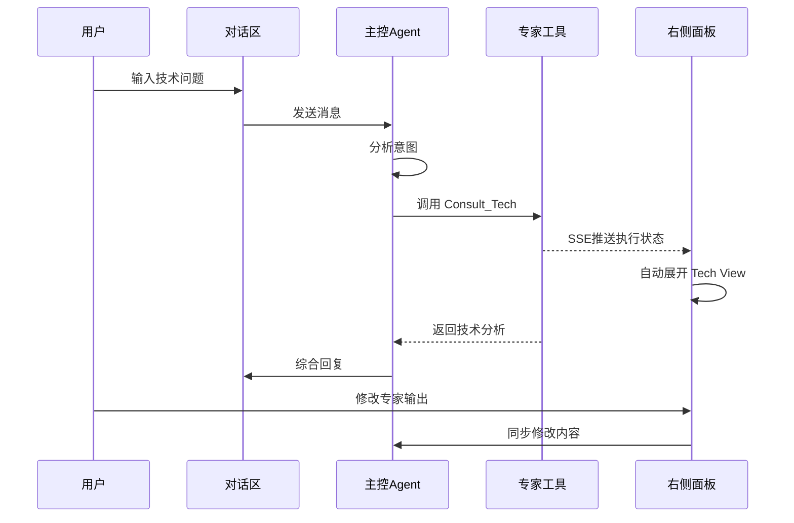

# 主控 Agent + 专家工具箱实现计划

## 一、系统架构设计



## 二、分阶段实施

### Phase 1: 主 Agent 工具调用能力 (核心)

**目标**: 让主 Agent 能够根据对话上下文自动判断并调用 4 个专家工具

**1.1 定义工具 Schema**

在 [backend/src/services/agent/tools/](backend/src/services/agent/tools/) 目录下创建专家工具定义：

```typescript
// expert-tools.ts
export const expertTools = [
  {
    name: 'Consult_Tech',
    description: '咨询技术原教旨主义者：提取硬核参数、物理原理、核心壁垒',
    parameters: {
      type: 'object',
      properties: {
        techDocument: { type: 'string', description: '原始技术文档或参数' },
        analysisType: { enum: ['five-view', 'three-fix', 'tech-matrix'], description: '分析类型' }
      },
      required: ['techDocument']
    }
  },
  {
    name: 'Consult_Scene',
    description: '咨询场景炼金术师：将技术点映射为用户痛点/爽点场景',
    parameters: { /* ... */ }
  },
  {
    name: 'Consult_Market',
    description: '咨询市场狙击手：竞品分析、差异化定位、传播策略',
    parameters: { /* ... */ }
  },
  {
    name: 'Consult_Content',
    description: '咨询内容总导演：生成脚本、PPT大纲、海报文案',
    parameters: { /* ... */ }
  }
];
```

**1.2 修改主 Agent 配置**

在 AI 角色配置中，为技术包装页面的主 Agent 绑定这 4 个工具：

- 关联文件: [backend/src/models/aiRole.model.ts](backend/src/models/aiRole.model.ts)
- 工具执行器: [backend/src/services/agent/ToolExecutor.ts](backend/src/services/agent/ToolExecutor.ts)

**1.3 实现工具执行逻辑**

在 `ToolExecutor` 中添加专家工具的执行分支，根据工具类型选择执行引擎：

- `Consult_Tech`: 调用 Direct Agent (五看/三定/技术矩阵)
- `Consult_Scene`: 调用 Dify Agent (场景分析)
- `Consult_Market`: 调用 Dify Agent (市场策略)
- `Consult_Content`: 调用 Dify Agent (内容生成)

---

### Phase 2: 工具调用事件通道

**目标**: 建立前后端工具调用状态的实时通信

**2.1 后端 SSE 推送**

修改 [backend/src/modules/ai-search/infrastructure/controllers/AiSearchController.ts](backend/src/modules/ai-search/infrastructure/controllers/AiSearchController.ts)：

- 添加 SSE 端点 `/api/ai-search/tool-events/:conversationId`
- 工具开始/结束/结果时发送事件

**2.2 前端事件监听**

修改 [frontend/src/components/ai-search/DialogueContent.tsx](frontend/src/components/ai-search/DialogueContent.tsx)：

- 建立 EventSource 连接
- 监听工具调用事件

**2.3 状态同步到 StudioSidebar**

通过 props 或 Context 将工具调用状态传递给右侧面板：

- `activeToolCall`: 当前正在执行的工具
- `toolOutput`: 工具执行结果

---

### Phase 3: 右侧面板动态展示

**目标**: 根据工具调用自动展开对应视图，实时展示结果

**3.1 视图自动切换**

修改 [frontend/src/components/ai-search/StudioSidebar.tsx](frontend/src/components/ai-search/StudioSidebar.tsx)：

```typescript
useEffect(() => {
  if (activeToolCall) {
    const roleMapping = {
      'Consult_Tech': 'tech-fundamentalist',
      'Consult_Scene': 'scene-alchemist',
      'Consult_Market': 'market-sniper',
      'Consult_Content': 'content-director'
    };
    const role = agentRoles.find(r => r.id === roleMapping[activeToolCall.name]);
    if (role) {
      setActiveRole(role);
      setViewMode('workspace');
    }
  }
}, [activeToolCall]);
```

**3.2 结果展示组件**

增强 `renderRoleSpecificContent` 函数，展示真实的工具输出：

- Tech View: 参数表格、对比图表
- Scene View: 用户画像卡片、场景故事板
- Market View: 竞品雷达图、SWOT 分析
- Content View: Markdown 预览、分镜脚本

---

### Phase 4: 人机协作闭环

**目标**: 用户可以修改专家输出，并同步回主 Agent

**4.1 右侧面板编辑功能**

在各视图组件中添加编辑模式：

- 使用 `textarea` 或 Markdown 编辑器
- 保存用户修改到状态

**4.2 修改同步机制**

修改 [frontend/src/components/ai-search/BaseAISearchPage.tsx](frontend/src/components/ai-search/BaseAISearchPage.tsx)：

- 添加 `onToolOutputModified` 回调
- 将修改内容作为上下文传递给下一次对话

**4.3 对话流状态卡片**

在 `DialogueContent` 中展示工具调用状态：

- "正在调用 技术原教旨主义者..."
- "已完成 五看分析 [查看结果]"

---

## 三、关键文件修改清单

| 文件 | 修改内容 |

|-----|---------|

| `backend/src/services/agent/tools/expert-tools.ts` | 新建：专家工具 Schema 定义 |

| `backend/src/services/agent/ToolExecutor.ts` | 修改：添加专家工具执行逻辑 |

| `backend/src/services/agent/AgentOrchestrator.ts` | 修改：集成专家工具 |

| `backend/src/modules/ai-search/.../AiSearchController.ts` | 修改：添加 SSE 端点 |

| `frontend/src/components/ai-search/StudioSidebar.tsx` | 修改：视图自动切换、结果展示 |

| `frontend/src/components/ai-search/DialogueContent.tsx` | 修改：工具调用状态卡片、事件监听 |

| `frontend/src/components/ai-search/BaseAISearchPage.tsx` | 修改：状态管理、编辑同步 |

| `frontend/src/configs/pageConfigs.ts` | 修改：工具与角色映射关系 |

---

## 四、验收标准

1. 用户输入"帮我包装 800V 高压平台"后，主 Agent 自动调用 `Consult_Tech`
2. 右侧面板自动展开 Tech View，展示技术分析结果
3. 用户可以修改参数，主 Agent 感知到修改并继续对话
4. 对话流中显示完整的工具调用过程