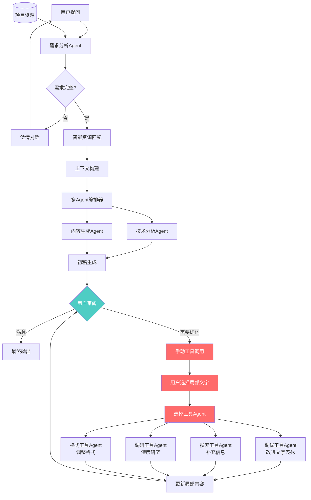
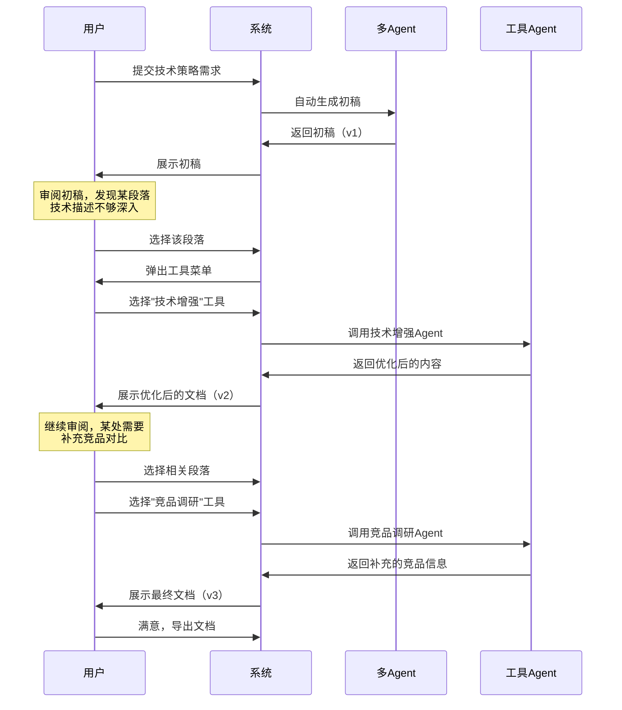

# 多Agent协作系统 + 人机协同优化方案

## 一、方案概述

### 1.1 核心架构（增强版）




### 1.2 人机协作核心特性

**红框部分 - 手动工具调用**：

1. **局部选择**：用户可以选择文档中的任意片段（段落、句子、章节）
2. **工具菜单**：系统提供多种专业工具Agent供用户选择
3. **针对性优化**：工具Agent只针对选中的局部内容进行处理
4. **版本管理**：保留修改历史，支持回退
5. **迭代优化**：用户可以多次调用不同工具进行叠加优化

---

## 二、核心组件设计

### 2.1 人机协作管理器

**文件**: `backend/src/services/agent/HumanInLoopManager.ts`**功能**：

1. 管理生成内容的版本
2. 处理局部内容选择
3. 调用工具Agent进行局部优化
4. 合并优化结果到原文档

**数据结构**：

```typescript
interface ContentVersion {
  versionId: string;
  executionId: string;
  content: string;
  timestamp: Date;
  changeDescription?: string;
  changedBy: 'system' | 'user';
}

interface LocalOptimizationRequest {
  executionId: string;
  versionId: string;
  selectedText: string;
  startPosition: number;      // 选中文本的起始位置
  endPosition: number;        // 选中文本的结束位置
  toolAgentId: string;        // 要调用的工具Agent
  instruction?: string;       // 用户自定义指令
  contextBefore?: string;     // 前文上下文（可选）
  contextAfter?: string;      // 后文上下文（可选）
}

interface LocalOptimizationResult {
  originalText: string;
  optimizedText: string;
  changeDescription: string;
  newVersionId: string;
  fullContent: string;        // 合并后的完整内容
}
```

**实现示例**：

```typescript
class HumanInLoopManager {
  private versionStore: Map<string, ContentVersion[]> = new Map();
  
  constructor(private agentOrchestrator: AgentOrchestrator) {}

  // 保存内容版本
  saveVersion(
    executionId: string,
    content: string,
    changeDescription?: string,
    changedBy: 'system' | 'user' = 'system'
  ): string {
    const versionId = `v-${Date.now()}`;
    const version: ContentVersion = {
      versionId,
      executionId,
      content,
      timestamp: new Date(),
      changeDescription,
      changedBy
    };

    if (!this.versionStore.has(executionId)) {
      this.versionStore.set(executionId, []);
    }
    this.versionStore.get(executionId)!.push(version);

    return versionId;
  }

  // 获取版本历史
  getVersionHistory(executionId: string): ContentVersion[] {
    return this.versionStore.get(executionId) || [];
  }

  // 局部优化
  async optimizeLocalContent(
    request: LocalOptimizationRequest
  ): Promise<LocalOptimizationResult> {
    // 1. 获取当前版本
    const versions = this.getVersionHistory(request.executionId);
    const currentVersion = versions.find(v => v.versionId === request.versionId);
    
    if (!currentVersion) {
      throw new Error('版本不存在');
    }

    // 2. 构建工具Agent的Prompt
    const toolPrompt = this.buildToolPrompt(request);

    // 3. 调用工具Agent
    const result = await this.agentOrchestrator.executeAgent(
      request.toolAgentId,
      toolPrompt,
      { localOptimization: true }
    );

    const optimizedText = result.content;

    // 4. 替换原文中的选中部分
    const fullContent = 
      currentVersion.content.substring(0, request.startPosition) +
      optimizedText +
      currentVersion.content.substring(request.endPosition);

    // 5. 保存新版本
    const newVersionId = this.saveVersion(
      request.executionId,
      fullContent,
      `使用 ${request.toolAgentId} 优化局部内容`,
      'user'
    );

    return {
      originalText: request.selectedText,
      optimizedText,
      changeDescription: result.metadata?.changeDescription || '内容已优化',
      newVersionId,
      fullContent
    };
  }

  // 构建工具Prompt
  private buildToolPrompt(request: LocalOptimizationRequest): string {
    let prompt = '';

    // 添加上下文
    if (request.contextBefore) {
      prompt += `## 前文上下文\n${request.contextBefore}\n\n`;
    }

    prompt += `## 需要优化的内容\n${request.selectedText}\n\n`;

    if (request.contextAfter) {
      prompt += `## 后文上下文\n${request.contextAfter}\n\n`;
    }

    // 添加用户指令
    if (request.instruction) {
      prompt += `## 用户要求\n${request.instruction}\n\n`;
    }

    prompt += `请优化上述选中的内容，保持与上下文的连贯性，直接输出优化后的内容，不要添加额外说明。`;

    return prompt;
  }

  // 回退到指定版本
  async revertToVersion(
    executionId: string,
    versionId: string
  ): Promise<ContentVersion> {
    const versions = this.getVersionHistory(executionId);
    const targetVersion = versions.find(v => v.versionId === versionId);

    if (!targetVersion) {
      throw new Error('版本不存在');
    }

    // 创建一个新的版本（回退版本）
    this.saveVersion(
      executionId,
      targetVersion.content,
      `回退到版本 ${versionId}`,
      'user'
    );

    return targetVersion;
  }
}
```


### 2.2 工具Agent库

**文件**: `backend/src/services/agent/ToolAgents.ts`**工具Agent分类**：

```typescript
interface ToolAgentDefinition {
  id: string;
  name: string;
  description: string;
  category: 'optimize' | 'search' | 'research' | 'format' | 'translate';
  icon: string;
  prompt: string;
  useContext: boolean;
}

const TOOL_AGENTS: ToolAgentDefinition[] = [
  // 1. 优化类工具
  {
    id: 'polish-writer',
    name: '文字润色',
    description: '改进文字表达，使其更加流畅、专业',
    category: 'optimize',
    icon: '✨',
    prompt: `你是一位专业的文案编辑。请优化以下内容的文字表达：
- 使语言更加流畅自然
- 提升专业性和准确性
- 保持原意不变
- 确保与上下文连贯`,
    useContext: true
  },
  {
    id: 'simplify-writer',
    name: '简化表达',
    description: '将复杂的技术内容简化，提高可读性',
    category: 'optimize',
    icon: '📝',
    prompt: `你是一位技术传播专家。请将以下内容简化：
- 去除冗余表达
- 使用通俗易懂的语言
- 保留核心信息
- 适合目标受众理解`,
    useContext: true
  },
  {
    id: 'enhance-technical',
    name: '技术增强',
    description: '增加技术深度，补充技术细节',
    category: 'optimize',
    icon: '🔬',
    prompt: `你是一位技术专家。请增强以下内容的技术深度：
- 补充技术原理
- 添加技术细节
- 提供更专业的描述
- 确保准确性`,
    useContext: true
  },

  // 2. 搜索类工具
  {
    id: 'web-search-supplement',
    name: '互联网搜索补充',
    description: '通过互联网搜索补充相关信息',
    category: 'search',
    icon: '🔍',
    prompt: `你是一位信息检索专家。请为以下内容补充相关信息：
1. 识别内容中需要补充的信息点
2. 模拟搜索相关信息
3. 补充到原文中
4. 标注信息来源`,
    useContext: true
  },
  {
    id: 'competitor-research',
    name: '竞品调研',
    description: '补充竞品对比和市场调研信息',
    category: 'research',
    icon: '📊',
    prompt: `你是一位市场分析师。请为以下内容补充竞品信息：
- 识别相关竞品
- 对比技术特点
- 分析优劣势
- 提供客观评价`,
    useContext: true
  },
  {
    id: 'case-study-finder',
    name: '案例补充',
    description: '为技术点补充应用案例和实践经验',
    category: 'research',
    icon: '💼',
    prompt: `你是一位行业专家。请为以下内容补充应用案例：
- 寻找相关应用场景
- 提供具体案例
- 说明实际效果
- 增强说服力`,
    useContext: true
  },

  // 3. 格式类工具
  {
    id: 'format-structure',
    name: '结构优化',
    description: '优化内容结构和层次',
    category: 'format',
    icon: '📐',
    prompt: `你是一位内容架构师。请优化以下内容的结构：
- 调整层次关系
- 改进逻辑顺序
- 使用恰当的标题
- 增强可读性`,
    useContext: true
  },
  {
    id: 'bullet-points',
    name: '转换为要点',
    description: '将段落内容转换为要点列表',
    category: 'format',
    icon: '📋',
    prompt: `请将以下内容转换为要点列表：
- 提取核心要点
- 使用简洁表达
- 保持逻辑清晰
- 易于快速阅读`,
    useContext: false
  },

  // 4. 翻译类工具（如有需要）
  {
    id: 'translate-en',
    name: '翻译为英文',
    description: '将中文内容翻译为英文',
    category: 'translate',
    icon: '🌐',
    prompt: `请将以下中文内容翻译为专业的英文：
- 保持技术术语准确
- 使用地道表达
- 保留原文结构`,
    useContext: false
  }
];
```


### 2.3 局部内容选择器（前端）

**文件**: `frontend/src/components/LocalContentEditor.tsx`**功能**：

1. 文本选择和高亮
2. 工具菜单弹出
3. 版本对比展示
4. 修改历史管理

**UI组件示例**：

```typescript
interface LocalContentEditorProps {
  executionId: string;
  content: string;
  versionId: string;
  onOptimize: (request: LocalOptimizationRequest) => Promise<void>;
  onRevert: (versionId: string) => Promise<void>;
}

const LocalContentEditor: React.FC<LocalContentEditorProps> = ({
  executionId,
  content,
  versionId,
  onOptimize,
  onRevert
}) => {
  const [selectedText, setSelectedText] = useState('');
  const [selectionRange, setSelectionRange] = useState<{start: number; end: number} | null>(null);
  const [showToolMenu, setShowToolMenu] = useState(false);
  const [menuPosition, setMenuPosition] = useState({ x: 0, y: 0 });
  const [customInstruction, setCustomInstruction] = useState('');
  const [versions, setVersions] = useState<ContentVersion[]>([]);
  const [showVersionHistory, setShowVersionHistory] = useState(false);

  // 处理文本选择
  const handleTextSelection = () => {
    const selection = window.getSelection();
    const text = selection?.toString().trim();

    if (text && text.length > 0) {
      // 计算选中文本的位置
      const range = selection!.getRangeAt(0);
      const preSelectionRange = range.cloneRange();
      preSelectionRange.selectNodeContents(document.getElementById('content-container')!);
      preSelectionRange.setEnd(range.startContainer, range.startOffset);
      const start = preSelectionRange.toString().length;
      const end = start + text.length;

      setSelectedText(text);
      setSelectionRange({ start, end });

      // 显示工具菜单
      const rect = range.getBoundingClientRect();
      setMenuPosition({ x: rect.right + 10, y: rect.top });
      setShowToolMenu(true);
    } else {
      setShowToolMenu(false);
    }
  };

  // 调用工具Agent
  const handleToolSelect = async (toolAgentId: string) => {
    if (!selectionRange) return;

    // 获取上下文
    const contextBefore = content.substring(
      Math.max(0, selectionRange.start - 200),
      selectionRange.start
    );
    const contextAfter = content.substring(
      selectionRange.end,
      Math.min(content.length, selectionRange.end + 200)
    );

    const request: LocalOptimizationRequest = {
      executionId,
      versionId,
      selectedText,
      startPosition: selectionRange.start,
      endPosition: selectionRange.end,
      toolAgentId,
      instruction: customInstruction || undefined,
      contextBefore,
      contextAfter
    };

    await onOptimize(request);
    setShowToolMenu(false);
    setCustomInstruction('');
  };

  return (
    <div className="local-content-editor">
      {/* 内容展示区 */}
      <div
        id="content-container"
        className="content-container"
        onMouseUp={handleTextSelection}
      >
        <ReactMarkdown>{content}</ReactMarkdown>
      </div>

      {/* 工具菜单 */}
      {showToolMenu && (
        <div
          className="tool-menu"
          style={{ left: menuPosition.x, top: menuPosition.y }}
        >
          <div className="tool-menu-header">
            <span>选择优化工具</span>
            <button onClick={() => setShowToolMenu(false)}>✕</button>
          </div>

          {/* 自定义指令 */}
          <div className="custom-instruction">
            <input
              type="text"
              placeholder="自定义优化要求（可选）"
              value={customInstruction}
              onChange={(e) => setCustomInstruction(e.target.value)}
            />
          </div>

          {/* 工具列表 */}
          <div className="tool-list">
            {TOOL_AGENTS.map(tool => (
              <button
                key={tool.id}
                className="tool-button"
                onClick={() => handleToolSelect(tool.id)}
              >
                <span className="tool-icon">{tool.icon}</span>
                <div>
                  <div className="tool-name">{tool.name}</div>
                  <div className="tool-desc">{tool.description}</div>
                </div>
              </button>
            ))}
          </div>
        </div>
      )}

      {/* 版本历史 */}
      <div className="version-controls">
        <button onClick={() => setShowVersionHistory(!showVersionHistory)}>
          <History className="w-4 h-4" />
          查看版本历史
        </button>
      </div>

      {showVersionHistory && (
        <div className="version-history">
          <h3>修改历史</h3>
          {versions.map(version => (
            <div key={version.versionId} className="version-item">
              <div className="version-info">
                <span className="version-time">
                  {version.timestamp.toLocaleString()}
                </span>
                <span className="version-desc">
                  {version.changeDescription}
                </span>
                <span className="version-by">
                  {version.changedBy === 'user' ? '手动' : '自动'}
                </span>
              </div>
              <button onClick={() => onRevert(version.versionId)}>
                回退到此版本
              </button>
            </div>
          ))}
        </div>
      )}
    </div>
  );
};
```

---

## 三、API接口设计

### 3.1 局部内容优化接口

**POST** `/api/v1/agent/optimize-local`**请求体**：

```json
{
  "executionId": "exec-1234567890",
  "versionId": "v-1234567890",
  "selectedText": "这是需要优化的文本片段...",
  "startPosition": 1250,
  "endPosition": 1350,
  "toolAgentId": "polish-writer",
  "instruction": "使用更专业的技术术语",
  "contextBefore": "前文上下文...",
  "contextAfter": "后文上下文..."
}
```

**响应**：

```json
{
  "success": true,
  "data": {
    "originalText": "这是需要优化的文本片段...",
    "optimizedText": "经过优化的文本内容...",
    "changeDescription": "使用polish-writer优化，提升了专业性",
    "newVersionId": "v-1234567891",
    "fullContent": "完整的更新后文档内容...",
    "executionTime": 3000
  }
}
```


### 3.2 获取版本历史接口

**GET** `/api/v1/agent/executions/:executionId/versions`**响应**：

```json
{
  "success": true,
  "data": {
    "executionId": "exec-1234567890",
    "versions": [
      {
        "versionId": "v-1234567890",
        "content": "...",
        "timestamp": "2024-01-01T10:00:00Z",
        "changeDescription": "初始生成",
        "changedBy": "system"
      },
      {
        "versionId": "v-1234567891",
        "content": "...",
        "timestamp": "2024-01-01T10:05:00Z",
        "changeDescription": "用户手动优化局部内容",
        "changedBy": "user"
      }
    ],
    "currentVersionId": "v-1234567891"
  }
}
```


### 3.3 回退版本接口

**POST** `/api/v1/agent/executions/:executionId/revert`

```json
{
  "targetVersionId": "v-1234567890"
}
```


### 3.4 获取可用工具Agent列表

**GET** `/api/v1/agent/tool-agents`**响应**：

```json
{
  "success": true,
  "data": {
    "toolAgents": [
      {
        "id": "polish-writer",
        "name": "文字润色",
        "description": "改进文字表达，使其更加流畅、专业",
        "category": "optimize",
        "icon": "✨"
      },
      {
        "id": "web-search-supplement",
        "name": "互联网搜索补充",
        "description": "通过互联网搜索补充相关信息",
        "category": "search",
        "icon": "🔍"
      }
      // ... 更多工具
    ]
  }
}
```

---

## 四、数据库设计（扩展）

### 4.1 内容版本表

```sql
CREATE TABLE IF NOT EXISTS content_versions (
    id TEXT PRIMARY KEY,
    execution_id TEXT NOT NULL,
    version_id TEXT NOT NULL,
    content TEXT NOT NULL,
    change_description TEXT,
    changed_by TEXT NOT NULL,          -- 'system' or 'user'
    created_at TIMESTAMP DEFAULT CURRENT_TIMESTAMP,
    
    FOREIGN KEY (execution_id) REFERENCES multi_agent_executions(id),
    UNIQUE(execution_id, version_id)
);

CREATE INDEX idx_content_versions_execution ON content_versions(execution_id);
CREATE INDEX idx_content_versions_created ON content_versions(created_at DESC);
```


### 4.2 局部优化记录表

```sql
CREATE TABLE IF NOT EXISTS local_optimizations (
    id TEXT PRIMARY KEY,
    execution_id TEXT NOT NULL,
    version_id TEXT NOT NULL,
    selected_text TEXT NOT NULL,
    start_position INTEGER NOT NULL,
    end_position INTEGER NOT NULL,
    tool_agent_id TEXT NOT NULL,
    custom_instruction TEXT,
    optimized_text TEXT NOT NULL,
    change_description TEXT,
    execution_time_ms INTEGER,
    created_at TIMESTAMP DEFAULT CURRENT_TIMESTAMP,
    
    FOREIGN KEY (execution_id) REFERENCES multi_agent_executions(id)
);

CREATE INDEX idx_local_opt_execution ON local_optimizations(execution_id);
CREATE INDEX idx_local_opt_tool ON local_optimizations(tool_agent_id);
```

---

## 五、实施路线图（更新）

### Phase 1-3: 基础多Agent系统（5周）

（保持原计划不变）

### Phase 4: 人机协作基础（1.5周）

**任务**：

- [ ] 实现`HumanInLoopManager`类
- [ ] 实现版本管理功能
- [ ] 创建工具Agent库配置
- [ ] 实现局部内容优化API
- [ ] 创建数据库表

**验收标准**：

- 版本管理正常工作
- 局部优化API调用成功
- 工具Agent调用准确

### Phase 5: 前端人机交互（1.5周）

**任务**：

- [ ] 实现`LocalContentEditor`组件
- [ ] 实现文本选择和高亮
- [ ] 实现工具菜单UI
- [ ] 实现版本历史展示
- [ ] 实现版本对比功能

**验收标准**：

- 用户可以流畅选择文本
- 工具菜单正确弹出
- 版本历史清晰展示
- 回退功能正常

### Phase 6: 工具Agent扩展（1周）

**任务**：

- [ ] 配置10+个工具Agent
- [ ] 实现搜索类工具（接入搜索API）
- [ ] 实现调研类工具
- [ ] 优化工具Prompt
- [ ] 测试各工具效果

**验收标准**：

- 至少10个可用工具
- 各工具效果达标
- 响应时间<5秒

### Phase 7: 业务场景集成（1周）

**任务**：

- [ ] 在技术策略场景中集成人机协作
- [ ] 在技术通稿场景中集成人机协作
- [ ] 用户培训和文档
- [ ] 性能优化
- [ ] 上线测试

**验收标准**：

- 完整的人机协作流程
- 用户满意度>90%
- 工具使用率>60%

---

## 六、典型使用场景

### 6.1 技术策略生成 + 人工精修




### 6.2 实际操作流程

**步骤1：系统自动生成初稿**

```javascript
用户：帮我生成XX项目的技术策略

系统：
[自动执行多Agent流程]
- 需求分析 → 资源匹配 → 上下文构建
- 技术分析Agent → 策略规划Agent → 内容生成Agent
- 质量检查 → 生成初稿（v1）

展示：初稿内容（5000字）
```

**步骤2：用户手动精修**

```javascript
用户选择第3段落（200字）："关于XX技术的介绍太简单了"

工具菜单弹出：
✨ 文字润色
🔬 技术增强  ← 用户选择
📝 简化表达
🔍 互联网搜索补充
📊 竞品调研

用户点击"技术增强" + 输入自定义要求："增加技术原理说明"

系统：
[调用技术增强Agent]
- 读取选中的200字
- 读取前后文上下文
- 基于用户要求生成增强版本
- 替换原文，生成新版本（v2）

展示：更新后的文档，高亮显示修改部分
```

**步骤3：继续优化**

```javascript
用户选择第6段落："需要补充竞品对比"

用户选择"竞品调研"工具

系统：
[调用竞品调研Agent]
- 识别竞品
- 补充对比信息
- 生成新版本（v3）

最终文档生成，用户满意
```

---

## 七、成本与收益

### 7.1 开发成本（增量）

| 阶段 | 工时 | 周期 ||------|------|------|| Phase 4: 人机协作基础 | 60h | 1.5周 || Phase 5: 前端人机交互 | 60h | 1.5周 || Phase 6: 工具Agent扩展 | 40h | 1周 || Phase 7: 业务场景集成 | 40h | 1周 || **增量总计** | **200h** | **5周** || **总成本（含基础）** | **520h** | **13周** |

### 7.2 运营成本

**Token消耗（增量）**：

- 局部优化：约1500 tokens/次
- 平均每个文档手动优化3次
- 增量成本：约4500 tokens/文档

### 7.3 业务收益

**量化指标**：

1. **用户满意度**：提升至95%+（可以自主掌控结果）
2. **内容质量**：最终质量提升至90分+（人工精修）
3. **灵活性**：支持个性化需求100%
4. **人工介入时间**：减少80%（精准优化，无需全文重写）

**定性价值**：

- **用户掌控感**：用户可以随时介入调整
- **专业性**：工具Agent提供专业支持
- **效率提升**：针对性优化，比全文重写快10倍
- **学习价值**：用户通过工具学习优化技巧

---

## 八、技术亮点

### 8.1 精准的局部优化

- **上下文感知**：工具Agent能看到前后文，保持连贯性
- **原地替换**：优化后的内容无缝融入原文
- **版本管理**：随时回退，不怕改坏

### 8.2 丰富的工具生态

- **多类别工具**：优化、搜索、调研、格式、翻译
- **可扩展**：易于添加新工具Agent
- **智能推荐**：根据选中内容推荐合适工具（未来）

### 8.3 人机协作最佳实践

- **AI初稿 + 人工精修**：发挥各自优势
- **迭代优化**：多次小步优化，逐步完善
- **透明可控**：所有修改可追溯、可回退

---

## 九、总结

本方案在基础多Agent协作系统上，增加了**人机协作（Human-in-the-loop）**能力：**核心特性**：

1. **局部选择优化**：用户可选择任意文本片段进行针对性优化
2. **丰富的工具Agent**：10+种专业工具，覆盖优化、搜索、调研、格式等
3. **版本管理**：完整的修改历史，支持回退
4. **上下文感知**：工具Agent能理解前后文，保持连贯性
5. **灵活可控**：用户完全掌控优化过程

**适用场景**：

- 技术策略、技术通稿等需要高质量和个性化的内容生成
- 用户对最终输出有明确要求和审美偏好