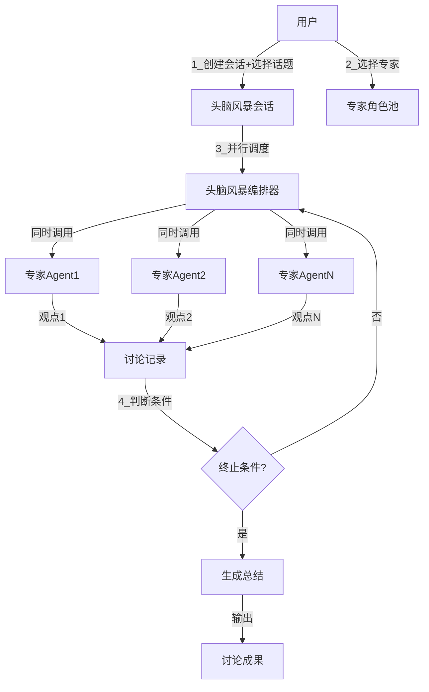
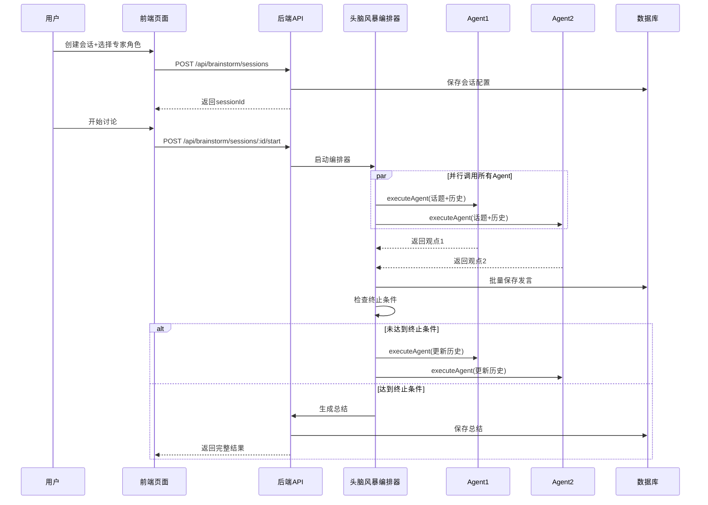

# 头脑风暴群聊功能实现规划

## 一、架构设计

### 1.1 核心机制

采用**并行 Agent 协作**模式：




### 1.2 数据流转




## 二、数据库设计

### 2.1 新增数据表

#### 表1: `brainstorm_sessions` (头脑风暴会话表)

| 字段 | 类型 | 说明 ||------|------|------|| id | TEXT PRIMARY KEY | 会话ID (UUID) || title | TEXT | 会话标题 || topic | TEXT | 讨论话题 || description | TEXT | 话题描述 || creator_id | TEXT | 创建者ID || status | TEXT | 状态: draft/active/completed/stopped || config | TEXT | JSON配置（终止条件等） || summary | TEXT | AI生成的讨论总结 || created_at | DATETIME | 创建时间 || updated_at | DATETIME | 更新时间 || completed_at | DATETIME | 完成时间 |

#### 表2: `brainstorm_participants` (参与者表)

| 字段 | 类型 | 说明 ||------|------|------|| id | INTEGER PRIMARY KEY | 自增ID || session_id | TEXT | 会话ID (外键) || ai_role_id | TEXT | AI角色ID (外键) || display_name | TEXT | 显示名称 || role_type | TEXT | 角色类型（专家领域） || sort_order | INTEGER | 排序 || created_at | DATETIME | 加入时间 |

#### 表3: `brainstorm_messages` (讨论消息表)

| 字段 | 类型 | 说明 ||------|------|------|| id | TEXT PRIMARY KEY | 消息ID (UUID) || session_id | TEXT | 会话ID (外键) || participant_id | INTEGER | 参与者ID (外键) || round_number | INTEGER | 发言轮次 || content | TEXT | 发言内容 || reply_to_id | TEXT | 回复的消息ID || metadata | TEXT | JSON元数据（token使用等） || created_at | DATETIME | 发言时间 |

### 2.2 配置结构 (JSON)

**`brainstorm_sessions.config` 结构**:

```typescript
{
  stopConditions: {
    manualStop: boolean,        // 支持手动停止
    maxRounds: number | null,   // 最大轮次
    consensusDetection: boolean // 共识检测
  },
  discussionMode: 'parallel',   // 讨论模式：并行
  summaryConfig: {
    enabled: boolean,
    provider: 'same-as-agents' | 'custom'
  }
}
```


## 三、后端实现

### 3.1 核心服务

#### 1. BrainstormOrchestrator（头脑风暴编排器）

**位置**: `backend/src/services/brainstorm/BrainstormOrchestrator.ts`**职责**:

- 并行调度多个 Agent 执行
- 构建每个 Agent 的上下文（包含其他 Agent 的历史发言）
- 判断终止条件
- 生成讨论总结

**核心方法**:

```typescript
class BrainstormOrchestrator {
  // 启动讨论
  async startSession(sessionId: string): Promise<void>
  
  // 执行一轮讨论
  async executeRound(sessionId: string, roundNumber: number): Promise<Message[]>
  
  // 判断是否应该停止
  async shouldStop(sessionId: string): Promise<{ stop: boolean; reason?: string }>
  
  // 生成总结
  async generateSummary(sessionId: string): Promise<string>
}
```

**实现要点**:

- 使用 `Promise.all()` 并行调用所有参与者的 Agent
- 每个 Agent 的 context 包含：话题描述 + 历史发言记录
- 复用现有的 [`AgentOrchestrator`](backend/src/services/agent/AgentOrchestrator.ts)

#### 2. BrainstormService（业务服务层）

**位置**: `backend/src/services/brainstorm/BrainstormService.ts`**职责**:

- 会话 CRUD 操作
- 参与者管理
- 消息保存和查询

### 3.2 数据模型

**位置**: `backend/src/models/Brainstorm.ts`定义三个模型类：

- `BrainstormSessionModel`
- `BrainstormParticipantModel`
- `BrainstormMessageModel`

### 3.3 API 路由

**位置**: `backend/src/routes/brainstorm.ts`| 端点 | 方法 | 说明 ||------|------|------|| `/api/v1/brainstorm/sessions` | POST | 创建会话 || `/api/v1/brainstorm/sessions` | GET | 列表查询 || `/api/v1/brainstorm/sessions/:id` | GET | 获取详情 || `/api/v1/brainstorm/sessions/:id` | PATCH | 更新配置 || `/api/v1/brainstorm/sessions/:id/participants` | POST | 添加参与者 || `/api/v1/brainstorm/sessions/:id/start` | POST | 启动讨论 || `/api/v1/brainstorm/sessions/:id/stop` | POST | 停止讨论 || `/api/v1/brainstorm/sessions/:id/messages` | GET | 获取消息 || `/api/v1/brainstorm/sessions/:id/summary` | GET | 获取总结 |

### 3.4 数据库迁移脚本

**位置**: `backend/src/scripts/create-brainstorm-tables.sql`包含三个表的 CREATE TABLE 语句和索引。

## 四、前端实现

### 4.1 核心页面

#### BrainstormPage（头脑风暴主页面）

**位置**: `frontend/src/pages/BrainstormPage.tsx`**UI 结构**:

```javascript
┌─────────────────────────────────────────┐
│  [返回] 头脑风暴工作室         [新建会话] │
├─────────────────────────────────────────┤
│ 会话列表 │     当前会话内容区            │
│         │                              │
│ [会话1] │  📋 话题：XXX                 │
│ [会话2] │  👥 参与专家：A, B, C         │
│ [会话3] │                              │
│         │  ┌─────────────────────────┐ │
│         │  │ [专家A] 我认为...        │ │
│         │  │ [专家B] 我补充一下...    │ │
│         │  │ [专家C] 从另一个角度... │ │
│         │  └─────────────────────────┘ │
│         │                              │
│         │  [开始讨论] [停止] [导出]    │
└─────────────────────────────────────────┘
```

**状态管理**:

- 使用 Zustand 管理会话状态
- 支持轮询获取讨论进度（长时间任务）

#### BrainstormSetupModal（会话配置弹窗）

**位置**: `frontend/src/components/brainstorm/BrainstormSetupModal.tsx`**表单字段**:

1. 会话标题
2. 讨论话题
3. 话题描述
4. 选择参与专家（从 AI 角色库多选）
5. 终止条件配置：

- 最大轮次
- 是否启用共识检测

### 4.2 核心组件

#### BrainstormMessageList（消息列表组件）

**位置**: `frontend/src/components/brainstorm/BrainstormMessageList.tsx`**功能**:

- 按轮次分组显示消息
- 区分不同专家的发言（头像+名称）
- 支持展开/折叠某一轮的讨论

#### BrainstormSummary（总结组件）

**位置**: `frontend/src/components/brainstorm/BrainstormSummary.tsx`**功能**:

- 显示 AI 生成的讨论总结
- 支持复制和导出
- 显示关键观点提取

### 4.3 服务层

**位置**: `frontend/src/services/brainstormService.ts`封装所有后端 API 调用：

```typescript
export const brainstormService = {
  createSession(data: CreateSessionDTO): Promise<Session>,
  listSessions(): Promise<Session[]>,
  getSession(id: string): Promise<SessionDetail>,
  startSession(id: string): Promise<void>,
  stopSession(id: string): Promise<void>,
  getMessages(id: string): Promise<Message[]>,
  getSummary(id: string): Promise<Summary>
}
```


## 五、关键技术要点

### 5.1 并行执行与上下文构建

每个 Agent 调用时的 Prompt 结构：

```javascript
系统角色：你是[专家领域]专家
讨论话题：[话题标题和描述]

历史讨论记录：
[轮次1]
- 专家A: xxx
- 专家B: xxx

[轮次2]
- 专家A: xxx
- 专家B: xxx

请从你的专业角度发表观点，可以：
1. 提出新的见解
2. 补充其他专家的观点
3. 指出潜在问题
4. 提供具体建议
```


### 5.2 终止条件判断

**轮次限制**: 简单计数判断**共识检测** (可选，V2 实现):

- 使用一个额外的 LLM 调用分析讨论内容
- 判断是否已经形成共识或话题已充分讨论

### 5.3 总结生成

使用专门的 Summarizer Agent：

- 输入：完整的讨论记录
- 输出：
- 核心观点汇总
- 各方共识
- 分歧点（如有）
- 建议结论

### 5.4 性能优化

**并发控制**:

- 使用 `Promise.allSettled()` 避免单个 Agent 失败导致整体失败
- 设置超时机制（单个 Agent 6分钟，整轮讨论 10分钟）

**增量更新**:

- 前端轮询获取新消息（每 3 秒）
- 后端支持增量查询（根据 `after_message_id` 参数）

## 六、实现步骤

### 阶段一：后端基础设施 (2-3h)

1. 创建数据库表结构和迁移脚本
2. 实现数据模型（`Brainstorm.ts`）
3. 实现基础服务（`BrainstormService.ts`）
4. 实现 API 路由（CRUD 操作）

### 阶段二：核心编排逻辑 (3-4h)

1. 实现 `BrainstormOrchestrator` 核心调度逻辑
2. 实现并行 Agent 调用
3. 实现终止条件判断
4. 实现总结生成

### 阶段三：前端页面开发 (4-5h)

1. 实现会话列表和创建流程
2. 实现专家选择器（复用 AI 角色库）
3. 实现消息展示组件
4. 实现讨论控制（启动/停止）
5. 实现总结展示和导出

### 阶段四：集成测试与优化 (2h)

1. 端到端功能测试
2. 性能优化（并发、超时处理）
3. UI/UX 调优

## 七、文件清单

### 后端新增文件

- `backend/src/models/Brainstorm.ts` - 数据模型
- `backend/src/services/brainstorm/BrainstormOrchestrator.ts` - 核心编排器
- `backend/src/services/brainstorm/BrainstormService.ts` - 业务服务
- `backend/src/routes/brainstorm.ts` - API 路由
- `backend/src/scripts/create-brainstorm-tables.sql` - 数据库迁移

### 前端新增文件

- `frontend/src/pages/BrainstormPage.tsx` - 主页面
- `frontend/src/components/brainstorm/BrainstormSetupModal.tsx` - 配置弹窗
- `frontend/src/components/brainstorm/BrainstormMessageList.tsx` - 消息列表
- `frontend/src/components/brainstorm/BrainstormSummary.tsx` - 总结组件
- `frontend/src/components/brainstorm/ExpertSelector.tsx` - 专家选择器
- `frontend/src/services/brainstormService.ts` - API 服务封装
- `frontend/src/types/brainstorm.ts` - TypeScript 类型定义

### 复用现有文件

- [`backend/src/services/agent/AgentOrchestrator.ts`](backend/src/services/agent/AgentOrchestrator.ts) - 复用 Agent 执行逻辑
- [`backend/src/models/AIRole.ts`](backend/src/models/AIRole.ts) - 复用 AI 角色定义
- `frontend/src/services/aiRoleService.ts` - 复用角色查询接口

## 八、扩展性考虑

### 未来可扩展功能

1. **轮流发言模式**: 在配置中支持切换讨论模式
2. **主持人模式**: 添加一个主持人 Agent 协调发言顺序
3. **用户参与**: 允许用户在讨论中插入观点
4. **反应式讨论**: Agent 可以针对特定消息回复（通过 `reply_to_id`）
5. **多话题分支**: 一个会话内可以衍生出多个子话题讨论