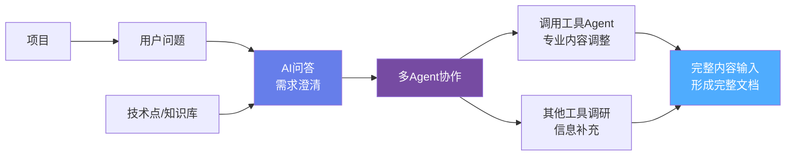
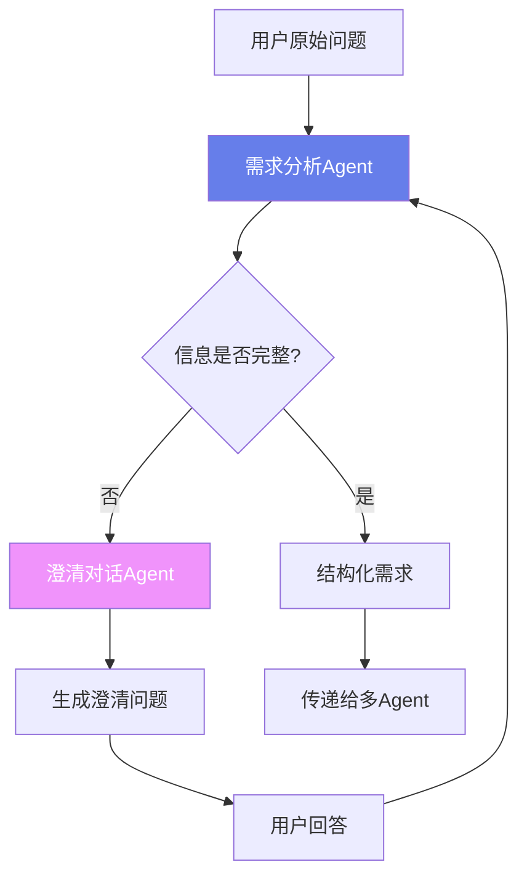
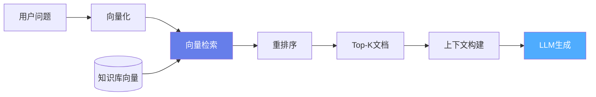
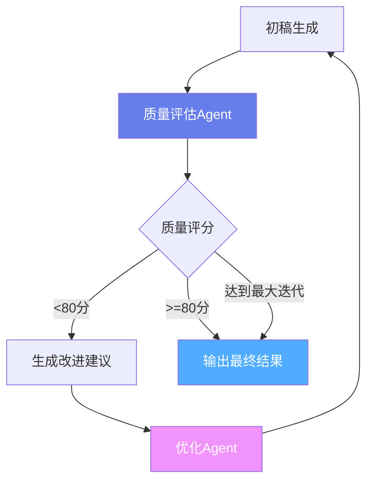
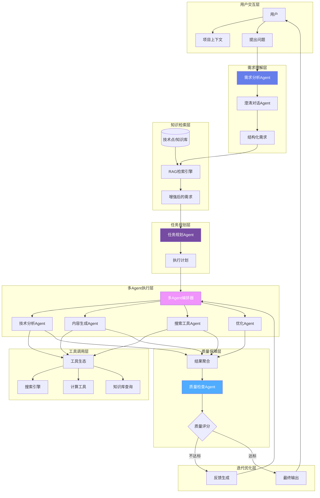

# 系统架构全面优化方案

## 架构图分析

根据提供的流程图，系统包含以下关键环节：




## 一、核心优化方向

### 1.1 需求澄清与理解增强

**问题**：用户问题往往不够清晰和完整**解决方案**：构建智能需求澄清Agent



**实现要点**：

- 需求完整性检查（缺少项目背景、技术细节、目标受众等）
- 多轮对话澄清
- 结构化需求提取

### 1.2 知识库RAG集成

**问题**：需要关联项目相关的技术点和知识库**解决方案**：构建RAG（检索增强生成）系统



**实现要点**：

- 技术点向量化存储
- 语义检索
- 上下文注入到Agent

### 1.3 工具Agent生态

**问题**：需要各类专业工具支持内容生成和优化**解决方案**：构建丰富的工具Agent生态**工具Agent分类**：| 类型 | Agent名称 | 功能 | 优先级 ||------|-----------|------|--------|| 信息获取 | 搜索Agent | 互联网搜索、竞品分析 | 高 || 信息获取 | 知识库Agent | 项目知识库检索 | 高 || 内容处理 | 分析Agent | 技术分析、要点提取 | 高 || 内容处理 | 写作Agent | 内容生成、文档撰写 | 高 || 内容处理 | 优化Agent | 内容优化、润色 | 中 || 质量保障 | 检查Agent | 质量检查、格式验证 | 高 || 质量保障 | 评分Agent | 内容评分、改进建议 | 中 |

### 1.4 迭代优化机制

**问题**：需要基于反馈持续优化内容**解决方案**：构建自我反思和迭代优化循环



---

## 二、完整架构设计

### 2.1 整体架构图




### 2.2 核心组件

#### 组件1: 需求分析与澄清系统

**文件**: `backend/src/services/agent/RequirementAnalyzer.ts`

```typescript
interface RequirementAnalysis {
  completeness: number;        // 完整性评分 0-100
  missingInfo: string[];       // 缺失的信息
  clarificationQuestions: string[];  // 澄清问题
  structuredRequirement: {
    projectContext?: string;
    technicalDetails?: string;
    targetAudience?: string;
    outputFormat?: string;
  };
}

class RequirementAnalyzer {
  // 分析需求完整性
  async analyzeRequirement(userQuestion: string): Promise<RequirementAnalysis>;
  
  // 生成澄清问题
  async generateClarificationQuestions(
    analysis: RequirementAnalysis
  ): Promise<string[]>;
  
  // 结构化需求
  async structureRequirement(
    userQuestion: string,
    clarificationAnswers: Record<string, string>
  ): Promise<StructuredRequirement>;
}
```

**使用场景**：

```typescript
// 用户问题："帮我生成技术策略"
const analysis = await requirementAnalyzer.analyzeRequirement(userQuestion);
// 结果：completeness=30, missingInfo=["项目背景", "技术特点", "目标受众"]

// 生成澄清问题
const questions = await requirementAnalyzer.generateClarificationQuestions(analysis);
// ["请问这个项目的技术特点是什么？", "目标受众是谁？", ...]

// 用户回答后，结构化需求
const structured = await requirementAnalyzer.structureRequirement(
  userQuestion,
  { "技术特点": "...", "目标受众": "..." }
);
```


#### 组件2: RAG知识库集成

**文件**: `backend/src/services/knowledge/RAGEngine.ts`

```typescript
interface RAGConfig {
  embeddingModel: string;
  vectorDB: 'chroma' | 'pinecone' | 'milvus';
  topK: number;
  similarityThreshold: number;
}

interface RetrievalResult {
  documents: {
    id: string;
    content: string;
    metadata: any;
    score: number;
  }[];
  context: string;  // 拼接后的上下文
}

class RAGEngine {
  // 向量化查询
  async vectorizeQuery(query: string): Promise<number[]>;
  
  // 检索相关文档
  async retrieve(
    query: string,
    filters?: Record<string, any>
  ): Promise<RetrievalResult>;
  
  // 构建上下文
  buildContext(documents: Document[]): string;
  
  // 增强查询（添加上下文）
  async enhanceQuery(
    originalQuery: string,
    projectId?: string
  ): Promise<EnhancedQuery>;
}
```

**集成到Agent**：

```typescript
class EnhancedAgentOrchestrator extends AgentOrchestrator {
  constructor(
    private ragEngine: RAGEngine
  ) {
    super();
  }
  
  async executeAgent(roleId: string, query: string, context: any) {
    // 1. RAG检索相关知识
    const ragResult = await this.ragEngine.retrieve(query, {
      projectId: context.projectId
    });
    
    // 2. 增强上下文
    const enhancedContext = {
      ...context,
      knowledgeBase: ragResult.context,
      relatedDocs: ragResult.documents
    };
    
    // 3. 执行Agent
    return super.executeAgent(roleId, query, enhancedContext);
  }
}
```


#### 组件3: 质量评估与迭代优化

**文件**: `backend/src/services/agent/QualityAssurance.ts`

```typescript
interface QualityScore {
  overall: number;              // 总分 0-100
  dimensions: {
    completeness: number;       // 完整性
    accuracy: number;           // 准确性
    coherence: number;          // 连贯性
    professionalism: number;    // 专业性
  };
  feedback: string;             // 改进建议
  passThreshold: boolean;       // 是否达标
}

class QualityAssuranceAgent {
  private readonly PASS_THRESHOLD = 80;
  private readonly MAX_ITERATIONS = 3;
  
  // 评估内容质量
  async evaluateQuality(
    content: string,
    requirement: StructuredRequirement
  ): Promise<QualityScore>;
  
  // 生成改进建议
  async generateFeedback(
    content: string,
    qualityScore: QualityScore
  ): Promise<string>;
  
  // 迭代优化流程
  async iterativeOptimization(
    initialContent: string,
    requirement: StructuredRequirement,
    optimizeAgent: AgentOrchestrator
  ): Promise<{ content: string; iterations: number; finalScore: QualityScore }>;
}
```

**迭代优化实现**：

```typescript
async iterativeOptimization(
  initialContent: string,
  requirement: StructuredRequirement,
  optimizeAgent: AgentOrchestrator
): Promise<IterationResult> {
  let content = initialContent;
  let iteration = 0;
  
  while (iteration < this.MAX_ITERATIONS) {
    // 评估质量
    const score = await this.evaluateQuality(content, requirement);
    
    // 如果达标，返回
    if (score.passThreshold) {
      return { content, iterations: iteration, finalScore: score };
    }
    
    // 生成改进建议
    const feedback = await this.generateFeedback(content, score);
    
    // 调用优化Agent
    const optimized = await optimizeAgent.executeAgent(
      'content-optimizer',
      `请根据以下反馈优化内容：\n${feedback}\n\n原内容：\n${content}`,
      { requirement }
    );
    
    content = optimized.content;
    iteration++;
  }
  
  // 达到最大迭代次数，返回当前结果
  const finalScore = await this.evaluateQuality(content, requirement);
  return { content, iterations: iteration, finalScore };
}
```

---

## 三、实施方案

### 3.1 Phase 1: 需求理解增强（2周）

**目标**：实现智能需求澄清和结构化**任务**：

- [ ] 实现`RequirementAnalyzer`类
- [ ] 设计需求完整性检查规则
- [ ] 实现多轮澄清对话
- [ ] 创建需求模板库
- [ ] 前端增加澄清对话UI

**验收标准**：

- 能识别需求中的缺失信息
- 自动生成3-5个澄清问题
- 完整性评分准确率>80%

**业务价值**：

- 减少需求理解偏差50%
- 提升首次生成质量30%

### 3.2 Phase 2: 知识库RAG集成（2周）

**目标**：接入项目知识库，提供上下文增强**任务**：

- [ ] 搭建向量数据库（Chroma/Milvus）
- [ ] 实现文档向量化和索引
- [ ] 实现`RAGEngine`类
- [ ] 集成到现有`AgentOrchestrator`
- [ ] 添加知识库管理API

**验收标准**：

- 向量检索召回率>90%
- 检索延迟<500ms
- 上下文相关性提升40%

**业务价值**：

- Agent能访问项目历史知识
- 生成内容更贴合项目实际

### 3.3 Phase 3: 工具Agent生态（2周）

**目标**：扩展工具Agent，完善搜索和专业工具**任务**：

- [ ] 实现搜索工具Agent（基于搜索引擎API）
- [ ] 实现知识库查询Agent
- [ ] 完善计算工具Agent
- [ ] 实现Agent工具（嵌套调用）
- [ ] 创建工具注册和发现机制

**验收标准**：

- 至少实现4类工具Agent
- 工具调用成功率>95%
- 支持工具结果缓存

**业务价值**：

- 信息获取能力提升60%
- 支持更复杂的任务处理

### 3.4 Phase 4: 多Agent协作优化（3周）

**目标**：实现完整的多Agent协作和迭代优化**任务**：

- [ ] 优化`MultiAgentOrchestrator`
- [ ] 实现任务规划Agent
- [ ] 实现结果聚合策略
- [ ] 实现`QualityAssuranceAgent`
- [ ] 实现迭代优化流程
- [ ] 添加执行追踪和可视化

**验收标准**：

- 支持3种执行模式（顺序/并行/分层）
- 质量评分准确率>85%
- 迭代优化平均提升15-20分

**业务价值**：

- 内容质量稳定性大幅提升
- 自动化优化减少人工介入

### 3.5 Phase 5: 业务场景落地（2周）

**目标**：在核心业务场景中验证完整流程**任务**：

- [ ] 配置技术策略生成完整流程
- [ ] 配置技术通稿生成完整流程
- [ ] 配置技术发布会稿生成流程
- [ ] 前端集成完整流程UI
- [ ] 性能和成本优化

**验收标准**：

- 3个核心场景完整可用
- 端到端成功率>90%
- 用户满意度>85%

**业务价值**：

- 完整的产品化能力
- 可量化的业务价值

---

## 四、技术架构细化

### 4.1 数据库扩展

```sql
-- 需求澄清记录表
CREATE TABLE IF NOT EXISTS requirement_clarifications (
    id TEXT PRIMARY KEY,
    user_question TEXT NOT NULL,
    completeness_score REAL,
    missing_info TEXT,              -- JSON数组
    clarification_qa TEXT,          -- JSON对象，问答对
    structured_requirement TEXT,    -- JSON对象
    created_at TIMESTAMP DEFAULT CURRENT_TIMESTAMP
);

-- 知识库文档表
CREATE TABLE IF NOT EXISTS knowledge_documents (
    id TEXT PRIMARY KEY,
    project_id TEXT,
    title TEXT NOT NULL,
    content TEXT NOT NULL,
    embedding BLOB,                 -- 向量嵌入
    metadata TEXT,                  -- JSON
    created_at TIMESTAMP DEFAULT CURRENT_TIMESTAMP,
    updated_at TIMESTAMP
);

-- RAG检索记录表
CREATE TABLE IF NOT EXISTS rag_retrievals (
    id TEXT PRIMARY KEY,
    query TEXT NOT NULL,
    project_id TEXT,
    retrieved_docs TEXT,            -- JSON数组
    context_used TEXT,
    created_at TIMESTAMP DEFAULT CURRENT_TIMESTAMP
);

-- 质量评估记录表
CREATE TABLE IF NOT EXISTS quality_evaluations (
    id TEXT PRIMARY KEY,
    execution_id TEXT NOT NULL,
    iteration INTEGER NOT NULL,
    content TEXT NOT NULL,
    overall_score REAL,
    dimension_scores TEXT,          -- JSON对象
    feedback TEXT,
    pass_threshold INTEGER,         -- 0或1
    created_at TIMESTAMP DEFAULT CURRENT_TIMESTAMP,
    
    FOREIGN KEY (execution_id) REFERENCES multi_agent_executions(id)
);

CREATE INDEX idx_knowledge_project ON knowledge_documents(project_id);
CREATE INDEX idx_rag_query ON rag_retrievals(query);
CREATE INDEX idx_quality_execution ON quality_evaluations(execution_id);
```


### 4.2 API接口设计

#### 接口1: 需求澄清

**POST** `/api/v1/requirement/analyze`

```json
{
  "userQuestion": "帮我生成技术策略",
  "projectId": "proj-123"
}
```

**响应**：

```json
{
  "analysis": {
    "completeness": 30,
    "missingInfo": ["技术特点", "目标受众", "核心卖点"],
    "clarificationQuestions": [
      "请问这个项目的核心技术特点是什么？",
      "目标受众是企业客户还是个人用户？",
      "希望强调哪些核心卖点？"
    ]
  },
  "sessionId": "clarify-xxx"
}
```


#### 接口2: 提交澄清答案

**POST** `/api/v1/requirement/clarify`

```json
{
  "sessionId": "clarify-xxx",
  "answers": {
    "技术特点": "基于AI的智能推荐系统",
    "目标受众": "企业客户",
    "核心卖点": "精准推荐、降本增效"
  }
}
```

**响应**：

```json
{
  "structuredRequirement": {
    "projectContext": "...",
    "technicalDetails": "基于AI的智能推荐系统",
    "targetAudience": "企业客户",
    "coreValue": "精准推荐、降本增效"
  },
  "readyForExecution": true
}
```


#### 接口3: 执行完整流程

**POST** `/api/v1/agent/execute-full-pipeline`

```json
{
  "requirement": { ... },
  "agentIds": ["tech-analyzer", "content-writer", "quality-checker"],
  "enableRAG": true,
  "enableIteration": true,
  "maxIterations": 3,
  "qualityThreshold": 80
}
```

**响应**：

```json
{
  "executionId": "exec-xxx",
  "finalContent": "...",
  "qualityScore": {
    "overall": 85,
    "dimensions": { ... }
  },
  "iterations": 2,
  "ragContext": "...",
  "intermediateResults": [ ... ]
}
```

---

## 五、流程示例

### 5.1 完整执行流程

```typescript
// 1. 用户提交问题
const userQuestion = "帮我生成一份技术策略文档";

// 2. 需求分析
const analysis = await requirementAnalyzer.analyzeRequirement(userQuestion);

// 3. 如果不完整，进行澄清
if (analysis.completeness < 70) {
  const questions = await requirementAnalyzer.generateClarificationQuestions(analysis);
  // 展示给用户，等待回答
  const answers = await getUserAnswers(questions);
  
  // 结构化需求
  const structured = await requirementAnalyzer.structureRequirement(
    userQuestion,
    answers
  );
} else {
  const structured = analysis.structuredRequirement;
}

// 4. RAG检索相关知识
const ragResult = await ragEngine.retrieve(structured.query, {
  projectId: structured.projectId
});

// 5. 生成执行计划
const plan = await taskPlanner.generatePlan(
  structured,
  ragResult.context
);

// 6. 多Agent执行
const agentResults = await multiAgentOrchestrator.executePlan(plan);

// 7. 质量评估
const qualityScore = await qualityAssurance.evaluateQuality(
  agentResults.content,
  structured
);

// 8. 如果不达标，迭代优化
if (!qualityScore.passThreshold) {
  const optimized = await qualityAssurance.iterativeOptimization(
    agentResults.content,
    structured,
    optimizerAgent
  );
  return optimized;
}

// 9. 返回最终结果
return agentResults;
```

---

## 六、关键技术选型

### 6.1 向量数据库

**推荐方案**: Chroma（初期）→ Milvus（生产）**理由**：

- Chroma：轻量级，易于集成，适合快速开发
- Milvus：高性能，生产级，适合大规模部署

### 6.2 嵌入模型

**推荐方案**:

- 中文：`text-embedding-ada-002` (OpenAI) 或 `bge-large-zh` (开源)
- 英文：`text-embedding-ada-002`

### 6.3 搜索引擎

**推荐方案**:

- SerpAPI（Google搜索API）
- 必应搜索API
- 自建爬虫（备选）

---

## 七、成本与收益

### 7.1 开发成本

| 阶段 | 工时 | 周期 ||------|------|------|| Phase 1: 需求理解 | 80h | 2周 || Phase 2: RAG集成 | 80h | 2周 || Phase 3: 工具生态 | 80h | 2周 || Phase 4: 多Agent协作 | 120h | 3周 || Phase 5: 业务落地 | 80h | 2周 || **总计** | **440h** | **11周** |

### 7.2 运营成本增加

- 向量数据库：$50-200/月（Chroma免费，Milvus云服务收费）
- 搜索API：$100-300/月（按调用量）
- Token消耗：增加30-50%（RAG上下文、迭代优化）

### 7.3 业务收益

**量化指标**：

1. **首次生成质量**：提升40-60%（需求澄清+RAG）
2. **最终输出质量**：提升60-80%（迭代优化）
3. **需求理解偏差**：减少50%
4. **人工修改时间**：减少70%

**投资回报**：

- 11周开发投入
- 质量和效率显著提升
- 6个月内收回成本

---

## 八、风险与应对

### 8.1 技术风险

1. **RAG检索效果不佳**

- 风险：知识库不够完善，检索召回率低
- 应对：持续完善知识库，优化检索策略

2. **迭代优化陷入死循环**

- 风险：质量评分不准确，导致无限迭代
- 应对：设置最大迭代次数，人工审核机制

3. **成本超预期**

- 风险：RAG和迭代带来Token消耗大增
- 应对：缓存策略，优化Prompt长度

### 8.2 业务风险

1. **用户不愿回答澄清问题**

- 风险：澄清流程增加用户负担
- 应对：智能预填充，减少必答问题数量

2. **质量评分不符合用户预期**

- 风险：系统评分与用户感知不一致
- 应对：引入用户反馈，持续校准评分模型

---

## 九、总结

本方案基于用户提供的架构图，全面优化系统：**核心亮点**：

1. **需求理解**：智能澄清，减少50%理解偏差
2. **知识增强**：RAG集成，内容更贴合项目
3. **工具生态**：丰富的专业工具，能力全面提升