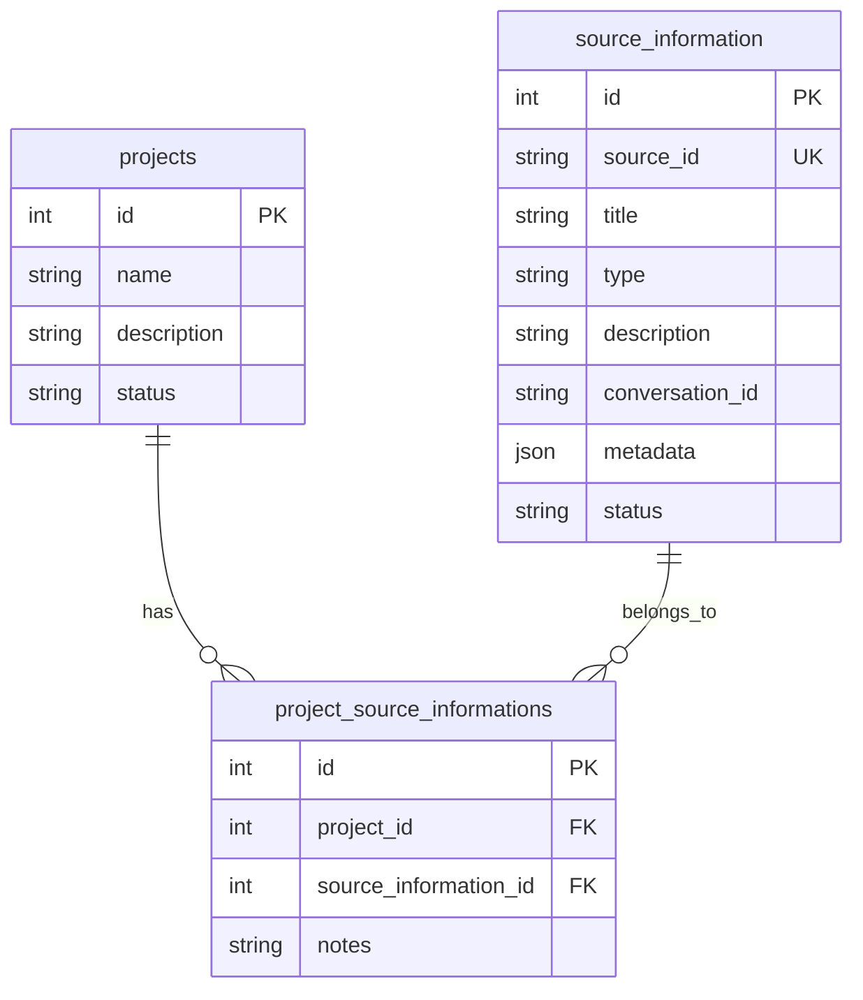
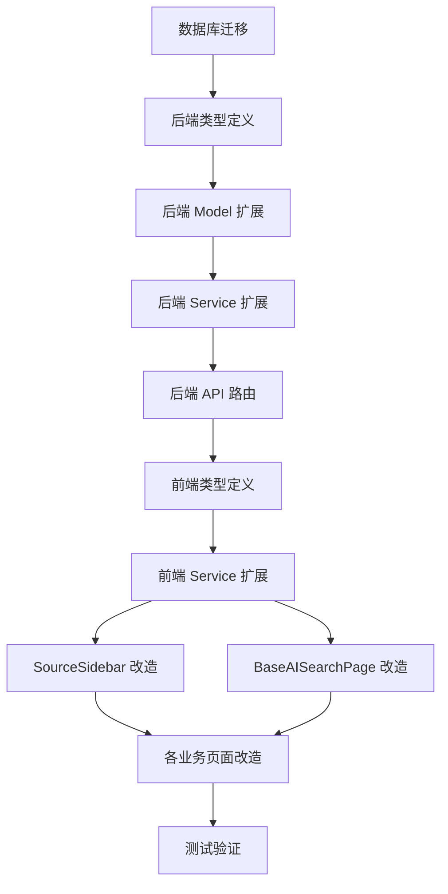

# 项目级"来源"管理重构方案

## 一、架构设计

### 数据模型关系




### 核心设计原则

1. **项目隔离**：通过 `project_source_informations` 关联表，实现来源与项目的多对多关系
2. **类别标识**：在 `metadata.category` 中存储来源分类（tech-package-qa、tech-strategy-qa、tech-article-qa、ai-qa-summary）
3. **向后兼容**：保留 `page_type` 字段用于非项目场景，但项目场景优先使用关联表
4. **集中管理**：在各业务页面（技术包装、技术策略、技术通稿）的 `SourceSidebar` 中显示当前项目的来源

---

## 二、实施步骤

### 第一阶段：数据库层改造

#### 1. 添加 project_id 字段到 source_information 表

修改 [`backend/src/scripts/unified-database-schema-v3.sql`](backend/src/scripts/unified-database-schema-v3.sql) 的 `source_information` 表定义（约 787 行）：

```sql
CREATE TABLE IF NOT EXISTS source_information (
    id INTEGER PRIMARY KEY AUTOINCREMENT,
    source_id TEXT NOT NULL UNIQUE,
    title TEXT NOT NULL,
    type TEXT NOT NULL CHECK (type IN ('knowledge_base', 'external')),
    url TEXT,
    description TEXT,
    page_type TEXT CHECK (page_type IN ('tech-package', 'press-release', 'tech-strategy', 'tech-article')),
    conversation_id TEXT,
    project_id INTEGER,  -- 新增：关联的项目ID（可选）
    metadata TEXT,
    status TEXT DEFAULT 'active' CHECK (status IN ('active', 'archived', 'deleted')),
    created_by TEXT,
    created_at DATETIME DEFAULT CURRENT_TIMESTAMP,
    updated_at DATETIME DEFAULT CURRENT_TIMESTAMP,
    FOREIGN KEY (project_id) REFERENCES projects(id) ON DELETE SET NULL
);

CREATE INDEX IF NOT EXISTS idx_source_information_project_id ON source_information(project_id);
```


#### 2. 创建数据迁移脚本

新建 `backend/src/scripts/migration-source-to-project.sql`：

- 从现有 `page_type` 中提取项目 ID（如 `tech-strategy-project-123` → `project_id = 123`）
- 更新 `source_information.project_id` 字段
- 在 `project_source_informations` 表中建立关联记录
- 清理旧的 `page_type` 格式，保留标准格式（tech-package、tech-strategy 等）

#### 3. 确保关联表存在

检查 [`backend/src/scripts/unified-database-schema-v3.sql`](backend/src/scripts/unified-database-schema-v3.sql) 中 `project_source_informations` 表定义（约 769 行），确保包含所需字段。---

### 第二阶段：后端 API 改造

#### 4. 更新类型定义

修改 [`backend/src/types/database.ts`](backend/src/types/database.ts)（约 400 行）：

```typescript
export interface SourceInformation extends BaseEntity {
  source_id: string;
  title: string;
  type: 'knowledge_base' | 'external';
  url?: string;
  description?: string;
  page_type?: 'tech-package' | 'press-release' | 'tech-strategy' | 'tech-article';
  conversation_id?: string;
  project_id?: number;  // 新增
  metadata?: Record<string, any>;
  status: 'active' | 'archived' | 'deleted';
  created_by?: string;
}
```


#### 5. 扩展 SourceInformationModel

修改 [`backend/src/models/SourceInformation.ts`](backend/src/models/SourceInformation.ts)：

- 在 `create()` 方法中添加 `project_id` 参数处理
- 新增 `findByProjectId(projectId: number)` 方法
- 新增 `findByProjectIdAndCategory(projectId: number, category: string)` 方法
- 更新 `findAll()` 方法，支持按 `project_id` 过滤

#### 6. 扩展 SourceInformationService

修改 [`backend/src/services/sourceInformationService.ts`](backend/src/services/sourceInformationService.ts)：

- 在 `createSourceInformation()` 中处理项目关联逻辑
- 新增 `getSourceInformationByProjectId(projectId: number)` 方法
- 如果提供了 `project_id`，自动在 `project_source_informations` 表中创建关联

#### 7. 新增项目-来源关联 API

修改 [`backend/src/routes/sourceInformationRoutes.ts`](backend/src/routes/sourceInformationRoutes.ts)：

- 新增 `GET /source-information/project/:projectId` 路由，获取指定项目的所有来源
- 修改 `POST /source-information` 路由，接收 `project_id` 参数
- 修改现有查询路由（约 104 行），支持 `projectId` 查询参数

---

### 第三阶段：前端服务层改造

#### 8. 更新前端类型定义

修改 [`frontend/src/services/sourceService.ts`](frontend/src/services/sourceService.ts)（约 22 行）：

```typescript
export interface SourceInformation {
  id?: number;
  source_id: string;
  title: string;
  type: "knowledge_base" | "external";
  url?: string;
  description?: string;
  page_type?: "tech-package" | "press-release" | "tech-strategy" | "tech-article";
  conversation_id?: string;
  project_id?: number;  // 新增
  metadata?: Record<string, any>;
  category?: SourceCategory;
  status?: "active" | "archived" | "deleted";
  created_by?: string;
  created_at?: string;
  updated_at?: string;
}
```


#### 9. 扩展 sourceService

修改 [`frontend/src/services/sourceService.ts`](frontend/src/services/sourceService.ts)：

- 在 `saveSourceInformation()` 方法（约 214 行）中添加 `projectId` 参数
- 新增 `loadSourceInformationByProjectId(projectId: number)` 方法
- 修改现有方法，在调用 API 时传递 `project_id`

---

### 第四阶段：前端组件改造

#### 10. 改造 SourceSidebar 组件

修改 [`frontend/src/components/ai-search/SourceSidebar.tsx`](frontend/src/components/ai-search/SourceSidebar.tsx)：

- 添加 `projectId?: number` 属性（约 20 行）
- 在来源列表中显示 `category` 标签（已有 getCategoryInfo 函数，约 30 行）
- 确保添加新来源时传递 `projectId`

#### 11. 改造 BaseAISearchPage 加载逻辑

修改 [`frontend/src/components/ai-search/BaseAISearchPage.tsx`](frontend/src/components/ai-search/BaseAISearchPage.tsx)：

- 更新 `effectivePageType` 计算逻辑（约 173 行），不再使用 `tech-strategy-project-123` 格式
- 修改 `loadPageTypeSources()`（约 183 行）：
- 如果有 `projectId`，调用 `loadSourceInformationByProjectId(projectId)`
- 如果没有 `projectId`，调用 `loadSourceInformationByPageType(pageType)`
- 修改 `autoSaveConversationAsSource()`（约 1238 行），传递 `projectId`

#### 12. 改造各业务页面

**技术包装页面** ([`frontend/src/pages/TechPackagePage.tsx`](frontend/src/pages/TechPackagePage.tsx))：

- 从 URL 获取 `projectId` 参数
- 传递给 `BaseAISearchPage`

**技术策略页面** ([`frontend/src/pages/BrainstormPage.tsx`](frontend/src/pages/BrainstormPage.tsx))：

- 已有 `projectId` 处理逻辑（约 18 行）
- 更新 `loadSources()` 方法（约 44 行），使用新的 API

**技术通稿页面** ([`frontend/src/pages/TechArticlePage.tsx`](frontend/src/pages/TechArticlePage.tsx))：

- 从 URL 获取 `projectId` 参数
- 传递给 `BaseAISearchPage`

#### 13. 改造项目资源页

修改 [`frontend/src/pages/ProjectResourcesPage.tsx`](frontend/src/pages/ProjectResourcesPage.tsx)：

- 更新 `loadSources()` 方法（约 809 行），调用新的 `loadSourceInformationByProjectId(projectId)` API
- 更新 `summarizeAndSaveConversation()` 方法（约 1726 行），传递 `projectId`

---

### 第五阶段：测试与验证

#### 14. 数据迁移测试

- 执行迁移脚本，验证现有数据正确迁移
- 检查 `project_source_informations` 表是否正确建立关联
- 验证 `source_information.project_id` 字段是否正确填充

#### 15. 功能验证

- **项目隔离测试**：在项目 A 中添加来源，验证项目 B 中不可见
- **对话总结测试**：在技术包装/策略/通稿页面进行对话，验证自动保存为来源且正确关联项目
- **分类显示测试**：验证来源列表中显示正确的 category 标签
- **跨页面共享测试**：同一项目的技术包装、技术策略、技术通稿页面应显示相同的来源列表

#### 16. 边界情况处理

- 非项目场景（直接访问 `/tech-package` 无 `projectId`）的兼容性
- 旧数据的兼容性（没有 `project_id` 的来源信息）
- 来源在多个项目间复用的场景（未来扩展）

---

## 三、关键技术点

### URL 参数传递

各业务页面通过 URL 参数传递项目信息：

- `/tech-package?projectId=123`
- `/tech-strategy?projectId=123`
- `/tech-article?projectId=123`

### Category 分类映射

| 页面类型 | Category 值 | 显示标签 | 图标颜色 ||---------|------------|---------|----------|| AI 问答 | `ai-qa-summary` | AI问答总结 | 蓝色 || 技术包装 | `tech-package-qa` | 技术包装对话 | 绿色 || 技术策略 | `tech-strategy-qa` | 技术策略对话 | 紫色 || 技术通稿 | `tech-article-qa` | 技术通稿对话 | 橙色 |

### 查询逻辑优化

后端查询优先级：

1. 如果提供 `projectId`，返回 `project_source_informations` 表关联的来源
2. 如果提供 `pageType`（无 `projectId`），返回该页面类型的所有来源
3. 两者都提供，以 `projectId` 为准

---

## 四、潜在风险与应对

| 风险 | 影响 | 应对措施 ||------|------|---------|| 现有数据迁移失败 | 部分来源信息丢失 | 备份数据库；迁移脚本支持回滚 || 前端 URL 参数未传递 | 项目隔离失效 | 在组件中添加警告日志；提供默认回退逻辑 || 性能问题（关联查询慢） | 页面加载变慢 | 添加数据库索引；考虑添加缓存层 || 向后兼容性问题 | 旧功能失效 | 保留 `page_type` 字段；优先使用新逻辑，回退旧逻辑 |---

## 五、实施顺序与依赖

