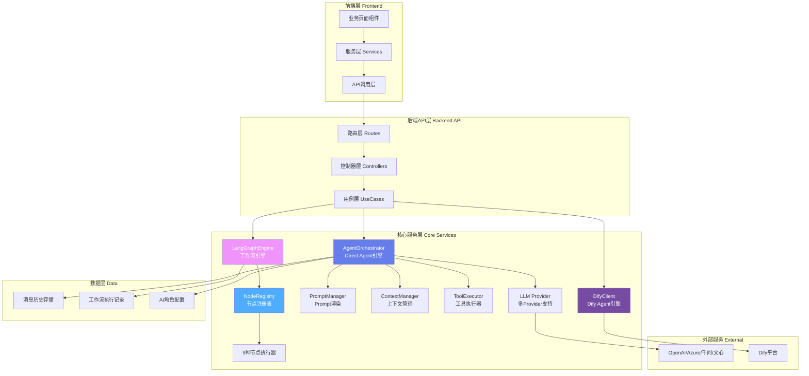
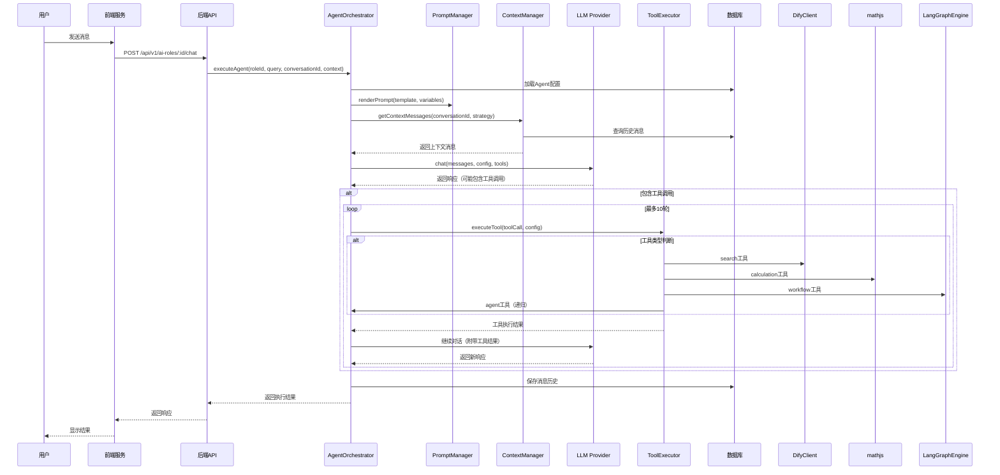
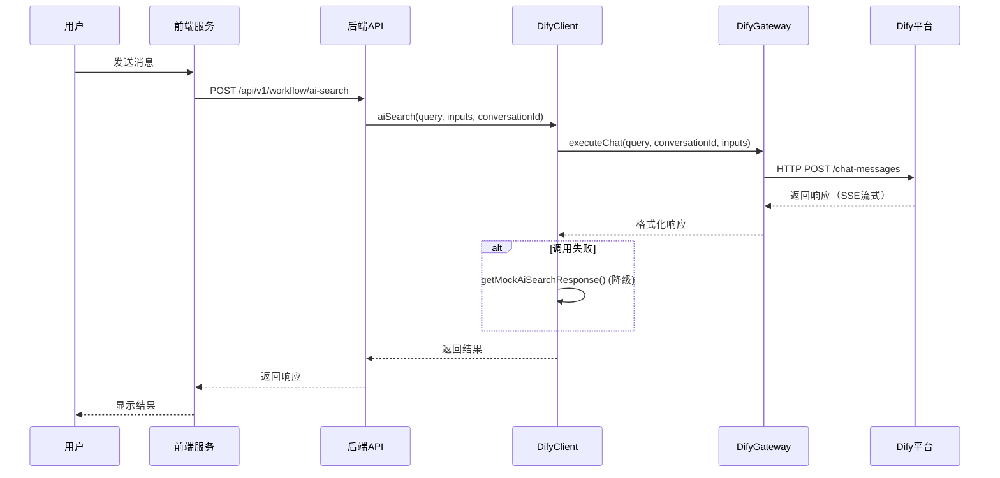
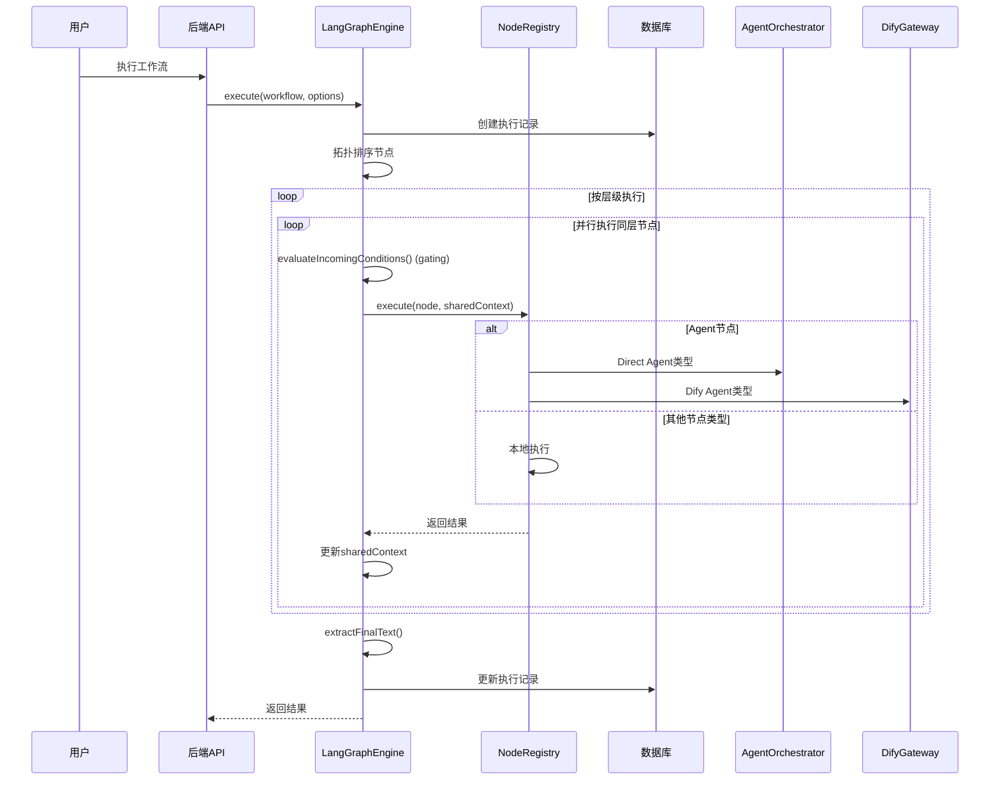
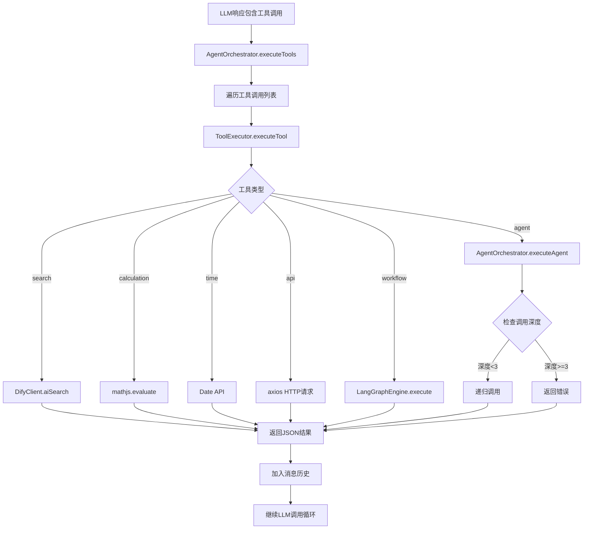

# Todify4 项目 AI/Agent 架构完整分析报告

> **生成时间**: 2026-01-12  
> **项目版本**: Todify4  
> **分析范围**: 完整的AI/Agent架构、角色识别、工作流设计、优化建议

---

## 📋 目录

- [一、AI和Agent角色完整清单](#一ai和agent角色完整清单)
- [二、Agent架构设计深度分析](#二agent架构设计深度分析)
- [三、系统工作流设计分析](#三系统工作流设计分析)
- [四、当前架构优势](#四当前架构优势)
- [五、存在的问题与优化建议](#五存在的问题与优化建议)
- [六、优化路线图](#六优化路线图)
- [七、技术债务清单](#七技术债务清单)

---

## 一、AI和Agent角色完整清单

### 1.1 按引擎类型分类

| 引擎类型 | 核心组件 | 角色/应用数量 | 实现状态 |
|---------|---------|-------------|---------|
| **Direct Agent** | `AgentOrchestrator` | 自定义AI角色（数据库配置） | ✅ 完整实现 |
| **Dify Agent** | `DifyClient` | 6种业务应用 | ✅ 完整实现 |
| **工作流引擎** | `LangGraphEngine` | DAG工作流（9种节点） | ✅ 插件化实现 |

### 1.2 Dify平台集成的6个AI应用

| 应用类型 | 中文名称 | 调用模式 | 用途 | 环境变量 |
|---------|---------|---------|------|---------|
| `ai-search` | AI搜索 | Chatflow | 智能问答、知识检索 | `AI_SEARCH_API_KEY` |
| `tech-package` | 技术包装 | Chatflow | 技术信息结构化分析 | `TECH_PACKAGE_API_KEY` |
| `tech-strategy` | 技术策略 | Workflow | 传播策略生成 | `TECH_STRATEGY_API_KEY` |
| `tech-article` | 技术通稿 | Workflow | 稿件撰写 | `TECH_ARTICLE_API_KEY` |
| `core-draft` | 核心稿件 | Workflow | 核心文档生成 | `CORE_DRAFT_API_KEY` |
| `tech-publish` | 技术发布 | Chatflow | 发布会稿生成 | `TECH_PUBLISH_API_KEY` |

**调用方式**：
- Chatflow模式：`DifyClient.callApp()` → `DifyGateway.executeChat()`
- Workflow模式：`DifyClient.runWorkflow()` → `DifyGateway.executeWorkflow()`

### 1.3 业务页面对应的AI功能

| 页面类型 | 页面标题 | 启用工具数 | 主要AI功能 | 配置位置 |
|---------|---------|-----------|-----------|---------|
| **tech-package** | 技术包装 | 8个 | 五看、三定、技术矩阵、传播、展具视频、翻译、讲稿、脚本 | `pageConfigs.ts` |
| **press-release** | 发布会稿 | 6个 | 技术转译、场景挖掘、场景化、口语化、翻译、讲稿 | `pageConfigs.ts` |
| **tech-strategy** | 技术策略 | 4个 | 传播策略、技术转译、场景挖掘、翻译 | `pageConfigs.ts` |
| **tech-article** | 技术通稿 | 2个 | 技术讲稿、翻译 | `pageConfigs.ts` |
| **ai-qa** | AI问答 | 0个 | 纯对话模式（无工具箱） | `pageConfigs.ts` |

### 1.4 功能工具映射表

| 工具ID | 工具名称 | 页面映射 | 说明 |
|-------|---------|---------|------|
| `five-view-analysis` | 五看/技术转译 | tech-package, press-release, tech-strategy, tech-article | 技术转译分析 |
| `three-fix-analysis` | 三定/用户场景挖掘 | tech-package, press-release, tech-strategy | 用户场景分析 |
| `tech-matrix` | 技术矩阵 | tech-package, press-release, tech-strategy | 技术矩阵生成 |
| `propagation-strategy` | 传播策略/领导人口语化 | tech-package, press-release, tech-strategy | 传播策略生成 |
| `exhibition-video` | 展具与视频 | tech-package, tech-strategy | 展具视频方案 |
| `translation` | 翻译 | 所有页面 | 多语言翻译 |
| `ppt-outline` | 技术讲稿 | tech-package, press-release, tech-strategy, tech-article | PPT大纲生成 |
| `script` | 脚本 | tech-package, tech-strategy | 脚本生成 |

### 1.5 工具类型完整清单

| 工具类型 | 功能描述 | 实现状态 | 实现方式 | 安全特性 |
|---------|---------|---------|---------|---------|
| `search` | AI搜索 | ✅ 已实现 | 调用 `DifyClient.aiSearch()` | ✅ 安全 |
| `calculation` | 数学计算 | ✅ 已实现 | 使用 `mathjs` 库 | ✅ 防代码注入 |
| `time` | 时间获取 | ✅ 已实现 | 多格式、多时区支持 | ✅ 安全 |
| `api` | HTTP调用 | ✅ 已实现 | 支持 GET/POST/PUT/DELETE | ⚠️ 需配置超时 |
| `workflow` | 工作流调用 | ✅ 已实现 | 使用 `LangGraphEngine` | ✅ 安全 |
| `agent` | 嵌套Agent调用 | ✅ 已实现 | 调用 `AgentOrchestrator` | ✅ 3层深度限制 |

**工具调用流程**：
```
LLM响应包含工具调用
  ↓
AgentOrchestrator.executeTools()
  ↓
ToolExecutor.executeTool()
  ↓
根据工具类型执行
  ├─ search → DifyClient.aiSearch()
  ├─ calculation → mathjs.evaluate()
  ├─ time → Date API
  ├─ api → axios HTTP请求
  ├─ workflow → LangGraphEngine.execute()
  └─ agent → AgentOrchestrator.executeAgent() (递归，最多3层)
  ↓
返回JSON格式结果
  ↓
加入消息历史，继续LLM调用循环
```

---

## 二、Agent架构设计深度分析

### 2.1 整体架构图



### 2.2 核心组件职责矩阵

| 组件 | 文件位置 | 核心职责 | 关键方法 | 依赖关系 |
|-----|---------|---------|---------|---------|
| **AgentOrchestrator** | `services/agent/AgentOrchestrator.ts` | Agent生命周期管理、工具调用循环 | `executeAgent()` | PromptManager, ContextManager, ToolExecutor, LLM Provider |
| **PromptManager** | `services/agent/PromptManager.ts` | Prompt模板渲染、变量替换 | `renderPrompt()` | 无 |
| **ContextManager** | `services/agent/ContextManager.ts` | 对话历史管理、3种上下文策略 | `getContextMessages()` | ChatMessageService |
| **ToolExecutor** | `services/agent/ToolExecutor.ts` | 6种工具类型执行 | `executeTool()` | DifyClient, LangGraphEngine, AgentOrchestrator |
| **DifyClient** | `services/DifyClient.ts` | Dify平台统一客户端 | `aiSearch()`, `techPackage()`, etc. | DifyGateway |
| **LangGraphEngine** | `services/workflow/langgraph/LangGraphEngine.ts` | DAG工作流执行引擎 | `execute()` | NodeRegistry, AgentOrchestrator, DifyGateway |
| **NodeRegistry** | `services/workflow/nodes/NodeRegistry.ts` | 节点类型插件化注册 | `register()`, `execute()` | 9种节点执行器 |

### 2.3 Direct Agent配置结构

```typescript
interface DirectAgentConfig {
  llm: {
    provider: 'openai' | 'azure-openai' | 'qwen' | 'ernie' | 'custom';
    apiKey: string;
    apiBaseUrl?: string;
    model: string;
    temperature: number;
    maxTokens: number;
    topP?: number;
    stream?: boolean;
  };
  prompt: {
    systemPrompt: string;
    variables?: PromptVariable[];
    templates?: PromptTemplate[];
  };
  contextStrategy: {
    type: 'window' | 'summary' | 'hybrid';
    maxMessages: number;
    maxTokens: number;
    summaryThreshold?: number;
    includeSystemPrompt: boolean;
  };
  tools?: ToolConfig[];
  agentCalls?: AgentCallConfig[];
}
```

### 2.4 节点插件化系统（已优化实现）

**支持的9种节点类型**：

| 节点类型 | 执行器类 | 功能 | 状态 |
|---------|---------|------|------|
| `input` | `InputNodeExecutor` | 提取工作流输入参数 | ✅ |
| `agent` | `AgentNodeExecutor` | 调用AI角色（支持Direct/Dify） | ✅ |
| `output` | `OutputNodeExecutor` | 提取最终输出 | ✅ |
| `condition` | `ConditionNodeExecutor` | 条件判断（支持gating） | ✅ |
| `assign` | `AssignNodeExecutor` | 变量赋值 | ✅ |
| `transform` | `TransformNodeExecutor` | 数据转换 | ✅ |
| `merge` | `MergeNodeExecutor` | 数据合并 | ✅ |
| `memory` | `MemoryNodeExecutor` | 文本记忆 | ✅ |
| `loop` | `LoopNodeExecutor` | 循环执行 | ✅ 新增 |

**插件化实现方式**：
```typescript
// LangGraphEngine.ts
private registerBuiltinNodes(): void {
  NodeRegistry.register('input', new InputNodeExecutor());
  NodeRegistry.register('agent', new AgentNodeExecutor());
  // ... 其他节点
}

// 执行节点时
private async executeNode(node: any, sharedContext: Record<string, any>): Promise<any> {
  return await NodeRegistry.execute(node, sharedContext);
}
```

### 2.5 上下文管理策略对比

| 策略类型 | 实现方式 | Token消耗 | 适用场景 | 优缺点 |
|---------|---------|----------|---------|--------|
| **Window** | 保留最近N条消息 | 低 | 短对话（<10轮） | ✅ 简单高效<br/>❌ 丢失早期上下文 |
| **Summary** | 旧消息压缩为摘要 | 中 | 长对话、文档场景 | ✅ 保留关键信息<br/>❌ 摘要依赖LLM，增加成本 |
| **Hybrid** | Token限制+消息数量限制 | 中-高 | 智能平衡场景 | ✅ 灵活平衡<br/>❌ 实现复杂 |

**上下文策略选择建议**：
- 技术文档场景：使用 `Summary` 策略
- 快速问答场景：使用 `Window` 策略
- 复杂多轮对话：使用 `Hybrid` 策略

---

## 三、系统工作流设计分析

### 3.1 Direct Agent执行流程



**关键时间节点**：
- Agent配置加载: ~50ms
- Prompt渲染: ~10ms
- 上下文查询: ~100ms
- LLM调用: 2-30秒（取决于模型和Token数）
- 工具调用: 1-60秒/次（取决于工具类型）
- 消息保存: ~50ms

**总计**: 2.2秒 - 6分钟（含工具调用）

### 3.2 Dify Agent执行流程



**时间开销分析**：
- Gateway获取: ~5ms（有缓存）
- Dify API调用: 2-30秒
- 响应格式转换: ~10ms
- Mock降级: ~1ms

**总计**: 2-30秒

### 3.3 工作流执行流程



**执行特点**：
- ✅ 拓扑排序：按依赖关系确定执行顺序
- ✅ 层级并行：同一层节点可并行执行
- ✅ 条件边（gating）：根据条件决定是否执行节点
- ✅ 共享上下文：节点间通过 `sharedContext` 共享数据
- ✅ 支持Direct Agent：Agent节点可以调用Direct Agent类型

### 3.4 工具调用嵌套流程



**安全机制**：
- ✅ Agent嵌套调用深度限制：最多3层
- ✅ 工具调用循环限制：最多10轮
- ✅ 超时控制：总体6分钟，单个工具60秒
- ✅ 计算工具安全：使用mathjs替代eval

---

## 四、当前架构优势

### ✅ 已实现的关键功能

| 功能 | 状态 | 说明 | 文件位置 |
|-----|------|------|---------|
| **双引擎架构** | ✅ | Direct Agent + Dify Agent 互补 | `AgentOrchestrator.ts`, `DifyClient.ts` |
| **节点插件化** | ✅ | NodeRegistry 动态注册，易于扩展 | `NodeRegistry.ts` |
| **工具生态完善** | ✅ | 6种工具类型全部实现 | `ToolExecutor.ts` |
| **Agent嵌套调用** | ✅ | 支持3层深度，防无限递归 | `ToolExecutor.ts:412-504` |
| **计算安全** | ✅ | mathjs 替代 eval，防止代码注入 | `ToolExecutor.ts:205-251` |
| **Direct Agent工作流支持** | ✅ | 工作流中可调用Direct Agent | `LangGraphEngine.ts:156-186` |
| **循环节点** | ✅ | LoopNodeExecutor 已注册 | `LangGraphEngine.ts:34` |
| **Mock降级** | ✅ | Dify调用失败自动降级 | `DifyClient.ts:161-164` |
| **上下文策略** | ✅ | Window/Summary/Hybrid三种策略 | `ContextManager.ts` |
| **多Provider定义** | ✅ | 支持5种Provider类型定义 | `AIRole.ts:115` |

### 🎯 架构设计亮点

1. **插件化节点系统**：通过 `NodeRegistry` 实现节点类型的动态注册，易于扩展新节点类型
2. **统一工具接口**：`ToolExecutor` 提供统一的工具执行接口，支持6种工具类型
3. **智能上下文管理**：3种上下文策略适应不同场景需求
4. **安全机制完善**：深度限制、超时控制、代码注入防护
5. **双引擎互补**：Direct Agent提供精细控制，Dify Agent提供快速配置

---

## 五、存在的问题与优化建议

### 5.1 🔴 高优先级优化（P1）

#### P1.1: 多Provider支持不完整

**问题描述**：
- `DirectAgentConfig` 定义了5种Provider类型（openai, azure-openai, qwen, ernie, custom）
- 但实际实现主要依赖OpenAI Provider
- 其他Provider标记为TODO或未实现

**影响**：
- 无法使用其他LLM（如Claude、Gemini、千问、文心等）
- 限制了系统的灵活性和成本优化空间

**优化方案**：
```typescript
// 1. 创建LLM Provider工厂
// backend/src/services/llm/LLMProviderFactory.ts
export class LLMProviderFactory {
  static create(config: LLMConfig): ILLMProvider {
    switch (config.provider) {
      case 'openai':
        return new OpenAIProvider(config);
      case 'azure-openai':
        return new AzureOpenAIProvider(config);
      case 'anthropic':
        return new AnthropicProvider(config);
      case 'qwen':
        return new QwenProvider(config);
      case 'ernie':
        return new ErnieProvider(config);
      case 'custom':
        return new CustomProvider(config);
      default:
        throw new Error(`不支持的Provider: ${config.provider}`);
    }
  }
}

// 2. 在AgentOrchestrator中使用工厂
const provider = LLMProviderFactory.create(agentConfig.llm);
const response = await provider.chat(messages, config, tools);
```

**工作量评估**：5天
- OpenAI Provider：已实现（1天）
- Azure OpenAI Provider：1天
- Anthropic Provider：1天
- Qwen Provider：1天
- Ernie Provider：1天

**验收标准**：
- ✅ 支持5种Provider类型
- ✅ 每种Provider有完整的错误处理
- ✅ 支持Function Calling（如果Provider支持）
- ✅ 统一的接口和响应格式

#### P1.2: 工具并行执行优化

**问题描述**：
- 当前工具调用为串行执行
- 多个独立工具调用时性能低下

**影响**：
- 多个search工具调用时，总耗时 = 单个耗时 × 数量
- 用户体验差，等待时间长

**优化方案**：
```typescript
// AgentOrchestrator.ts
private async executeTools(
  toolCalls: ToolCall[],
  toolConfigs: ToolConfig[],
  checkTimeout?: () => void
): Promise<Array<{ toolCallId: string; toolName: string; content: string }>> {
  // 判断是否可以并行执行
  const canParallel = this.canExecuteInParallel(toolCalls, toolConfigs);
  
  if (canParallel) {
    // 并行执行安全工具
    return Promise.all(toolCalls.map(toolCall => 
      this.executeSingleTool(toolCall, toolConfigs, checkTimeout)
    ));
  } else {
    // 串行执行（有依赖关系）
    const results = [];
    for (const toolCall of toolCalls) {
      const result = await this.executeSingleTool(toolCall, toolConfigs, checkTimeout);
      results.push(result);
    }
    return results;
  }
}

private canExecuteInParallel(toolCalls: ToolCall[], toolConfigs: ToolConfig[]): boolean {
  // 安全工具类型可以并行执行
  const parallelSafeTypes = ['search', 'calculation', 'time', 'api'];
  
  const types = toolCalls.map(tc => {
    const config = toolConfigs.find(c => c.name === tc.function.name);
    return config?.type;
  });
  
  // 所有工具都是安全类型，且没有依赖关系
  return types.every(type => parallelSafeTypes.includes(type || ''));
}
```

**工作量评估**：2天
- 并行执行逻辑：1天
- 依赖关系检测：0.5天
- 测试和验证：0.5天

**验收标准**：
- ✅ 多个search工具可以并行执行
- ✅ workflow和agent工具保持串行（有依赖关系）
- ✅ 错误处理正确（一个失败不影响其他）
- ✅ 性能提升明显（多个工具时）

#### P1.3: 执行追踪与可观测性

**问题描述**：
- 缺少详细的执行日志和性能追踪
- 调试困难，无法追踪Agent执行过程
- 无法分析性能瓶颈

**影响**：
- 问题排查困难
- 无法优化性能
- 用户体验问题难以定位

**优化方案**：
```typescript
// 1. 创建执行追踪服务
// backend/src/services/agent/ExecutionTracer.ts
export class ExecutionTracer {
  private steps: ExecutionStep[] = [];
  
  recordStep(step: ExecutionStep) {
    this.steps.push({
      ...step,
      timestamp: Date.now(),
      duration: step.endTime - step.startTime
    });
  }
  
  getTrace(): ExecutionTrace {
    return {
      steps: this.steps,
      totalDuration: this.steps.reduce((sum, s) => sum + s.duration, 0),
      tokenUsage: this.calculateTokenUsage()
    };
  }
}

// 2. 在AgentOrchestrator中集成
async executeAgent(...) {
  const tracer = new ExecutionTracer();
  
  tracer.recordStep({ name: 'loadConfig', startTime: Date.now() });
  const agent = await aiRoleModel.getById(roleId);
  tracer.recordStep({ name: 'loadConfig', endTime: Date.now() });
  
  // ... 其他步骤
  
  // 保存追踪记录
  await executionTraceModel.create(tracer.getTrace());
  
  return { ...result, trace: tracer.getTrace() };
}
```

**工作量评估**：3天
- 执行追踪服务：1天
- 数据库模型：0.5天
- AgentOrchestrator集成：1天
- 前端展示：0.5天

**验收标准**：
- ✅ 记录每个执行步骤的耗时
- ✅ 记录Token使用量
- ✅ 前端可以查看执行过程
- ✅ 支持性能分析

### 5.2 🟡 中优先级优化（P2）

#### P2.1: Mock模式增强

**问题描述**：
- Dify有Mock降级，但Direct Agent缺少Mock模式
- 开发测试时成本高昂

**优化方案**：
```typescript
// AgentOrchestrator.ts
async executeAgent(...) {
  if (process.env.AI_MOCK_MODE === 'true') {
    return this.getMockResponse(roleId, query);
  }
  // 正常执行
}

private getMockResponse(roleId: string, query: string): AgentExecutionResult {
  return {
    content: `这是对"${query}"的模拟响应（AI_MOCK_MODE=true）\n\n[模拟内容：基于角色${roleId}的配置生成]`,
    conversationId: `mock-${Date.now()}`,
    usage: { promptTokens: 10, completionTokens: 20, totalTokens: 30 },
    metadata: { model: 'mock', finishReason: 'stop', toolCalls: 0 }
  };
}
```

**工作量评估**：1天

#### P2.2: 上下文消息查询优化

**问题描述**：
- 每次全量查询历史消息后截取
- 数据库查询效率低

**优化方案**：
```typescript
// ContextManager.ts
async getContextMessages(conversationId: string, strategy: ContextStrategy) {
  // 根据策略提前计算需要的消息数量
  const limit = this.calculateMessageLimit(strategy);
  
  // 数据库层面限制查询数量
  const sql = `
    SELECT * FROM chat_messages 
    WHERE conversation_id = ? 
    ORDER BY created_at DESC 
    LIMIT ?
  `;
  const messages = await db.query(sql, [conversationId, limit]);
  
  // 反转顺序（从旧到新）
  return messages.reverse();
}
```

**工作量评估**：2天

#### P2.3: 统一错误处理

**问题描述**：
- 错误返回格式不统一
- 前端难以解析和处理

**优化方案**：
```typescript
// 定义统一错误类型
export enum AgentErrorCode {
  TIMEOUT = 'TIMEOUT',
  TOOL_ERROR = 'TOOL_ERROR',
  LLM_ERROR = 'LLM_ERROR',
  CONFIG_ERROR = 'CONFIG_ERROR',
  NETWORK_ERROR = 'NETWORK_ERROR'
}

export interface AgentError {
  code: AgentErrorCode;
  message: string;
  details?: any;
  recoverable: boolean;
  timestamp: number;
}

// 在AgentOrchestrator中统一错误处理
catch (error) {
  const agentError = this.normalizeError(error);
  throw agentError;
}
```

**工作量评估**：2天

### 5.3 🟢 低优先级优化（P3）

| 优化项 | 说明 | 工作量 | 优先级 |
|-------|------|-------|--------|
| **工作流循环增强** | LoopNodeExecutor已注册，需完善循环逻辑 | 3天 | P3 |
| **性能监控面板** | Token使用统计、耗时分析 | 4天 | P3 |
| **配置动态化** | Dify API Key从数据库读取 | 2天 | P3 |
| **Agent配置缓存** | 减少数据库查询 | 1天 | P3 |
| **流式响应支持** | 支持SSE流式输出 | 5天 | P3 |

---

## 六、优化路线图

### Phase 1：核心增强（1周）

**目标**：提升系统核心能力和开发效率

| 任务 | 工作量 | 负责人 | 状态 |
|-----|-------|--------|------|
| T1: Mock模式增强 | 1天 | - | ⏳ 待开始 |
| T2: 工具并行执行 | 2天 | - | ⏳ 待开始 |
| T3: 执行追踪基础版 | 3天 | - | ⏳ 待开始 |
| T4: 统一错误处理 | 2天 | - | ⏳ 待开始 |

**验收标准**：
- ✅ 开发环境可使用Mock模式节省成本
- ✅ 多个工具调用性能提升50%+
- ✅ 可以查看Agent执行过程
- ✅ 错误信息统一格式

### Phase 2：Provider扩展（1周）

**目标**：支持多种LLM Provider

| 任务 | 工作量 | 负责人 | 状态 |
|-----|-------|--------|------|
| T5: LLM Provider工厂 | 1天 | - | ⏳ 待开始 |
| T6: Azure OpenAI支持 | 1天 | - | ⏳ 待开始 |
| T7: Anthropic支持 | 1天 | - | ⏳ 待开始 |
| T8: Qwen支持 | 1天 | - | ⏳ 待开始 |
| T9: Ernie支持 | 1天 | - | ⏳ 待开始 |

**验收标准**：
- ✅ 支持5种Provider类型
- ✅ 每种Provider有完整测试
- ✅ 统一的接口和错误处理

### Phase 3：性能优化（1周）

**目标**：提升系统性能和用户体验

| 任务 | 工作量 | 负责人 | 状态 |
|-----|-------|--------|------|
| T10: 上下文查询优化 | 2天 | - | ⏳ 待开始 |
| T11: Agent配置缓存 | 1天 | - | ⏳ 待开始 |
| T12: 性能监控面板 | 4天 | - | ⏳ 待开始 |

**验收标准**：
- ✅ 上下文查询性能提升30%+
- ✅ Agent配置加载时间减少50%+
- ✅ 性能监控面板可用

### Phase 4：生态完善（2周）

**目标**：完善工作流和扩展能力

| 任务 | 工作量 | 负责人 | 状态 |
|-----|-------|--------|------|
| T13: 工作流循环增强 | 3天 | - | ⏳ 待开始 |
| T14: 配置动态化 | 2天 | - | ⏳ 待开始 |
| T15: 流式响应支持 | 5天 | - | ⏳ 待开始 |

---

## 七、技术债务清单

### 7.1 代码质量

| 问题 | 位置 | 严重程度 | 建议 |
|-----|------|---------|------|
| 硬编码API Key | `DifyClient.ts:78-86` | 🟡 中 | 从数据库或配置中心读取 |
| 错误处理不统一 | 多处 | 🟡 中 | 统一错误类型和格式 |
| 缺少类型定义 | 部分工具参数 | 🟢 低 | 完善TypeScript类型 |

### 7.2 性能问题

| 问题 | 位置 | 影响 | 建议 |
|-----|------|------|------|
| 工具串行执行 | `AgentOrchestrator.ts` | 🟡 中 | 实现并行执行 |
| 上下文全量查询 | `ContextManager.ts` | 🟡 中 | 数据库层面限制 |
| Agent配置无缓存 | `AgentOrchestrator.ts` | 🟢 低 | 增加缓存层 |

### 7.3 可维护性

| 问题 | 位置 | 影响 | 建议 |
|-----|------|------|------|
| Provider实现不完整 | `AgentOrchestrator.ts` | 🔴 高 | 实现多Provider支持 |
| 缺少执行追踪 | 多处 | 🟡 中 | 增加追踪服务 |
| 文档不完整 | 部分工具 | 🟢 低 | 补充文档 |

---

## 八、总结

### 8.1 架构成熟度评估

| 维度 | 评分 | 说明 |
|-----|-----|------|
| **功能完整性** | ⭐⭐⭐⭐ (4/5) | 双引擎+6种工具+9种节点，功能完善 |
| **扩展性** | ⭐⭐⭐⭐ (4/5) | 节点插件化、工具可配置，扩展性强 |
| **可维护性** | ⭐⭐⭐ (3/5) | 文档完善，但代码分散，需统一错误处理 |
| **性能** | ⭐⭐⭐ (3/5) | 串行执行有优化空间，缺少性能监控 |
| **可观测性** | ⭐⭐ (2/5) | 缺少执行追踪和性能分析 |

**总体评分**：⭐⭐⭐ (3.2/5)

### 8.2 关键建议优先级

1. **短期（1周内）**：
   - ✅ 增加Mock模式和执行追踪，提升开发效率
   - ✅ 实现工具并行执行，提升用户体验

2. **中期（1个月内）**：
   - ✅ 实现多Provider支持，提升系统灵活性
   - ✅ 优化上下文查询和配置缓存，提升性能

3. **长期（3个月内）**：
   - ✅ 构建完整的性能监控体系
   - ✅ 完善工作流循环和流式响应支持

### 8.3 架构演进方向

1. **统一化**：统一错误处理、统一接口、统一配置管理
2. **可观测性**：执行追踪、性能监控、日志分析
3. **性能优化**：并行执行、缓存策略、查询优化
4. **生态扩展**：多Provider支持、新工具类型、新节点类型

---

**文档维护者**: AI Assistant  
**最后更新**: 2026-01-12  
**文档版本**: v1.0  
**反馈联系**: 请在项目Issue中提出
