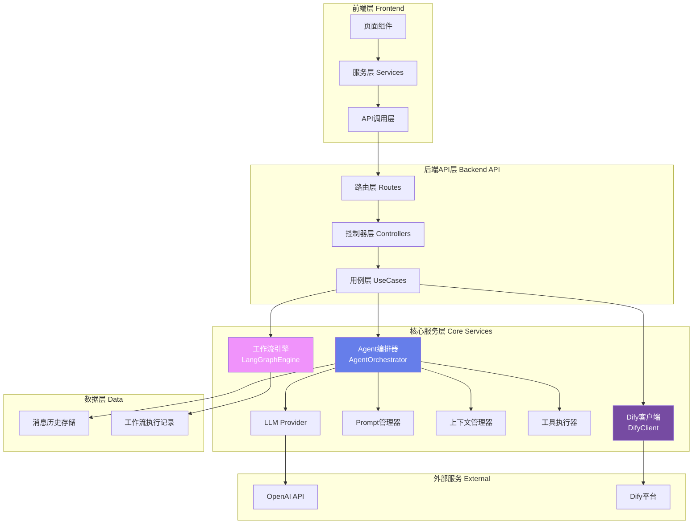
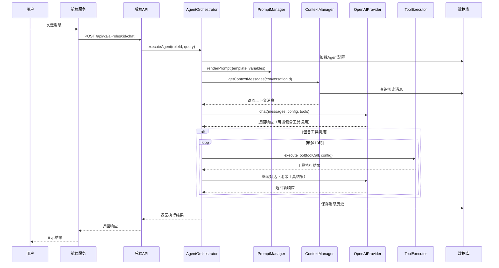
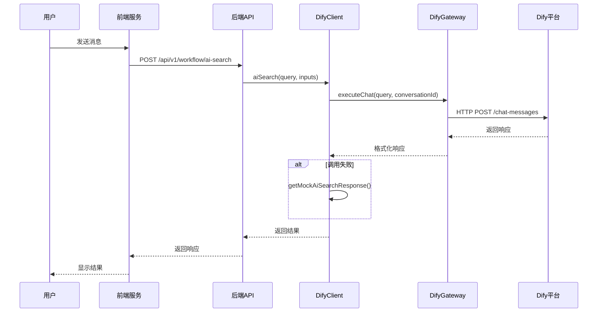
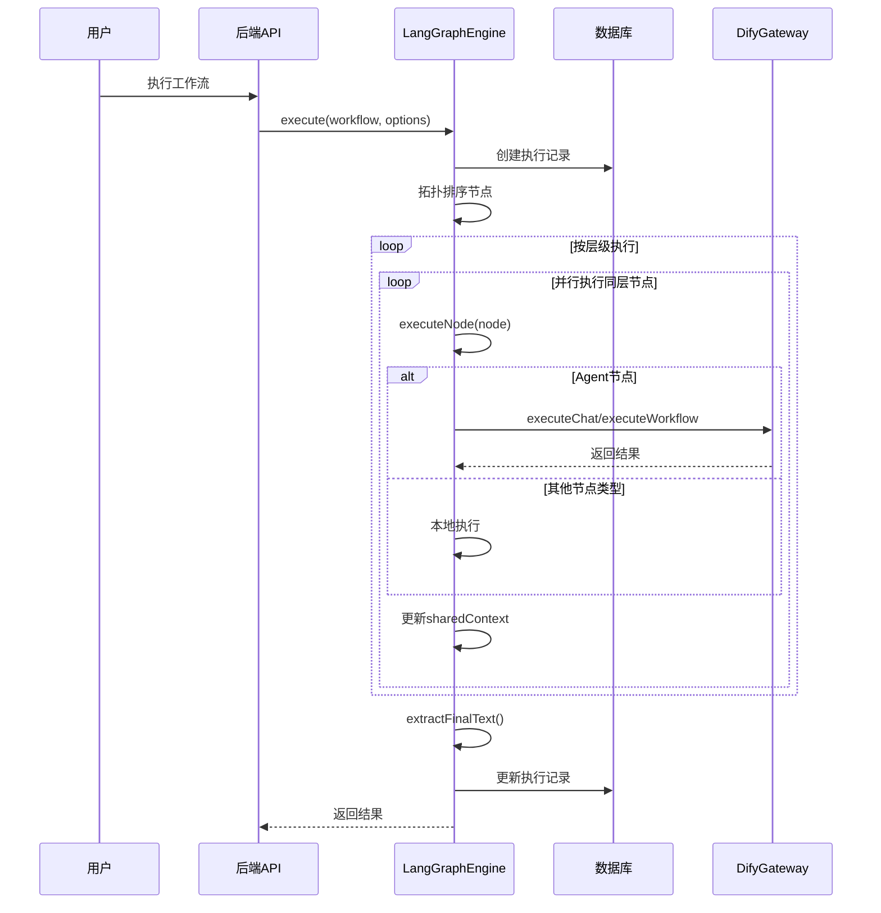

# Todify4 项目 AI 及 Agent 设计框架全面梳理

> **生成时间**: 2025-01-08  
> **项目版本**: Todify4  
> **分析范围**: 完整的AI/Agent架构、调用链路、问题识别与优化建议

---

## 📋 目录

- [一、架构总览](#一架构总览)
- [二、核心组件详解](#二核心组件详解)
- [三、调用链路分析](#三调用链路分析)
- [四、数据模型与配置](#四数据模型与配置)
- [五、现有问题识别](#五现有问题识别)
- [六、待优化任务清单](#六待优化任务清单)
- [七、优化路线图](#七优化路线图)

---

## 一、架构总览

### 1.1 整体架构图



### 1.2 双引擎架构

项目采用**混合式双引擎架构**：

| 引擎类型 | 实现方式 | 适用场景 | 优缺点 |
|---------|---------|---------|--------|
| **Direct Agent** | AgentOrchestrator | 需要精细控制、工具调用、多轮对话 | ✅ 完全自主控制<br/>✅ 支持Function Calling<br/>❌ 需要自己管理复杂度 |
| **Dify Agent** | DifyClient + Gateway | 预定义的复杂业务流程 | ✅ 快速配置<br/>✅ 可视化编排<br/>❌ 依赖外部平台 |
| **工作流引擎** | LangGraphEngine | 多节点编排、条件分支 | ✅ 灵活的DAG执行<br/>❌ 不支持循环<br/>❌ 节点扩展性差 |

---

## 二、核心组件详解

### 2.1 AgentOrchestrator（Agent编排器）

**位置**: `backend/src/services/agent/AgentOrchestrator.ts`

#### 核心职责
- 执行Direct Agent类型的AI角色
- 管理完整的Agent生命周期（从请求到响应）
- 协调Prompt、Context、Tool的执行

#### 关键特性
```typescript
// 核心执行方法
async executeAgent(
  roleId: string,
  query: string,
  conversationId: string = '',
  context: Record<string, any> = {}
): Promise<AgentExecutionResult>
```

**执行流程**:
1. 加载Agent配置（从数据库）
2. 渲染System Prompt（变量替换）
3. 获取上下文消息（根据策略）
4. 构建完整消息列表
5. 准备工具定义（Function Calling格式）
6. 调用LLM（支持多轮工具调用循环，最多10轮）
7. 保存消息历史
8. 返回执行结果

**超时控制**:
- ✅ 总体超时: 6分钟
- ✅ 单个工具调用超时: 60秒
- ✅ 最大工具调用迭代: 10轮

**问题点**:
- ⚠️ 只支持OpenAI Provider（其他Provider标记为TODO）
- ⚠️ 工具调用为串行执行，无并行优化
- ⚠️ 缺少重试机制（只在LLM层有重试）

---

### 2.2 PromptManager（Prompt管理器）

**位置**: `backend/src/services/agent/PromptManager.ts`

#### 核心职责
- Prompt模板渲染
- 变量替换（支持`{{variable}}`和`{variable}`格式）
- 嵌套属性解析（如`user.profile.name`）

#### 变量类型
- `static`: 静态值
- `dynamic`: 从上下文动态获取
- `context`: 直接使用上下文中的值

---

### 2.3 ContextManager（上下文管理器）

**位置**: `backend/src/services/agent/ContextManager.ts`

#### 支持的策略

| 策略类型 | 特点 | 适用场景 |
|---------|------|---------|
| **Window** | 保留最近N条消息 | 短对话场景 |
| **Summary** | 旧消息压缩为摘要 | 长对话场景 |
| **Hybrid** | Token限制+消息数量限制 | 智能平衡场景 |

**关键特性**:
- ✅ Token估算和优化
- ✅ 自动摘要生成（超过限制时）
- ⚠️ 摘要生成依赖LLM，增加成本

---

### 2.4 ToolExecutor（工具执行器）

**位置**: `backend/src/services/agent/ToolExecutor.ts`

#### 支持的工具类型

| 工具类型 | 功能描述 | 实现状态 |
|---------|---------|---------|
| `search` | 搜索工具 | ❌ 占位符（待实现） |
| `calculation` | 数学计算 | ✅ 已实现 |
| `time` | 时间获取 | ✅ 已实现 |
| `api` | HTTP API调用 | ✅ 已实现（支持GET/POST/PUT/DELETE） |
| `workflow` | 工作流调用 | ⚠️ 已实现但AgentWorkflowService已移除 |
| `agent` | Agent嵌套调用 | ❌ 占位符（待实现） |

**工具调用流程**:
1. 解析工具调用参数（JSON格式）
2. 验证参数（类型、必需性、枚举值）
3. 根据工具类型执行相应逻辑
4. 返回JSON格式的执行结果

**问题点**:
- ❌ `workflow`工具依赖的`AgentWorkflowService`已被移除为占位符
- ❌ `search`和`agent`工具未实现
- ⚠️ `calculation`工具使用`eval`存在安全风险

---

### 2.5 OpenAIProvider（LLM Provider）

**位置**: `backend/src/services/llm/OpenAIProvider.ts`

#### 核心特性
- ✅ 支持OpenAI API调用
- ✅ 支持工具调用（Function Calling）
- ✅ 重试机制（最多3次，指数退避）
- ✅ 超时控制（180秒）
- ✅ 支持o1/o3/gpt-5.1等reasoning模型

**问题点**:
- ⚠️ 只支持OpenAI，其他Provider（如Anthropic、Google等）标记为TODO
- ⚠️ 缺少Mock模式（开发测试时节省成本）

---

### 2.6 DifyClient（Dify客户端）

**位置**: `backend/src/services/DifyClient.ts`

#### 支持的应用类型

| 应用类型 | 用途 | 调用模式 |
|---------|------|---------|
| `ai-search` | AI搜索 | Chatflow |
| `tech-package` | 技术包装 | Chatflow |
| `tech-strategy` | 技术策略 | Workflow |
| `tech-article` | 技术通稿 | Workflow |
| `core-draft` | 核心稿件 | Workflow |
| `tech-publish` | 技术发布 | Chatflow |

**调用模式**:
- **Chatflow模式**: 对话式应用，支持多轮对话
- **Workflow模式**: 工作流应用，结构化输出

**关键特性**:
- ✅ 统一的Gateway管理（缓存复用）
- ✅ Mock响应降级（调用失败时）
- ✅ 响应格式统一转换

**问题点**:
- ⚠️ API Key硬编码在环境变量中，缺少动态配置
- ⚠️ Mock响应质量不高，只是占位符

---

### 2.7 LangGraphEngine（工作流引擎）

**位置**: `backend/src/services/workflow/langgraph/LangGraphEngine.ts`

#### 支持的节点类型

| 节点类型 | 功能 | 实现状态 |
|---------|------|---------|
| `input` | 输入节点 | ✅ 已实现 |
| `agent` | Agent调用节点 | ✅ 已实现（仅支持Dify） |
| `output` | 输出节点 | ✅ 已实现 |
| `condition` | 条件判断 | ✅ 已实现 |
| `assign` | 变量赋值 | ✅ 已实现 |
| `transform` | 数据转换 | ✅ 已实现 |
| `merge` | 数据合并 | ✅ 已实现 |
| `memory` | 文本记忆 | ✅ 已实现 |

#### 执行特点
- ✅ 拓扑排序执行（按依赖层级）
- ✅ 同一层节点可并行执行
- ✅ 支持条件边（gating）
- ✅ 共享上下文传递（sharedContext）

#### 严重问题
- ❌ **不支持循环**：无法实现迭代优化流程
- ❌ **节点扩展性差**：硬编码switch-case，难以动态扩展
- ❌ **只支持Dify Agent**：Direct Agent类型被明确禁止
- ⚠️ 状态管理简单：仅依赖sharedContext，缺少持久化

---

### 2.8 AgentWorkflowService（已移除）

**位置**: `backend/src/services/AgentWorkflowService.ts`

**状态**: ❌ **已被移除为占位符**

```typescript
// 所有方法返回错误提示
return {
  success: false,
  message: '工作流功能已移除',
  data: null,
};
```

**影响**:
- ❌ `ToolExecutor`中的`workflow`工具失效
- ❌ 旧代码中的工作流调用全部失败
- ⚠️ 需要迁移到`LangGraphEngine`或直接调用Agent

---

### 2.9 BrainstormService（头脑风暴）

**位置**: `backend/src/services/brainstorm/`

**状态**: ⚠️ 存在但功能未完全集成

**包含**:
- `BrainstormService.ts`
- `BrainstormOrchestrator.ts`

**说明**: 这是一个独立的头脑风暴功能模块，但在主流程中使用较少。

---

## 三、调用链路分析

### 3.1 Direct Agent调用链路



**时间开销分析**:
- Agent配置加载: ~50ms
- Prompt渲染: ~10ms
- 上下文查询: ~100ms
- LLM调用: 2-30秒（取决于模型和Token数）
- 工具调用: 1-60秒/次（取决于工具类型）
- 消息保存: ~50ms

**总计**: 2.2秒 - 6分钟（含工具调用）

---

### 3.2 Dify Agent调用链路



**时间开销分析**:
- Gateway获取: ~5ms（有缓存）
- Dify API调用: 2-30秒
- 响应格式转换: ~10ms
- Mock降级: ~1ms

**总计**: 2-30秒

---

### 3.3 工作流执行链路



---

### 3.4 前端调用节点统计

#### 前端服务层（10个）
1. `workflowAPI.aiSearch()`
2. `workflowAPI.smartSearch()`
3. `workflowAPI.techPackage()`
4. `workflowAPI.techStrategy()`
5. `workflowAPI.techArticle()`
6. `workflowAPI.coreDraft()`
7. `aiRoleService.chatWithRole()`
8. `aiSearchService.triggerFeatureAgent()`
9. `WorkflowEngine.callAgent()`
10. 各节点组件的AI调用方法

#### 后端服务层（15个）
1. `AgentOrchestrator.executeAgent()`
2. `DifyClient.aiSearch()`
3. `DifyClient.techPackage()`
4. `DifyClient.techStrategy()`
5. `DifyClient.techArticle()`
6. `DifyClient.coreDraft()`
7. `DifyClient.techPublish()`
8. `DifyClient.callApp()`
9. `DifyClient.runWorkflow()`
10. `TriggerAgentUseCase.execute()`
11. `ToolExecutor.executeTool()` (agent类型)
12. `SendMessageUseCase.execute()`
13. `LangGraphEngine.execute()`
14. ~~`AgentWorkflowService.executeRole()`~~ (已移除)
15. ~~`AgentWorkflowService.executeWorkflow()`~~ (已移除)

---

## 四、数据模型与配置

### 4.1 AI角色配置结构

```typescript
interface AIRoleConfig {
  id: string;
  name: string;
  description: string;
  source: 'independent-page' | 'workflow' | 'tool' | 'custom';
  provider: 'dify' | 'direct-agent';
  enabled: boolean;
  
  // Dify配置
  difyConfig?: {
    connectionType: 'chatflow' | 'workflow';
    apiKey: string;
    apiUrl: string;
  };
  
  // Direct Agent配置
  agentConfig?: {
    prompt: {
      systemPrompt: string;
      variables: PromptVariable[];
    };
    llm: LLMConfig;
    tools: ToolConfig[];
    contextStrategy: ContextStrategy;
  };
}
```

### 4.2 工作流配置结构

```typescript
interface Workflow {
  id: string;
  name: string;
  description: string;
  nodes: WorkflowNode[];
  edges: WorkflowEdge[];
  metadata?: {
    engine: 'langgraph';
  };
}

interface WorkflowNode {
  id: string;
  type: 'input' | 'agent' | 'output' | 'condition' | 'assign' | 'transform' | 'merge' | 'memory';
  data: {
    agentId?: string;  // 对于agent节点
    inputs?: any[];     // 对于input节点
    outputs?: any[];    // 对于output节点
    condition?: any;    // 对于condition节点
    // ... 其他节点特定配置
  };
}
```

### 4.3 消息历史结构

```typescript
interface ChatMessage {
  role: 'system' | 'user' | 'assistant' | 'tool';
  content: string;
  name?: string;           // 工具名称
  tool_call_id?: string;   // 工具调用ID
}

interface ChatConversation {
  conversation_id: string;
  app_type: 'direct-agent' | 'dify' | string;
  session_name: string;
  status: 'active' | 'completed';
  created_at: string;
  updated_at: string;
}
```

---

## 五、现有问题识别

### 5.1 架构层面问题

#### 🔴 严重问题

1. **AgentWorkflowService已移除但仍被引用**
   - 位置: `backend/src/services/AgentWorkflowService.ts`
   - 影响: `ToolExecutor`的`workflow`工具完全失效
   - 后果: 所有依赖工作流工具的Agent无法正常工作

2. **LangGraphEngine不支持Direct Agent**
   - 位置: `backend/src/services/workflow/langgraph/LangGraphEngine.ts:133`
   - 代码: `if (provider === 'direct-agent') throw new Error(...)`
   - 后果: 工作流中无法使用功能更强大的Direct Agent

3. **工作流引擎不支持循环**
   - 后果: 无法实现迭代优化、反馈循环等高级场景

#### 🟡 中等问题

4. **只支持OpenAI Provider**
   - 位置: `backend/src/services/agent/AgentOrchestrator.ts:319-327`
   - 后果: 无法使用其他LLM（如Claude、Gemini等）

5. **工具调用为串行执行**
   - 位置: `backend/src/services/agent/AgentOrchestrator.ts:220-267`
   - 后果: 多个工具调用时性能低下

6. **缺少Mock模式**
   - 后果: 开发测试时成本高昂

7. **节点类型硬编码**
   - 位置: `backend/src/services/workflow/langgraph/LangGraphEngine.ts:88-108`
   - 后果: 扩展新节点类型需要修改核心代码

#### 🟢 轻微问题

8. **calculation工具使用eval**
   - 位置: `backend/src/services/agent/ToolExecutor.ts:227`
   - 风险: 存在代码注入安全隐患

9. **Dify Mock响应质量低**
   - 位置: `backend/src/services/DifyClient.ts:168-207`
   - 后果: 开发测试时体验差

10. **上下文摘要依赖LLM**
    - 后果: 增加成本，且可能失败

---

### 5.2 功能缺失问题

| 功能 | 状态 | 优先级 |
|------|------|--------|
| search工具实现 | ❌ 未实现 | P1 |
| agent嵌套调用工具 | ❌ 未实现 | P1 |
| 其他LLM Provider | ❌ 未实现 | P2 |
| Mock模式 | ❌ 未实现 | P2 |
| 工具并行执行 | ❌ 未实现 | P2 |
| 工作流循环支持 | ❌ 未实现 | P3 |
| 节点插件化系统 | ❌ 未实现 | P3 |

---

### 5.3 性能问题

1. **Direct Agent首次调用慢**
   - 原因: 需要加载配置、查询历史、渲染Prompt
   - 优化: 增加缓存层

2. **工具调用无超时处理**（已部分解决）
   - 现状: 有60秒超时，但未传播到所有工具
   - 风险: 某些工具可能卡死

3. **消息历史查询未优化**
   - 问题: 每次都全量查询然后截取
   - 优化: 数据库层面限制查询数量

---

### 5.4 可用性问题

1. **错误信息不够友好**
   - 位置: 多处工具执行失败时
   - 问题: 只返回JSON错误，前端难以解析

2. **缺少执行日志和追踪**
   - 问题: 调试困难，无法追踪Agent执行过程

3. **Dify配置分散**
   - 问题: API Key在环境变量中，难以动态配置

---

## 六、待优化任务清单

### 6.1 紧急任务（P0）

#### T1: 修复AgentWorkflowService移除问题
**描述**: 恢复或替代AgentWorkflowService功能

**方案1**: 恢复完整的AgentWorkflowService
- 工作量: 3天
- 风险: 可能与LangGraphEngine功能重复

**方案2**: 使用LangGraphEngine替代
- 工作量: 2天
- 步骤:
  1. 修改ToolExecutor中的workflow工具实现
  2. 将原AgentWorkflowService调用迁移到LangGraphEngine
  3. 更新相关文档

**推荐**: 方案2

#### T2: 支持Direct Agent在工作流中使用
**描述**: 移除LangGraphEngine对Direct Agent的限制

**实现步骤**:
1. 移除类型检查限制（`LangGraphEngine.ts:133`）
2. 在executeAgent方法中增加Direct Agent调用分支
3. 调用AgentOrchestrator.executeAgent()
4. 处理返回结果格式

**工作量**: 1天

**预期收益**:
- ✅ 工作流中可以使用更强大的Direct Agent
- ✅ 支持Function Calling在工作流中使用
- ✅ 统一Agent调用方式

---

### 6.2 高优先级任务（P1）

#### T3: 实现search工具
**描述**: 实现ToolExecutor中的search工具

**实现方案**:
```typescript
private async executeSearch(args: any): Promise<ToolExecutionResult> {
  const query = args.query || '';
  const limit = args.limit || 10;
  
  // 调用现有的AI Search功能
  const aiSearchService = new AiSearchService();
  const result = await aiSearchService.search({
    query,
    limit,
    // ... 其他参数
  });
  
  return {
    success: true,
    content: JSON.stringify({
      query,
      results: result.results,
      count: result.count
    })
  };
}
```

**工作量**: 2天

#### T4: 实现agent嵌套调用工具
**描述**: 实现Agent工具的嵌套调用

**安全考虑**:
- ⚠️ 防止无限递归
- ⚠️ 追踪调用链深度
- ⚠️ 累计超时控制

**实现方案**:
```typescript
private async executeAgent(toolConfig: ToolConfig, args: any): Promise<ToolExecutionResult> {
  const agentId = toolConfig.implementation?.agentId;
  const query = args.query || args.input || JSON.stringify(args);
  
  // 检查调用深度（防止无限递归）
  const maxDepth = 3;
  const currentDepth = args._callDepth || 0;
  if (currentDepth >= maxDepth) {
    return {
      success: false,
      content: JSON.stringify({ error: `Agent嵌套调用深度超过限制: ${maxDepth}` })
    };
  }
  
  // 调用AgentOrchestrator
  const orchestrator = new AgentOrchestrator();
  const result = await orchestrator.executeAgent(
    agentId,
    query,
    '', // 新对话
    { ...args, _callDepth: currentDepth + 1 }
  );
  
  return {
    success: true,
    content: JSON.stringify({
      content: result.content,
      usage: result.usage
    })
  };
}
```

**工作量**: 2天

#### T5: 增加执行日志和追踪
**描述**: 为Agent执行增加详细日志

**实现点**:
1. 在AgentOrchestrator中增加日志记录
2. 记录每个步骤的执行时间
3. 保存中间结果到数据库
4. 前端展示执行过程

**工作量**: 3天

---

### 6.3 中优先级任务（P2）

#### T6: 支持多个LLM Provider
**描述**: 增加对Anthropic、Google、本地模型等的支持

**实现架构**:
```typescript
// backend/src/services/llm/AnthropicProvider.ts
export class AnthropicProvider implements ILLMProvider {
  async chat(messages: ChatMessage[], config: LLMConfig, tools?: Tool[]): Promise<LLMResponse> {
    // Anthropic API调用
  }
}

// backend/src/services/llm/ProviderFactory.ts
export class LLMProviderFactory {
  static create(llmConfig: LLMConfig): ILLMProvider {
    switch (llmConfig.provider) {
      case 'openai':
        return new OpenAIProvider(llmConfig.apiKey, llmConfig.apiBaseUrl);
      case 'anthropic':
        return new AnthropicProvider(llmConfig.apiKey);
      case 'google':
        return new GoogleProvider(llmConfig.apiKey);
      case 'local':
        return new LocalProvider(llmConfig.apiBaseUrl);
      default:
        throw new Error(`不支持的Provider: ${llmConfig.provider}`);
    }
  }
}
```

**工作量**: 5天（每个Provider 1-2天）

#### T7: 增加Mock模式
**描述**: 为AgentOrchestrator增加Mock模式

**实现方案**:
```typescript
// .env
AI_MOCK_MODE=true

// AgentOrchestrator.ts
async executeAgent(...) {
  if (process.env.AI_MOCK_MODE === 'true') {
    return this.getMockResponse(roleId, query);
  }
  // 正常执行
}

private getMockResponse(roleId: string, query: string): AgentExecutionResult {
  return {
    content: `这是对"${query}"的模拟响应（AI_MOCK_MODE=true）`,
    conversationId: `mock-${Date.now()}`,
    usage: { promptTokens: 10, completionTokens: 20, totalTokens: 30 },
    metadata: { model: 'mock', finishReason: 'stop', toolCalls: 0 }
  };
}
```

**工作量**: 1天

#### T8: 工具并行执行优化
**描述**: 支持多个工具调用的并行执行（安全场景下）

**实现方案**:
```typescript
private async executeTools(
  toolCalls: any[],
  toolConfigs: ToolConfig[],
  checkTimeout?: () => void
): Promise<Array<{ toolCallId: string; toolName: string; content: string }>> {
  // 判断是否可以并行执行
  const canParallel = this.canExecuteInParallel(toolCalls, toolConfigs);
  
  if (canParallel) {
    // 并行执行
    return Promise.all(toolCalls.map(toolCall => 
      this.executeSingleTool(toolCall, toolConfigs, checkTimeout)
    ));
  } else {
    // 串行执行（现有逻辑）
    const results = [];
    for (const toolCall of toolCalls) {
      const result = await this.executeSingleTool(toolCall, toolConfigs, checkTimeout);
      results.push(result);
    }
    return results;
  }
}

private canExecuteInParallel(toolCalls: any[], toolConfigs: ToolConfig[]): boolean {
  // 判断工具是否可以并行执行
  // 例如：多个search工具可以并行，但workflow工具不行
  const types = toolCalls.map(tc => {
    const config = toolConfigs.find(c => c.name === tc.function.name);
    return config?.type;
  });
  
  const parallelSafeTypes = ['search', 'calculation', 'time', 'api'];
  return types.every(type => parallelSafeTypes.includes(type || ''));
}
```

**工作量**: 3天

#### T9: 优化计算工具安全性
**描述**: 替换eval为更安全的实现

**实现方案**:
```typescript
// 使用mathjs库
import { evaluate } from 'mathjs';

private executeCalculation(args: any): ToolExecutionResult {
  try {
    const expression = args.expression || '';
    
    // 使用mathjs进行安全计算
    const result = evaluate(expression);
    
    return {
      success: true,
      content: JSON.stringify({ expression, result })
    };
  } catch (error) {
    return {
      success: false,
      content: JSON.stringify({ error: '表达式计算失败' })
    };
  }
}
```

**工作量**: 0.5天

---

### 6.4 低优先级任务（P3）

#### T10: 工作流循环支持
**描述**: 为LangGraphEngine增加循环支持

**实现难度**: 高（需要重新设计状态机）

**工作量**: 7天

#### T11: 节点插件化系统
**描述**: 将节点类型从硬编码改为插件式

**实现架构**:
```typescript
// backend/src/services/workflow/nodes/NodeRegistry.ts
export class NodeRegistry {
  private static nodes = new Map<string, NodeExecutor>();
  
  static register(type: string, executor: NodeExecutor) {
    this.nodes.set(type, executor);
  }
  
  static execute(node: any, context: any): Promise<any> {
    const executor = this.nodes.get(node.type);
    if (!executor) {
      throw new Error(`未知节点类型: ${node.type}`);
    }
    return executor.execute(node, context);
  }
}

// 注册内置节点
NodeRegistry.register('input', new InputNodeExecutor());
NodeRegistry.register('agent', new AgentNodeExecutor());
// ...
```

**工作量**: 5天

#### T12: 性能监控和分析
**描述**: 增加Agent执行的性能监控

**功能**:
- 记录每个步骤的执行时间
- 统计Token使用量
- 分析瓶颈环节
- 生成性能报告

**工作量**: 4天

---

## 七、优化路线图

### 7.1 Phase 1: 紧急修复（1周）

| 任务 | 工作量 | 负责人 | 状态 |
|------|--------|--------|------|
| T2: Direct Agent工作流支持 | 1天 | - | ⏳ 待开始 |
| T1: 修复AgentWorkflowService | 2天 | - | ⏳ 待开始 |
| T7: 增加Mock模式 | 1天 | - | ⏳ 待开始 |

**验收标准**:
- ✅ 工作流中可以使用Direct Agent
- ✅ workflow工具恢复正常工作
- ✅ 开发环境可使用Mock模式节省成本

---

### 7.2 Phase 2: 功能完善（2周）

| 任务 | 工作量 | 负责人 | 状态 |
|------|--------|--------|------|
| T3: 实现search工具 | 2天 | - | ⏳ 待开始 |
| T4: Agent嵌套调用 | 2天 | - | ⏳ 待开始 |
| T5: 执行日志和追踪 | 3天 | - | ⏳ 待开始 |
| T9: 计算工具安全性 | 0.5天 | - | ⏳ 待开始 |
| T8: 工具并行执行 | 3天 | - | ⏳ 待开始 |

**验收标准**:
- ✅ 所有工具类型正常工作
- ✅ 支持Agent嵌套调用（最深3层）
- ✅ 前端可查看执行过程
- ✅ 计算工具使用mathjs库

---

### 7.3 Phase 3: 生态扩展（3周）

| 任务 | 工作量 | 负责人 | 状态 |
|------|--------|--------|------|
| T6: 多Provider支持 | 5天 | - | ⏳ 待开始 |
| T12: 性能监控 | 4天 | - | ⏳ 待开始 |
| T11: 节点插件化 | 5天 | - | ⏳ 待开始 |
| T10: 工作流循环 | 7天 | - | ⏳ 待开始 |

**验收标准**:
- ✅ 支持3种以上LLM Provider
- ✅ 性能监控面板可用
- ✅ 可动态注册节点类型
- ✅ 工作流支持循环执行

---

### 7.4 优化优先级矩阵

```
高影响
↑   │ T2: Direct Agent  │ T3: search工具    │
    │ 工作流支持        │ T4: Agent嵌套     │
    │ T1: Workflow修复  │                   │
    ├──────────────────┼──────────────────┤
    │ T7: Mock模式      │ T6: 多Provider    │
    │ T5: 执行日志      │ T11: 节点插件化   │
    │                   │ T10: 循环支持     │
低  │ T9: 计算安全      │ T12: 性能监控     │
    │ T8: 并行执行      │                   │
    └──────────────────┴──────────────────┘
         低 ← 实现难度 → 高
```

---

## 八、最佳实践建议

### 8.1 Agent设计最佳实践

1. **Prompt设计**
   - ✅ 清晰的角色定义
   - ✅ 结构化的输出要求
   - ✅ 适当的示例（Few-shot）
   - ❌ 避免过长的System Prompt（超过2000 tokens）

2. **工具设计**
   - ✅ 工具功能单一明确
   - ✅ 参数验证严格
   - ✅ 错误处理完善
   - ❌ 避免工具之间的循环依赖

3. **上下文策略**
   - 短对话（<10轮）: 使用Window策略
   - 长对话（>10轮）: 使用Hybrid策略
   - 技术文档场景: 使用Summary策略

### 8.2 性能优化建议

1. **缓存策略**
   - Agent配置缓存（1小时）
   - Prompt模板缓存
   - DifyGateway实例缓存（已实现）

2. **并发控制**
   - 限制同时执行的Agent数量
   - 工具调用支持并行（安全场景）
   - 工作流节点层级并行（已实现）

3. **超时设置**
   - LLM调用: 180秒
   - 工具调用: 60秒
   - Agent总执行: 6分钟

---

## 九、总结

### 9.1 架构优势

✅ **双引擎架构灵活**: Direct Agent和Dify Agent各有优势，互补使用  
✅ **工作流编排完善**: LangGraphEngine支持复杂的DAG执行  
✅ **工具系统可扩展**: ToolExecutor设计合理，易于扩展  
✅ **上下文管理智能**: 多种策略支持不同场景  

### 9.2 主要问题

❌ **AgentWorkflowService已移除**: 影响workflow工具功能  
❌ **工作流不支持Direct Agent**: 限制了灵活性  
❌ **只支持OpenAI**: 生态受限  
❌ **工作流不支持循环**: 无法实现迭代场景  

### 9.3 优化方向

🎯 **紧急**: 修复workflow功能，支持Direct Agent在工作流中使用  
🎯 **重要**: 实现search和agent工具，增加执行日志  
🎯 **长远**: 多Provider支持，节点插件化，循环支持  

---

**文档维护者**: AI Assistant  
**最后更新**: 2025-01-08  
**文档版本**: v1.0  
**反馈联系**: 请在项目Issue中提出

