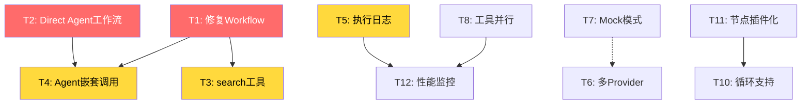

# AI Agent 框架优化任务清单

> 基于 `AI_AGENT_FRAMEWORK_ANALYSIS.md` 生成的可执行任务清单  
> 更新时间: 2025-01-08

---

## 🔴 P0: 紧急任务（必须立即修复）

### ✅ T1: 修复 AgentWorkflowService 移除问题
- **问题**: AgentWorkflowService已被移除为占位符，导致workflow工具完全失效
- **影响**: 所有依赖工作流工具的Agent无法正常工作
- **方案**: 使用LangGraphEngine替代
- **工作量**: 2天
- **步骤**:
  1. [ ] 修改 `ToolExecutor.ts` 中的 `executeWorkflow` 方法，直接调用 `LangGraphEngine`
  2. [ ] 更新所有依赖 `AgentWorkflowService` 的代码
  3. [ ] 测试workflow工具调用
  4. [ ] 更新相关文档

### ✅ T2: 支持 Direct Agent 在工作流中使用
- **问题**: LangGraphEngine禁止Direct Agent类型，限制了灵活性
- **位置**: `backend/src/services/workflow/langgraph/LangGraphEngine.ts:133`
- **工作量**: 1天
- **步骤**:
  1. [ ] 移除Direct Agent类型检查限制
  2. [ ] 在 `executeAgent` 方法中增加Direct Agent调用分支
  3. [ ] 调用 `AgentOrchestrator.executeAgent()`
  4. [ ] 处理返回结果格式转换
  5. [ ] 测试Direct Agent在工作流中的执行

---

## 🟡 P1: 高优先级任务（重要功能缺失）

### ✅ T3: 实现 search 工具
- **问题**: search工具只是占位符，未实现实际功能
- **位置**: `backend/src/services/agent/ToolExecutor.ts:142-169`
- **工作量**: 2天
- **步骤**:
  1. [ ] 集成现有的AI Search功能
  2. [ ] 实现搜索参数解析和验证
  3. [ ] 格式化搜索结果
  4. [ ] 添加缓存机制
  5. [ ] 编写测试用例

### ✅ T4: 实现 agent 嵌套调用工具
- **问题**: agent工具只是占位符，未实现嵌套调用
- **位置**: `backend/src/services/agent/ToolExecutor.ts:392-429`
- **工作量**: 2天
- **安全考虑**:
  - 防止无限递归（最大深度3层）
  - 累计超时控制
  - 调用链追踪
- **步骤**:
  1. [ ] 实现调用深度检查
  2. [ ] 调用 `AgentOrchestrator.executeAgent()` 
  3. [ ] 处理嵌套上下文传递
  4. [ ] 累计超时计算
  5. [ ] 测试嵌套场景

### ✅ T5: 增加执行日志和追踪
- **问题**: 缺少详细的执行日志，调试困难
- **工作量**: 3天
- **步骤**:
  1. [ ] 在 `AgentOrchestrator` 中增加日志记录
  2. [ ] 记录每个步骤的执行时间
  3. [ ] 保存中间结果到数据库
  4. [ ] 创建执行追踪表（execution_traces）
  5. [ ] 前端增加执行过程展示页面
  6. [ ] 支持按执行ID查询完整链路

---

## 🟢 P2: 中优先级任务（改进体验）

### ✅ T6: 支持多个 LLM Provider
- **问题**: 只支持OpenAI，生态受限
- **工作量**: 5天（每个Provider 1-2天）
- **计划支持**:
  - [ ] Anthropic (Claude)
  - [ ] Google (Gemini)
  - [ ] 本地模型 (Ollama/LocalAI)
- **步骤**:
  1. [ ] 创建 `ProviderFactory` 工厂类
  2. [ ] 实现 `AnthropicProvider`
  3. [ ] 实现 `GoogleProvider`
  4. [ ] 实现 `LocalProvider`
  5. [ ] 更新 `AgentOrchestrator` 使用工厂模式
  6. [ ] 配置页面支持选择Provider
  7. [ ] 测试各Provider功能

### ✅ T7: 增加 Mock 模式
- **问题**: 开发测试时成本高昂
- **工作量**: 1天
- **步骤**:
  1. [ ] 在 `.env` 增加 `AI_MOCK_MODE` 配置
  2. [ ] 在 `AgentOrchestrator` 中增加Mock分支
  3. [ ] 实现高质量的Mock响应生成器
  4. [ ] 支持根据不同角色生成不同Mock内容
  5. [ ] 前端增加Mock模式指示器

### ✅ T8: 工具并行执行优化
- **问题**: 多个工具调用时性能低下
- **工作量**: 3天
- **步骤**:
  1. [ ] 实现工具类型判断（哪些可并行）
  2. [ ] 修改 `executeTools` 方法支持并行
  3. [ ] 处理并行执行的错误
  4. [ ] 保证工具执行顺序可控（需要时）
  5. [ ] 性能测试对比

### ✅ T9: 优化计算工具安全性
- **问题**: 使用eval存在代码注入风险
- **位置**: `backend/src/services/agent/ToolExecutor.ts:227`
- **工作量**: 0.5天
- **步骤**:
  1. [ ] 安装 `mathjs` 库
  2. [ ] 替换 `safeEvaluate` 实现
  3. [ ] 测试各种数学表达式
  4. [ ] 更新错误处理

---

## 🔵 P3: 低优先级任务（长期改进）

### ✅ T10: 工作流循环支持
- **问题**: 无法实现迭代优化流程
- **工作量**: 7天
- **实现难度**: 高（需要重新设计状态机）
- **步骤**:
  1. [ ] 设计循环节点类型
  2. [ ] 实现循环条件判断
  3. [ ] 处理循环中的状态累积
  4. [ ] 防止无限循环（最大迭代次数）
  5. [ ] 更新工作流编辑器UI
  6. [ ] 测试复杂循环场景

### ✅ T11: 节点插件化系统
- **问题**: 节点类型硬编码，难以扩展
- **工作量**: 5天
- **步骤**:
  1. [ ] 设计 `NodeRegistry` 注册中心
  2. [ ] 定义 `NodeExecutor` 接口
  3. [ ] 重构现有节点为插件形式
  4. [ ] 支持动态注册节点类型
  5. [ ] 创建节点开发文档
  6. [ ] 示例：开发一个自定义节点

### ✅ T12: 性能监控和分析
- **问题**: 缺少性能监控，无法定位瓶颈
- **工作量**: 4天
- **步骤**:
  1. [ ] 设计性能指标体系
  2. [ ] 收集执行时间、Token使用等指标
  3. [ ] 创建性能监控表
  4. [ ] 实现性能分析API
  5. [ ] 前端创建性能监控面板
  6. [ ] 生成性能报告

---

## 📊 任务依赖关系



---

## 🎯 执行计划

### Week 1-2: Phase 1 - 紧急修复
**目标**: 修复核心功能问题

| 任务 | 天数 | 开始 | 完成 | 状态 |
|------|------|------|------|------|
| T2: Direct Agent工作流 | 1 | - | - | ⏳ |
| T1: 修复Workflow | 2 | - | - | ⏳ |
| T7: Mock模式 | 1 | - | - | ⏳ |
| T9: 计算工具安全 | 0.5 | - | - | ⏳ |

**验收标准**:
- ✅ 工作流中可以使用Direct Agent
- ✅ workflow工具恢复正常工作
- ✅ Mock模式可用，节省开发成本
- ✅ 计算工具使用安全的mathjs库

---

### Week 3-4: Phase 2 - 功能完善
**目标**: 补齐核心功能

| 任务 | 天数 | 开始 | 完成 | 状态 |
|------|------|------|------|------|
| T3: search工具 | 2 | - | - | ⏳ |
| T4: Agent嵌套调用 | 2 | - | - | ⏳ |
| T5: 执行日志 | 3 | - | - | ⏳ |
| T8: 并行执行 | 3 | - | - | ⏳ |

**验收标准**:
- ✅ 所有工具类型正常工作
- ✅ 支持Agent嵌套调用（最深3层）
- ✅ 前端可查看执行链路
- ✅ 工具并行执行提升性能

---

### Week 5-7: Phase 3 - 生态扩展
**目标**: 扩展能力边界

| 任务 | 天数 | 开始 | 完成 | 状态 |
|------|------|------|------|------|
| T6: 多Provider | 5 | - | - | ⏳ |
| T12: 性能监控 | 4 | - | - | ⏳ |
| T11: 节点插件化 | 5 | - | - | ⏳ |
| T10: 循环支持 | 7 | - | - | ⏳ |

**验收标准**:
- ✅ 支持3种以上LLM Provider
- ✅ 性能监控面板可用
- ✅ 节点插件系统完善
- ✅ 工作流支持循环

---

## 📝 任务模板

复制此模板创建具体任务Issue：

```markdown
## 任务标题: [T-编号] 任务名称

### 优先级
P0 / P1 / P2 / P3

### 问题描述
详细描述当前存在的问题

### 解决方案
简要说明解决方案

### 实施步骤
- [ ] 步骤1
- [ ] 步骤2
- [ ] 步骤3

### 验收标准
- [ ] 标准1
- [ ] 标准2

### 工作量估算
X天

### 相关文件
- `文件路径1`
- `文件路径2`

### 依赖任务
- 依赖于: [T-X]
- 阻塞: [T-Y]

### 测试计划
1. 测试场景1
2. 测试场景2

### 文档更新
- [ ] 更新技术文档
- [ ] 更新API文档
- [ ] 更新用户手册
```

---

## 🎉 快速开始

1. **阅读完整分析**: 先阅读 `AI_AGENT_FRAMEWORK_ANALYSIS.md`
2. **选择任务**: 从P0任务开始
3. **创建分支**: `git checkout -b feature/T1-fix-workflow`
4. **实施开发**: 按步骤执行
5. **测试验证**: 确保通过验收标准
6. **提交PR**: 附带测试结果和文档更新

---

**维护**: AI Agent 开发团队  
**最后更新**: 2025-01-08  
**版本**: v1.0

