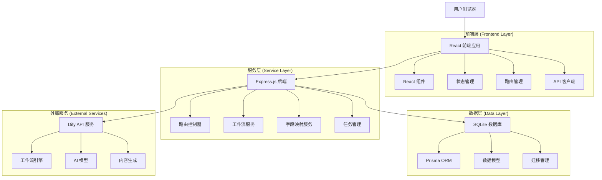
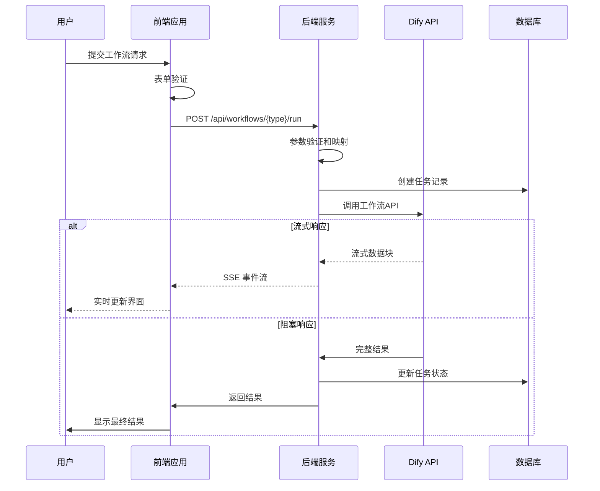
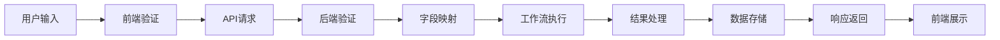
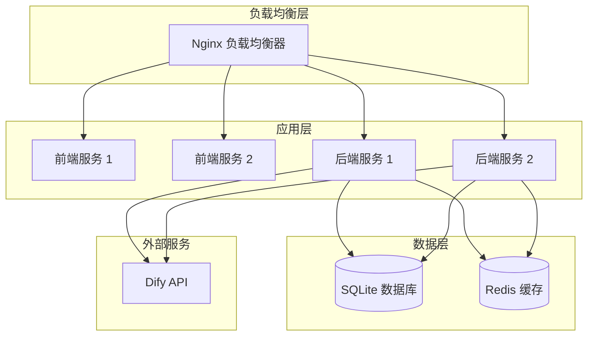

# Todify 系统架构文档

> 基于现代Web技术栈的智能内容生成平台架构设计

## 📋 目录

1. [系统概述](#系统概述)
2. [整体架构](#整体架构)
3. [技术栈](#技术栈)
4. [架构层次详解](#架构层次详解)
5. [核心组件](#核心组件)
6. [数据流设计](#数据流设计)
7. [安全架构](#安全架构)
8. [性能优化](#性能优化)
9. [部署架构](#部署架构)

## 🎯 系统概述

### 项目简介
Todify 是一个基于现代 Web 技术栈构建的智能内容生成平台，采用分层架构设计，集成 Dify AI 工作流平台，为用户提供以下三大核心功能：

- **技术IP挖掘**: 智能分析技术内容，提取核心技术点
- **技术通稿撰写**: 基于技术内容生成专业通稿
- **发布会演讲稿撰写**: 生成适合不同场景的演讲稿

### 技术愿景
- 🏗️ 构建可扩展的微服务架构
- ⚡ 实现高性能的 AI 工作流处理
- 🎨 提供友好的用户交互体验
- 🔒 确保系统的稳定性和可维护性
- 🚀 支持快速迭代和部署

### 系统特点
- **前后端分离**: 独立开发和部署
- **类型安全**: 全栈 TypeScript 支持
- **响应式设计**: 支持多设备访问
- **实时交互**: 基于 SSE 的流式响应
- **模块化设计**: 高内聚低耦合

## 🏗️ 整体架构

### 架构图


### 架构层次

| 层次 | 技术栈 | 职责 | 特点 |
|------|--------|------|------|
| **表现层** | React + TypeScript | 用户界面，交互逻辑 | 响应式，组件化 |
| **服务层** | Express.js + TypeScript | 业务逻辑，API 服务 | RESTful，中间件 |
| **数据层** | SQLite + Prisma | 数据存储，持久化 | 类型安全，迁移 |
| **集成层** | Dify API | AI 工作流，内容生成 | 流式响应，高可用 |

## 🛠️ 技术栈

### 前端技术栈
```json
{
  "核心框架": {
    "React": "18.x - 用户界面构建",
    "TypeScript": "5.x - 类型安全",
    "Vite": "5.x - 构建工具"
  },
  "样式方案": {
    "Tailwind CSS": "3.x - 原子化CSS",
    "Headless UI": "组件库",
    "Heroicons": "图标库"
  },
  "状态管理": {
    "Zustand": "4.x - 轻量级状态管理",
    "React Context": "全局状态",
    "React Hooks": "组件状态"
  },
  "路由导航": {
    "React Router": "v6 - 单页应用路由"
  },
  "HTTP客户端": {
    "Axios": "1.6.x - API请求"
  }
}
```

### 后端技术栈
```json
{
  "运行环境": {
    "Node.js": "18+ - JavaScript运行时",
    "TypeScript": "5.x - 类型安全"
  },
  "Web框架": {
    "Express.js": "4.x - Web应用框架",
    "CORS": "跨域资源共享",
    "Helmet": "安全中间件"
  },
  "数据库": {
    "SQLite": "3.x - 轻量级数据库",
    "Prisma": "5.x - 现代ORM"
  },
  "验证和日志": {
    "Zod": "运行时类型验证",
    "Winston": "日志系统"
  }
}
```

### 开发工具链
```json
{
  "构建工具": {
    "Vite": "前端构建",
    "TSC": "TypeScript编译",
    "ESBuild": "快速打包"
  },
  "代码质量": {
    "ESLint": "代码检查",
    "Prettier": "代码格式化",
    "Husky": "Git钩子"
  },
  "测试框架": {
    "Jest": "单元测试",
    "React Testing Library": "组件测试",
    "Supertest": "API测试"
  }
}
```

## 🏛️ 架构层次详解

### 1. 前端层 (Frontend Layer)

#### 1.1 React 应用主体
```typescript
// src/App.tsx - 应用入口
interface AppProps {
  theme: 'light' | 'dark';
  locale: string;
}

function App({ theme, locale }: AppProps) {
  return (
    <ThemeProvider theme={theme}>
      <I18nProvider locale={locale}>
        <Router>
          <Routes>
            <Route path="/" element={<HomePage />} />
            <Route path="/ip-mining" element={<IPMiningPage />} />
            <Route path="/tech-article" element={<TechArticlePage />} />
            <Route path="/speech-writing" element={<SpeechWritingPage />} />
          </Routes>
        </Router>
      </I18nProvider>
    </ThemeProvider>
  );
}
```

#### 1.2 页面组件架构
```
src/pages/
├── IPMining/                    # IP挖掘模块
│   ├── IPMiningPage.tsx        # 主页面容器
│   ├── IPMiningInput.tsx       # 输入表单组件
│   ├── components/             # 子组件
│   │   ├── InputForm.tsx
│   │   ├── ProgressIndicator.tsx
│   │   └── ResultDisplay.tsx
│   └── outputs/                # 结果展示组件
│       ├── TechPointsOutput.tsx
│       ├── AnalysisOutput.tsx
│       └── SummaryOutput.tsx
├── TechArticle/                # 技术通稿模块
│   ├── TechArticlePage.tsx
│   ├── ArticleEditor.tsx
│   └── components/
└── SpeechWriting/              # 演讲稿模块
    ├── SpeechWritingPage.tsx
    ├── SpeechEditor.tsx
    └── components/
```

#### 1.3 状态管理架构
```typescript
// src/stores/useAppStore.ts - Zustand 全局状态
interface AppState {
  // 用户状态
  user: User | null;
  isAuthenticated: boolean;
  
  // 应用状态
  theme: 'light' | 'dark';
  locale: string;
  
  // 工作流状态
  activeWorkflow: string | null;
  workflowResults: Record<string, any>;
  
  // 操作方法
  setUser: (user: User) => void;
  setTheme: (theme: 'light' | 'dark') => void;
  updateWorkflowResult: (id: string, result: any) => void;
}

const useAppStore = create<AppState>((set) => ({
  // 初始状态
  user: null,
  isAuthenticated: false,
  theme: 'light',
  locale: 'zh-CN',
  activeWorkflow: null,
  workflowResults: {},
  
  // 状态更新方法
  setUser: (user) => set({ user, isAuthenticated: !!user }),
  setTheme: (theme) => set({ theme }),
  updateWorkflowResult: (id, result) => 
    set((state) => ({
      workflowResults: { ...state.workflowResults, [id]: result }
    }))
}));
```

#### 1.4 API 客户端
```typescript
// src/lib/api-client.ts - 统一API客户端
class APIClient {
  private axios: AxiosInstance;
  
  constructor(baseURL: string) {
    this.axios = axios.create({
      baseURL,
      timeout: 30000,
      headers: {
        'Content-Type': 'application/json'
      }
    });
    
    this.setupInterceptors();
  }
  
  // 工作流API
  async runWorkflow(type: WorkflowType, inputs: any): Promise<WorkflowResult> {
    const response = await this.axios.post(`/api/workflows/${type}/run`, {
      inputs,
      response_mode: 'streaming',
      user: 'web-user'
    });
    
    return response.data;
  }
  
  // 流式响应处理
  async *streamWorkflow(type: WorkflowType, inputs: any): AsyncGenerator<any> {
    const response = await this.axios.post(
      `/api/workflows/${type}/stream`,
      { inputs },
      { responseType: 'stream' }
    );
    
    for await (const chunk of response.data) {
      yield JSON.parse(chunk.toString());
    }
  }
}
```

### 2. 服务层 (Service Layer)

#### 2.1 Express 服务器架构
```typescript
// api/app.ts - Express应用配置
class Application {
  private app: Express;
  
  constructor() {
    this.app = express();
    this.setupMiddleware();
    this.setupRoutes();
    this.setupErrorHandling();
  }
  
  private setupMiddleware(): void {
    this.app.use(cors({
      origin: process.env.FRONTEND_URL,
      credentials: true
    }));
    
    this.app.use(helmet());
    this.app.use(express.json({ limit: '10mb' }));
    this.app.use(morgan('combined'));
  }
  
  private setupRoutes(): void {
    this.app.use('/api/workflows', workflowRoutes);
    this.app.use('/api/tasks', taskRoutes);
    this.app.use('/api/results', resultRoutes);
    this.app.use('/health', healthRoutes);
  }
}
```

#### 2.2 工作流服务架构
```typescript
// api/services/WorkflowService.ts - 工作流服务
class WorkflowService {
  private difyClient: DifyClient;
  private taskManager: TaskManager;
  
  constructor() {
    this.difyClient = new DifyClient({
      apiKey: process.env.DIFY_API_KEY!,
      baseURL: process.env.DIFY_API_URL!
    });
    
    this.taskManager = new TaskManager();
  }
  
  async executeWorkflow(
    type: WorkflowType,
    inputs: WorkflowInputs,
    options: ExecutionOptions = {}
  ): Promise<WorkflowResult> {
    // 1. 验证输入参数
    const validatedInputs = await this.validateInputs(type, inputs);
    
    // 2. 创建任务记录
    const task = await this.taskManager.createTask({
      type,
      inputs: validatedInputs,
      status: 'pending'
    });
    
    try {
      // 3. 执行工作流
      const result = await this.difyClient.runWorkflow({
        inputs: validatedInputs,
        response_mode: options.streaming ? 'streaming' : 'blocking',
        user: options.user || 'system'
      });
      
      // 4. 更新任务状态
      await this.taskManager.updateTask(task.id, {
        status: 'completed',
        result
      });
      
      return result;
    } catch (error) {
      // 5. 错误处理
      await this.taskManager.updateTask(task.id, {
        status: 'failed',
        error: error.message
      });
      
      throw error;
    }
  }
}
```

#### 2.3 字段映射服务
```typescript
// api/services/FieldMappingService.ts - 字段映射服务
class FieldMappingService {
  private mappings: Map<WorkflowType, FieldMapping>;
  
  constructor() {
    this.loadMappings();
  }
  
  private loadMappings(): void {
    this.mappings = new Map([
      ['ip-mining', require('../mappings/ip-mining-mappings.json')],
      ['tech-article', require('../mappings/tech-article-mappings.json')],
      ['speech-writing', require('../mappings/speech-writing-mappings.json')]
    ]);
  }
  
  mapFields(type: WorkflowType, inputs: any): any {
    const mapping = this.mappings.get(type);
    if (!mapping) {
      throw new Error(`No mapping found for workflow type: ${type}`);
    }
    
    const mappedInputs = {};
    
    for (const [sourceField, targetField] of Object.entries(mapping.fields)) {
      if (inputs[sourceField] !== undefined) {
        mappedInputs[targetField] = this.transformValue(
          inputs[sourceField],
          mapping.transformations[sourceField]
        );
      }
    }
    
    return mappedInputs;
  }
}
```

### 3. 数据层 (Data Layer)

#### 3.1 数据模型设计
```prisma
// prisma/schema.prisma - 数据模型
model User {
  id        String   @id @default(cuid())
  email     String   @unique
  name      String?
  createdAt DateTime @default(now())
  updatedAt DateTime @updatedAt
  
  tasks     Task[]
  results   Result[]
}

model Task {
  id          String      @id @default(cuid())
  type        WorkflowType
  status      TaskStatus
  inputs      Json
  result      Json?
  error       String?
  createdAt   DateTime    @default(now())
  updatedAt   DateTime    @updatedAt
  
  userId      String
  user        User        @relation(fields: [userId], references: [id])
  
  results     Result[]
}

model Result {
  id          String   @id @default(cuid())
  type        String
  content     Json
  metadata    Json?
  createdAt   DateTime @default(now())
  
  taskId      String
  task        Task     @relation(fields: [taskId], references: [id])
  
  userId      String
  user        User     @relation(fields: [userId], references: [id])
}

enum WorkflowType {
  IP_MINING
  TECH_ARTICLE
  SPEECH_WRITING
}

enum TaskStatus {
  PENDING
  RUNNING
  COMPLETED
  FAILED
}
```

#### 3.2 数据访问层
```typescript
// api/repositories/TaskRepository.ts - 任务数据访问
class TaskRepository {
  private prisma: PrismaClient;
  
  constructor() {
    this.prisma = new PrismaClient();
  }
  
  async createTask(data: CreateTaskData): Promise<Task> {
    return this.prisma.task.create({
      data: {
        type: data.type,
        status: 'PENDING',
        inputs: data.inputs,
        userId: data.userId
      },
      include: {
        user: true,
        results: true
      }
    });
  }
  
  async updateTask(id: string, data: UpdateTaskData): Promise<Task> {
    return this.prisma.task.update({
      where: { id },
      data,
      include: {
        user: true,
        results: true
      }
    });
  }
  
  async findTasksByUser(userId: string): Promise<Task[]> {
    return this.prisma.task.findMany({
      where: { userId },
      include: {
        results: true
      },
      orderBy: {
        createdAt: 'desc'
      }
    });
  }
}
```

## 🔄 数据流设计

### 请求处理流程


### 数据流转图


## 🔒 安全架构

### 安全措施
1. **输入验证**: 使用 Zod 进行运行时类型验证
2. **CORS 配置**: 限制跨域访问来源
3. **请求限制**: 实现 API 调用频率限制
4. **错误处理**: 避免敏感信息泄露
5. **日志记录**: 记录关键操作和异常

### 安全配置示例
```typescript
// api/middleware/security.ts
export const securityMiddleware = [
  helmet({
    contentSecurityPolicy: {
      directives: {
        defaultSrc: ["'self'"],
        styleSrc: ["'self'", "'unsafe-inline'"],
        scriptSrc: ["'self'"],
        imgSrc: ["'self'", "data:", "https:"]
      }
    }
  }),
  
  rateLimit({
    windowMs: 15 * 60 * 1000, // 15分钟
    max: 100, // 限制每个IP 100次请求
    message: 'Too many requests from this IP'
  }),
  
  (req: Request, res: Response, next: NextFunction) => {
    // 请求日志
    logger.info(`${req.method} ${req.path}`, {
      ip: req.ip,
      userAgent: req.get('User-Agent')
    });
    next();
  }
];
```

## ⚡ 性能优化

### 前端优化
1. **代码分割**: 使用 React.lazy 和 Suspense
2. **缓存策略**: 实现智能缓存机制
3. **虚拟滚动**: 处理大量数据展示
4. **图片优化**: 懒加载和压缩

### 后端优化
1. **连接池**: 数据库连接池管理
2. **缓存层**: Redis 缓存热点数据
3. **异步处理**: 使用队列处理长时间任务
4. **压缩**: 启用 gzip 压缩

### 性能监控
```typescript
// api/middleware/performance.ts
export const performanceMiddleware = (req: Request, res: Response, next: NextFunction) => {
  const start = Date.now();
  
  res.on('finish', () => {
    const duration = Date.now() - start;
    
    logger.info('Request completed', {
      method: req.method,
      path: req.path,
      statusCode: res.statusCode,
      duration: `${duration}ms`
    });
    
    // 性能指标收集
    if (duration > 1000) {
      logger.warn('Slow request detected', {
        method: req.method,
        path: req.path,
        duration: `${duration}ms`
      });
    }
  });
  
  next();
};
```

## 🚀 部署架构

### 生产环境架构


### 容器化部署
```dockerfile
# Dockerfile.frontend
FROM node:18-alpine AS builder
WORKDIR /app
COPY package*.json ./
RUN npm ci --only=production
COPY . .
RUN npm run build

FROM nginx:alpine
COPY --from=builder /app/dist /usr/share/nginx/html
COPY nginx.conf /etc/nginx/nginx.conf
EXPOSE 80
CMD ["nginx", "-g", "daemon off;"]
```

```dockerfile
# Dockerfile.backend
FROM node:18-alpine
WORKDIR /app
COPY package*.json ./
RUN npm ci --only=production
COPY . .
RUN npm run build
EXPOSE 3000
CMD ["npm", "start"]
```

---

## 📚 相关文档

- [数据流管理文档](./data-flow-management.md)
- [数据库设计文档](./database-schema.md)
- [API集成指南](../api/dify-integration-guide.md)
- [部署指南](../deployment/production-deployment.md)
- [开发环境设置](../deployment/development-setup.md)

---

*本文档基于 Todify v2.0 架构设计，持续更新中。如有问题请联系架构团队。*