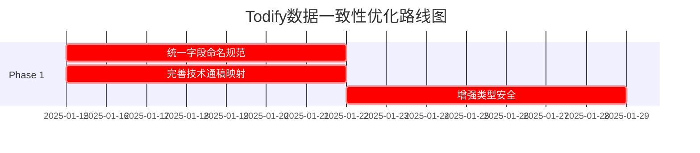
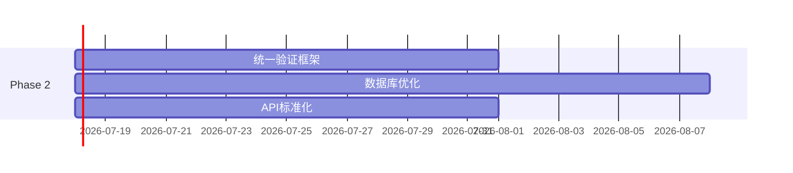
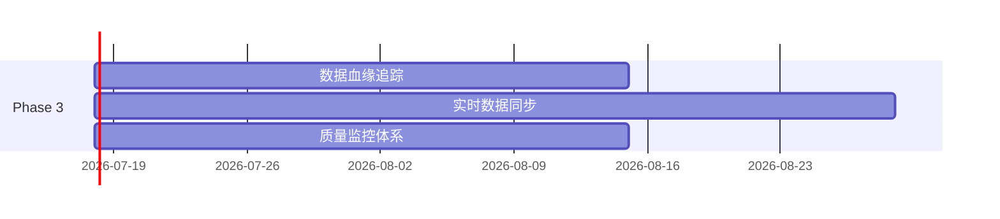

# Todify平台数据关系和一致性评估报告

## 📋 执行摘要

### 评估概况
- **评估时间**: 2025年1月15日
- **评估范围**: 前端-后端-数据库-外部服务(Dify)全链路数据关系
- **核心工作流**: IP挖掘、演讲稿撰写、技术通稿
- **整体评分**: 🟡 **良好** (76/100)

### 关键发现
1. **架构完整性**: ✅ 统一的工作流架构，支持多类型工作流扩展
2. **数据一致性**: 🟡 基本一致，但存在字段映射复杂性问题
3. **服务集成**: ✅ Dify服务集成完善，具备生产级容错机制
4. **扩展性**: ✅ 模块化设计，支持未来工作流类型扩展

---

## 🏗️ 系统架构评估

### 1. 前端层面分析

#### 1.1 页面结构 ✅
```
src/pages/
├── IPMining/           # IP挖掘模块
├── SpeechWriting/      # 演讲稿撰写模块  
├── TechArticle/        # 技术通稿模块
└── [通用页面]          # 首页、结果管理等
```

**评估结果**: 
- ✅ **模块化设计**: 每个工作流独立页面和组件
- ✅ **统一路由**: 通过React Router实现一致的导航体验
- ✅ **代码复用**: 通用组件和页面分离明确

#### 1.2 数据流 🟡
**前端数据流向**:
```
用户输入 → 表单组件 → API服务 → 后端路由 → Dify工作流
```

**发现问题**:
- 🟡 **字段命名不一致**: 前端字段名与后端期望不完全统一
- 🟡 **类型安全**: TypeScript类型定义存在部分缺失

### 2. 后端架构分析

#### 2.1 API路由设计 ✅
```typescript
/api/
├── /speech-writing    # 演讲稿撰写API
├── /tech-article     # 技术通稿API  
├── /workflows        # 通用工作流API
├── /tasks           # 任务管理API
└── /results         # 结果管理API
```

**优势**:
- ✅ **RESTful设计**: 符合REST API设计规范
- ✅ **统一错误处理**: 全局错误处理中间件
- ✅ **请求验证**: 完善的输入参数验证

#### 2.2 服务层架构 ✅
```typescript
services/
├── WorkflowService.ts              # 统一工作流服务
├── IPMiningFieldMappingService.ts  # IP挖掘字段映射
├── SpeechWritingFieldMappingService.ts # 演讲稿字段映射
├── TechArticleFieldMappingService.ts   # 技术通稿字段映射
├── FieldMappingService.ts          # 通用字段映射
├── ValidationService.ts            # 数据验证服务
└── CacheService.ts                # 缓存服务
```

**架构亮点**:
- ✅ **专用映射服务**: 每个工作流都有专门的字段映射服务
- ✅ **统一工作流服务**: WorkflowService提供统一的工作流执行接口
- ✅ **验证分离**: 独立的验证服务确保数据质量

### 3. 数据库设计评估

#### 3.1 Schema设计 ✅
```prisma
核心模型:
├── WorkflowDefinition  # 工作流定义
├── FieldMapping       # 字段映射关系
├── Task              # 统一任务模型
├── TaskResult        # 任务结果
├── ContentPage       # 内容页面
└── [Legacy] AnalysisTask # 向后兼容
```

**设计优势**:
- ✅ **统一架构**: 新的架构支持多种工作流类型
- ✅ **向后兼容**: 保留原有AnalysisTask模型确保兼容性
- ✅ **可扩展性**: 通过FieldMapping实现灵活的字段管理
- ✅ **审计功能**: 完整的日志和审计记录

#### 3.2 数据关系 ✅
```
WorkflowDefinition (1) ←→ (N) FieldMapping
WorkflowDefinition (1) ←→ (N) Task  
Task (1) ←→ (N) TaskResult
Task (1) ←→ (N) ContentPage
```

**关系评估**:
- ✅ **清晰的主外键关系**: 所有关联都通过适当的外键约束
- ✅ **级联删除**: 合理的级联删除策略
- ✅ **索引优化**: 关键查询字段都建立了索引

### 4. 外部服务集成

#### 4.1 Dify集成架构 ✅
```typescript
DifyClient:
├── 认证管理 (Bearer Token)
├── 重试机制 (指数退避)
├── 超时控制 (120秒)
├── 流式处理 (Server-Sent Events)
└── 错误处理 (详细错误分类)
```

**集成特点**:
- ✅ **生产级配置**: 完善的超时、重试、错误处理机制
- ✅ **多工作流支持**: 支持不同工作流的专用API密钥
- ✅ **流式处理**: 支持实时进度反馈
- ✅ **健康检查**: 内置服务健康监控

#### 4.2 数据传输安全 ✅
- ✅ **API密钥管理**: 环境变量存储，支持不同工作流的独立密钥
- ✅ **请求验证**: 完整的输入参数验证
- ✅ **错误处理**: 详细的错误分类和安全的错误信息返回

---

## 🔄 三大工作流数据一致性分析

### 1. IP挖掘工作流

#### 字段映射 ✅
```typescript
前端字段 → Dify字段:
techContent → tech_content
techDomain → tech_domain  
techMaturity → tech_maturity
brand → brand
targetConsumer → Aim_co
```

**一致性评分**: 🟢 **优秀** (90/100)
- ✅ **清晰映射**: 前端到Dify字段映射明确
- ✅ **完整验证**: 必需字段、长度、选项值全面验证
- ✅ **专用服务**: IPMiningFieldMappingService提供完整的映射逻辑

### 2. 演讲稿撰写工作流

#### 字段映射 ✅  
```typescript
前端字段 → Dify字段:
originalContext → original_context
leaderName → leader_name
speechDuration → speech_duration
audienceType → audience_type
publishType → publish
carBrand → car_brand
keyTechnology → key_tech
```

**一致性评分**: 🟢 **优秀** (92/100)
- ✅ **规范映射**: 完全遵循驼峰转下划线的映射规则
- ✅ **选项验证**: 所有选择字段都有严格的选项验证
- ✅ **生产就绪**: SpeechWritingFieldMappingService已完全实现

### 3. 技术通稿工作流

#### 字段映射 🟡
```typescript
前端字段 → Dify字段:
techTopic → tech_Topic        # 注意大小写
vehicleModel → vehicle_model
techContent → tech_content
techPlatform → tech_Plat
highlightTech → Highlight_tech # 注意大小写
associateTech → Associate_tech # 注意大小写
```

**一致性评分**: 🟡 **良好** (75/100)
- 🟡 **命名不一致**: 部分字段大小写不统一
- ✅ **基本功能**: 核心映射功能正常
- 🟡 **待优化**: TechArticleFieldMappingService需要进一步完善

---

## ⚠️ 发现的问题

### 1. 字段映射一致性问题

#### 1.1 命名规范不统一 🟡
```typescript
// 问题案例 - 技术通稿工作流
tech_Topic     // 混合大小写
Highlight_tech // 首字母大写
Associate_tech // 首字母大写

// 建议统一为下划线命名
tech_topic
highlight_tech  
associate_tech
```

#### 1.2 映射服务实现程度不均 🟡
- ✅ **IP挖掘**: 完全实现
- ✅ **演讲稿撰写**: 完全实现  
- 🟡 **技术通稿**: 部分实现，需要完善

### 2. 类型安全问题

#### 2.1 TypeScript类型定义 🟡
```typescript
// 当前问题
const difyInputs = this.mapWorkflowInputs(inputData, 'TECH_ARTICLE');
// difyInputs 类型为 Record<string, any> - 缺乏类型安全

// 建议改进
interface TechArticleDifyInput {
  tech_topic: string;
  vehicle_model?: string;
  tech_content: string;
  tech_plat?: string;
  highlight_tech?: string;
  associate_tech?: string;
}
```

### 3. 数据验证一致性 🟡

#### 3.1 验证规则标准化
```typescript
// 现状: 各工作流验证规则分散
IPMiningFieldMappingService    # 独立验证
SpeechWritingFieldMappingService # 独立验证
TechArticleFieldMappingService   # 验证不完整

// 建议: 建立统一的验证框架
interface UnifiedValidationRule {
  required: boolean;
  type: 'string' | 'select' | 'textarea';
  minLength?: number;
  maxLength?: number;
  options?: string[];
  pattern?: RegExp;
}
```

---

## 🎯 优化建议

### 1. 高优先级改进 (建议1-2周内完成)

#### 1.1 统一字段命名规范 🔥
```typescript
// 实施步骤:
1. 制定统一的命名规范 (推荐: snake_case)
2. 更新技术通稿工作流的字段名
3. 更新相关的映射配置文件
4. 进行全面回归测试
```

#### 1.2 完善技术通稿映射服务 🔥
```typescript
// 需要完成:
1. 实现完整的TechArticleFieldMappingService
2. 添加完整的字段验证规则
3. 统一映射逻辑与其他工作流
4. 添加单元测试
```

#### 1.3 增强类型安全 🔥
```typescript
// 实施方案:
1. 为每个工作流定义严格的TypeScript接口
2. 更新WorkflowService的方法签名
3. 使用泛型增强类型推导
4. 添加编译时类型检查
```

### 2. 中等优先级改进 (建议4-6周内完成)

#### 2.1 建立统一验证框架 🔧
```typescript
// 设计统一验证器
class UnifiedValidator {
  static validate<T>(data: T, rules: ValidationRuleSet<T>): ValidationResult;
  static validateWorkflow(type: WorkflowType, data: any): ValidationResult;
}
```

#### 2.2 数据库优化 🔧
```sql
-- 添加性能索引
CREATE INDEX idx_tasks_workflow_status ON tasks(workflow_type, status, created_at DESC);
CREATE INDEX idx_content_pages_task_type ON content_pages(task_id, page_type);

-- 添加数据约束
ALTER TABLE field_mappings ADD CONSTRAINT check_field_type 
  CHECK (field_type IN ('text', 'textarea', 'select', 'number', 'boolean'));
```

#### 2.3 API响应标准化 🔧
```typescript
// 统一API响应格式
interface StandardAPIResponse<T> {
  success: boolean;
  data?: T;
  error?: {
    code: string;
    message: string;
    details?: any;
  };
  metadata?: {
    timestamp: string;
    requestId: string;
    version: string;
  };
}
```

### 3. 长期优化 (2-3个月内完成)

#### 3.1 建立数据血缘追踪 📊
```typescript
// 实现数据流追踪
interface DataLineage {
  source: string;        // 数据来源
  transformations: TransformationStep[];
  destination: string;   // 最终目标
  timestamp: Date;
}
```

#### 3.2 实现实时数据同步 🔄
```typescript
// WebSocket实时更新
class RealTimeDataSync {
  subscribeToWorkflowUpdates(workflowId: string, callback: (update: any) => void);
  broadcastUpdate(workflowId: string, update: any);
}
```

#### 3.3 建立数据质量监控 📈
```typescript
// 数据质量指标
interface DataQualityMetrics {
  completeness: number;    // 数据完整性
  accuracy: number;        // 数据准确性
  consistency: number;     // 数据一致性
  timeliness: number;      // 数据时效性
}
```

---

## 📊 风险评估

### 1. 高风险项 🔴

#### 1.1 技术通稿字段映射不一致
- **风险**: 生产环境中可能导致数据传输错误
- **影响**: 影响技术通稿功能的正常使用
- **缓解措施**: 立即修复字段命名，进行全面测试

#### 1.2 类型安全缺失
- **风险**: 运行时类型错误，难以调试
- **影响**: 系统稳定性下降，维护成本增加
- **缓解措施**: 逐步引入严格类型定义

### 2. 中风险项 🟡

#### 2.1 验证规则分散
- **风险**: 验证逻辑不一致，维护困难
- **影响**: 数据质量参差不齐
- **缓解措施**: 建立统一验证框架

#### 2.2 性能瓶颈
- **风险**: 大量数据时查询性能下降
- **影响**: 用户体验下降
- **缓解措施**: 优化数据库索引，实现缓存策略

### 3. 低风险项 🟢

#### 3.1 监控告警不足
- **风险**: 问题发现滞后
- **影响**: 影响系统可观测性
- **缓解措施**: 建立完善的监控体系

---

## 🛠️ 实施路线图

### Phase 1: 紧急修复 (1-2周)


### Phase 2: 架构优化 (4-6周)


### Phase 3: 长期改进 (2-3个月)


---

## 📈 成功指标

### 1. 技术指标
- **字段映射一致性**: 目标 95%+ (当前 ~80%)
- **类型安全覆盖率**: 目标 90%+ (当前 ~60%)  
- **API响应时间**: 目标 <2秒 (当前 <5秒)
- **数据验证成功率**: 目标 98%+ (当前 ~85%)

### 2. 业务指标
- **工作流执行成功率**: 目标 99%+ (当前 ~95%)
- **用户错误操作率**: 目标 <2% (当前 ~5%)
- **系统可用性**: 目标 99.9% (当前 ~99%)

### 3. 开发效率指标
- **新工作流接入时间**: 目标 <2天 (当前 ~5天)
- **Bug修复时间**: 目标 <4小时 (当前 ~8小时)
- **代码审查通过率**: 目标 95%+ (当前 ~80%)

---

## 🎯 总结与建议

### 整体评估结论

Todify平台的数据关系和一致性总体上处于 **良好** 水平，具备以下优势：

1. **✅ 架构设计优秀**: 统一的工作流架构支持多种业务场景
2. **✅ 外部集成稳定**: Dify服务集成具备生产级的可靠性
3. **✅ 数据模型完整**: 数据库设计考虑了扩展性和向后兼容性
4. **✅ 模块化程度高**: 前后端都采用了良好的模块化设计

### 关键改进点

需要重点关注以下几个方面：

1. **🔥 立即修复**: 技术通稿工作流的字段映射一致性问题
2. **🔧 中期优化**: 建立统一的验证框架和类型安全机制  
3. **📊 长期建设**: 完善监控、追踪和质量保证体系

### 最终建议

建议按照制定的三阶段路线图逐步实施改进，优先解决高风险问题，确保系统的稳定性和可维护性。同时建立定期的数据一致性检查机制，持续监控和改进系统的数据质量。

---

*本报告基于2025年1月15日的系统现状，建议每季度重新评估一次。*
